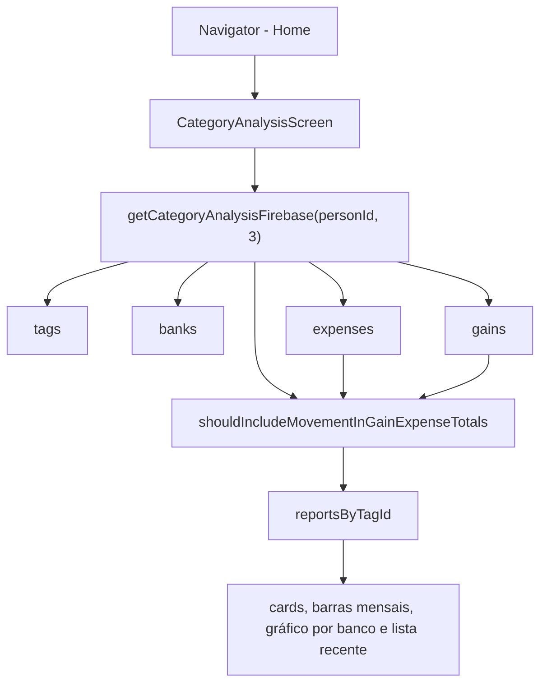

# Análise por Categoria

Tela de relatório dinâmico que compara gastos e ganhos de uma tag contra a média histórica recente. Existe para detectar variações incomuns, como uma categoria ficar acima, abaixo ou próxima da média dos últimos meses.

## Como funciona

1. A opção **Análise por Categoria** fica no grupo Home do `components/uiverse/navigation/navigator.tsx` e abre `/category-analysis`
2. `CategoryAnalysisScreen.tsx` carrega uma vez por foco via `useFocusEffect` e mantém todos os relatórios por tag em memória local
3. A categoria é escolhida por `components/uiverse/categories/tag-actionsheet-selector.tsx`, reaproveitando o mesmo ActionSheet das telas de registro; dentro da lista, cada tag mostra um label de uso (`Despesa`, `Ganho`, `Despesa obrigatória`, `Ganho obrigatório` ou combinações) abaixo do nome
4. O relatório compara o mês atual contra a média dos 3 meses fechados anteriores
5. A tela permite alternar entre **Gastos** e **Ganhos** quando a categoria suporta os dois usos. No Android/iOS, a alternância usa as Tabs controladas de `components/ui/tabs`; na Web, usa `Tabs` controladas do Mantine em um controle segmentado sem bordas externas ou nos gatilhos, com o amarelo âmbar escuro `#CA8A04` já presente na paleta do sistema, rótulos na fonte padrão do sistema e centralizados em cada tab, texto/ícone brancos quando selecionados, hover/foco visíveis e desabilitação contextual. As duas opções ficam como primeiro controle visual, em ordem fixa, e o seletor de categoria aparece logo abaixo. A opção sem suporte permanece desabilitada e a alternância reutiliza o relatório já carregado
6. O status pode ser:
   - `above` — mês atual acima da média histórica
   - `below` — mês atual abaixo da média histórica
   - `stable` — variação até 5% para cima ou para baixo
   - `no-history` — sem média histórica confiável
7. O relatório exibe:
   - mensagem textual da variação
   - total do mês atual
   - média histórica
   - diferença em reais e percentual contra a média histórica
   - barras mensais dos meses analisados
   - distribuição do mês atual por banco/dinheiro
   - movimentos recentes da categoria
   - as seções de evolução, distribuição e últimas movimentações usam apenas composição de layout, sem card externo ou ícone decorativo, com títulos em caixa alta alinhados ao padrão visual da [[Dashboard Home]]
   - botão **Baixar análise em PDF** ao final do relatório
8. A exportação em PDF usa `expo-print` e `expo-sharing`, respeita a preferência de [[Privacidade de Valores]] e usa o mesmo recorte ativo na tela

## Arquivos principais

- `screens/mobile/CategoryAnalysisScreen.tsx` — Tela de relatório e interação por tag
- `screens/web/CategoryAnalysisScreen.web.tsx` — Composição Web do relatório, com Tabs Mantine e seletor de categoria em fluxo vertical
- `functions/CategoryAnalysisFirebase.ts` — Agregação Firestore e cálculo dos relatórios
- `utils/categoryAnalysisPdf.ts` — HTML do relatório PDF da análise
- `app/mobile/category-analysis.tsx` — Rota Expo Router
- `components/uiverse/navigation/navigator.tsx` — Entrada da tela no grupo Home
- `components/uiverse/categories/tag-actionsheet-selector.tsx` — Seletor ActionSheet de categorias reaproveitado na tela
- `components/ui/tabs/index.tsx` — Alternância controlada entre gastos e ganhos
- `assets/UnDraw/analyzeGainExpensesTag.svg` — Ilustração da tela

## Integrações

- [[Gerenciamento de Tags]] — Lista de categorias, nomes e ícones
- [[Gerenciamento de Bancos]] — Quebra por banco e dinheiro no mês atual
- [[Transações de Despesas]] — Gastos com tag entram no relatório
- [[Transações de Receitas]] — Ganhos com tag entram no relatório
- [[Dashboard Home]] — A tela é acessada pela aba Home do navigator e segue o padrão visual de tela com hero
- [[Navegação]] — Nova rota `/category-analysis`
- [[Componentes UI]] — Tabs controladas para alternar o tipo do relatório; Mantine é usado somente na composição Web

## Configuração

- Sem variável de ambiente nova
- O período histórico padrão é de 3 meses fechados anteriores ao mês atual
- A tela respeita [[Privacidade de Valores]] usando `useValueVisibility()`
- A exportação usa `expo-print` para gerar o arquivo e `expo-sharing` quando disponível; antes de compartilhar, copia o PDF para o cache com nome contextual `Lumus-Financas-Analise-por-Categoria-[categoria]-[tipo]-[data].pdf`; sem sharing, abre a impressão do dispositivo para salvar como PDF

## Observações importantes

- Valores monetários continuam em centavos; conversão para reais ocorre apenas na renderização
- Movimentos internos excluídos de totais de gastos/ganhos são filtrados por `shouldIncludeMovementInGainExpenseTotals()`
- Transferências sem tag não entram no relatório por categoria
- Tags sem movimentação continuam aparecendo para permitir leitura explícita de ausência de dados
- A distribuição por banco considera `bankId`; movimentos sem banco aparecem como **Dinheiro**
- Percentuais do card de média são calculados como variação do mês atual contra a média histórica; a participação por banco é exibida separadamente e evita mostrar `100%` como falso sinal de variação quando há apenas uma fonte no mês
