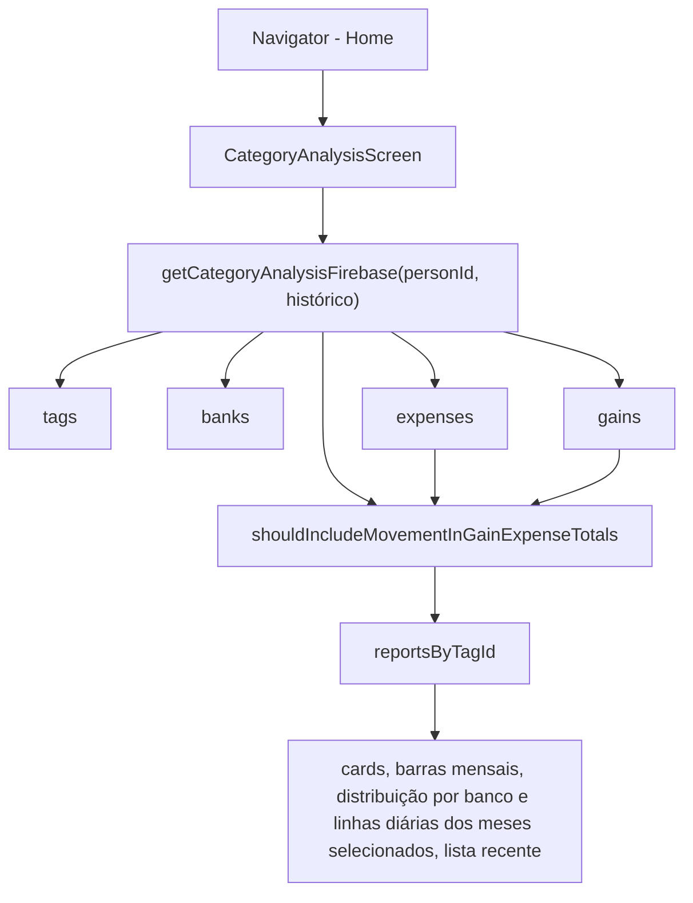

# Análise por Categoria

Tela de relatório dinâmico que compara gastos e ganhos de uma tag contra a média histórica recente. Existe para detectar variações incomuns, como uma categoria ficar acima, abaixo ou próxima da média dos últimos meses.

## Como funciona

```mermaid
graph TD
    NAV[Navigator - Home] --> CAS[CategoryAnalysisScreen]
    CAS --> CAF["getCategoryAnalysisFirebase(personId, histórico)"]
    CAF --> TAGS[tags]
    CAF --> BANKS[banks]
    CAF --> EXP[expenses]
    CAF --> GAIN[gains]
    CAF --> FILTER["shouldIncludeMovementInGainExpenseTotals"]
    EXP --> FILTER
    GAIN --> FILTER
    FILTER --> REPORT[reportsByTagId]
    REPORT --> UI["cards, barras mensais, distribuição por banco e linhas diárias dos meses selecionados, lista recente"]
```

1. A opção **Análise por Categoria** fica no grupo Home do `components/uiverse/navigation/navigator.tsx` e abre `/category-analysis`
2. As duas telas usam `useCategoryAnalysisData`, que carrega por foco e por alteração válida do histórico. Datas usam o mesmo `DatePickerField` do extrato bancário e consulta automática. O hook descarta respostas antigas ao mudar período, UID ou foco; mantém os filtros acessíveis em erro e intervalo inválido.
3. A categoria é escolhida por `components/uiverse/categories/tag-actionsheet-selector.tsx`, reaproveitando o mesmo ActionSheet das telas de registro; dentro da lista, cada tag mostra um label de uso (`Despesa`, `Ganho`, `Despesa obrigatória`, `Ganho obrigatório` ou combinações) abaixo do nome
4. Os campos **Data inicial** e **Data final** definem o histórico de comparação: por padrão, do primeiro dia de três meses atrás ao último dia do mês anterior. Aceitam até 12 meses históricos, incluindo seis e doze meses, e a data final deve anteceder o mês atual. O mês atual permanece separado, limitado ao instante da consulta e identificado como **Parcial até DD/MM/AAAA**. A média usa somente os meses completos dentro do histórico, somando em cada um os dias 1 até o mesmo dia do mês atual (meses mais curtos terminam no último dia disponível). Meses completos sem lançamentos contribuem com zero; meses cortados pelas datas aparecem nos gráficos e movimentos, mas não entram na média. Sem meses completos ou média positiva, o status é `no-history`.
5. A tela permite alternar entre **Gastos** e **Ganhos** quando a categoria suporta os dois usos. No Android/iOS, a alternância usa as Tabs controladas de `components/ui/tabs`; na Web, usa `Tabs` controladas do Mantine com o mesmo adaptador visual do extrato bancário, sem sombra no estado ativo. Depois dos campos de data, as tabs ficam em ordem fixa, e o seletor de categoria aparece logo abaixo nas duas plataformas. O estado ativo usa fundo amarelo e texto/ícone brancos; hover, foco e desabilitação são preservados. Logo após o seletor de categoria há `Divider size="sm"` Mantine na Web e `Divider` Gluestack no mobile. A opção sem suporte permanece desabilitada e a alternância reutiliza o relatório já carregado
6. O status pode ser:
   - `above` — mês atual acima da média histórica
   - `below` — mês atual abaixo da média histórica
   - `stable` — variação até 5% para cima ou para baixo
   - `no-history` — sem média histórica confiável
7. O relatório exibe:
   - mensagem textual da variação
   - total do mês atual
   - média histórica
   - diferença em reais e percentual contra a média histórica
   - barras mensais dos meses analisados
   - distribuição do mês atual por banco/dinheiro
   - na Web, a distribuição usa `DonutChart` do Mantine em Expo DOM; valores do gráfico continuam em centavos e tooltip/total central respeitam a privacidade
   - na Web, o `LineChart` ao lado da distribuição mostra o total acumulado lançado até cada dia, com uma linha por mês nos meses do histórico escolhido e no mês atual e somente o tipo ativo (gastos ou ganhos); lançamentos do dia elevam a linha, dias sem lançamentos mantêm o acumulado, dias fora dos limites selecionados e dias futuros do mês atual ficam em branco e valores ocultos são neutralizados
   - prévia de até oito movimentos do tipo selecionado, filtrados antes do limite; **Mostrar mais N movimentações** usa o botão de link primário compartilhado com a previsão financeira e abre a lista completa em páginas de vinte itens, com Anterior/Próxima; **Mostrar menos movimentações** recolhe a lista; mudar categoria, tipo ou recarregar o período reseta a paginação
   - as seções de evolução, distribuição e últimas movimentações usam apenas composição de layout, sem card externo ou ícone decorativo, com títulos em caixa alta alinhados ao padrão visual da [[Dashboard Home]]
   - botão **Baixar análise em PDF** ao final do relatório
   - superfícies, seletor, carregamento e estados vazios usam cantos de 16 px
8. A exportação em PDF usa `expo-print` e `expo-sharing`, respeita a preferência de [[Privacidade de Valores]] e inclui o histórico escolhido, o corte diário da comparação e todas as movimentações do tipo ativo no recorte, independentemente da página visível

## Arquivos principais

- `screens/mobile/CategoryAnalysisScreen.tsx` — Tela de relatório e interação por tag
- `screens/web/CategoryAnalysisScreen.web.tsx` — Composição Web do relatório, com Tabs Mantine e seletor de categoria em fluxo vertical
- `components/uiverse/categories/category-analysis-bank-donut-chart.tsx` — Gráfico Web Mantine isolado em Expo DOM, recebe dados agregados em centavos e respeita tema/privacidade
- `components/uiverse/categories/category-analysis-monthly-line-chart.tsx` — Gráfico Web Mantine em Expo DOM com uma série acumulada por mês para a categoria ativa
- `functions/CategoryAnalysisFirebase.ts` — Consultas separadas do histórico e do mês atual, agregação e relatórios
- `utils/categoryAnalysis.ts` — Intervalos, comparação por dias equivalentes em centavos e paginação após filtro
- `hooks/useCategoryAnalysisData.ts` — Consulta automática e proteção contra respostas obsoletas
- `components/uiverse/categories/category-analysis-period-fields.tsx` — Campos de datas compartilhados
- `components/uiverse/categories/category-analysis-movement-pagination.tsx` — Controles de prévia e paginação
- `tests/categoryAnalysis.test.ts` — Regressões de comparação, datas, consultas e paginação
- `tests/categoryAnalysisData.test.ts` — Concorrência entre períodos, logout e recuperação de erro
- `utils/categoryAnalysisPdf.ts` — HTML do relatório PDF da análise
- `app/mobile/category-analysis.tsx` — Rota Expo Router
- `components/uiverse/navigation/navigator.tsx` — Entrada da tela no grupo Home
- `components/uiverse/categories/tag-actionsheet-selector.tsx` — Seletor ActionSheet de categorias reaproveitado na tela
- `components/ui/tabs/index.tsx` — Alternância controlada entre gastos e ganhos
- `assets/UnDraw/analyzeGainExpensesTag.svg` — Ilustração da tela

## Integrações

- [[Gerenciamento de Tags]] — Lista de categorias, nomes e ícones
- [[Gerenciamento de Bancos]] — Quebra por banco e dinheiro no mês atual
- [[Transações de Despesas]] — Gastos com tag entram no relatório
- [[Transações de Receitas]] — Ganhos com tag entram no relatório
- [[Dashboard Home]] — A tela é acessada pela aba Home do navigator e segue o padrão visual de tela com hero
- [[Navegação]] — Nova rota `/category-analysis`
- [[Componentes UI]] — Tabs controladas para alternar o tipo do relatório; Mantine é usado somente na composição Web

## Configuração

- Sem variável de ambiente nova
- O período histórico padrão é de 3 meses fechados anteriores ao mês atual; pode ser alterado pelos campos de data até 12 meses. Datas usam o calendário local do dispositivo, como o extrato bancário.
- A tela respeita [[Privacidade de Valores]] usando `useValueVisibility()`
- A exportação usa `expo-print` para gerar o arquivo e `expo-sharing` quando disponível; antes de compartilhar, copia o PDF para o cache com nome contextual `Lumus-Financas-Analise-por-Categoria-[categoria]-[tipo]-[data].pdf`; sem sharing, abre a impressão do dispositivo para salvar como PDF

## Observações importantes

- Valores monetários continuam em centavos; conversão para reais ocorre apenas na renderização
- Movimentos internos excluídos de totais de gastos/ganhos são filtrados por `shouldIncludeMovementInGainExpenseTotals()`
- Transferências sem tag não entram no relatório por categoria
- Tags sem movimentação continuam aparecendo para permitir leitura explícita de ausência de dados
- A distribuição por banco considera `bankId`; movimentos sem banco aparecem como **Dinheiro**
- O gráfico diário da Web reutiliza os movimentos e os meses agregados pelo relatório da categoria e não faz uma consulta adicional
- Percentuais do card de média são calculados como variação do mês atual contra a média histórica; a participação por banco é exibida separadamente e evita mostrar `100%` como falso sinal de variação quando há apenas uma fonte no mês

- Barras e linhas mostram os totais do recorte de cada mês; a média e sua contagem usam apenas os dias comparáveis. A tela explicita essa diferença.
- O histórico e o mês atual são consultados separadamente, sem ler os meses do intervalo entre um histórico antigo e o mês atual. Consultas e filtros preservam pessoas autorizadas e exclusão de movimentos internos.
