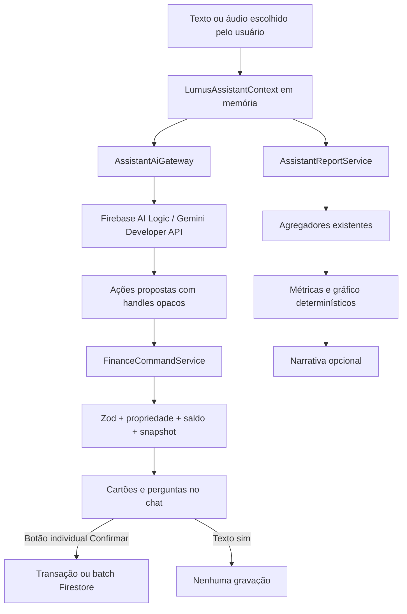

# Assistente Lumus

Conversa financeira em português que transforma texto ou áudio em rascunhos estruturados, pergunta somente o que falta e apresenta um cartão de revisão para cada operação. O Firebase AI Logic interpreta a intenção; somente o código determinístico do Lumus valida e grava no Firestore.

## Como funciona

1. A rota protegida `/lumus-assistant` importa `LumusAssistantProvider` e sua tela diretamente, sem `React.lazy`/`Suspense`, para que o Native Stack abra a tela imediatamente. Enquanto preferências, Remote Config e disponibilidade são verificados, o hero e o painel da própria tela ficam visíveis com um estado interno de preparação; a IA e o compositor só são liberados ao fim dessa verificação. O gateway Android continua adiando apenas os imports do React Native Firebase até confirmar um runtime compatível e obter o token de App Check. A boundary local ficou restrita à recuperação de erro inesperado da tela, sem criar um gate de navegação. A sessão permanece em memória enquanto a rota estiver montada e o UID atual estiver autenticado.
2. No primeiro uso, o usuário precisa aceitar o aviso sobre envio de texto, áudio e contexto mínimo ao Gemini. O consentimento e a opção de leitura automática são persistidos por UID; mensagens, catálogos e rascunhos nunca são persistidos.
3. O aplicativo carrega somente documentos graváveis do UID atual e cria handles opacos com salt aleatório da sessão. Eles permanecem estáveis durante a conversa, mudam ao limpar/logout e nunca contêm o ID real. UID, e-mail, token e configuração Firebase também não entram no prompt.
4. O modelo pode chamar apenas `prepare_financial_actions` e `request_financial_report`. Nenhuma ferramenta fornecida ao modelo grava dados.
5. Propostas passam por schemas Zod por ação. Valores permanecem em centavos, datas civis usam `America/Sao_Paulo`, e campos ausentes viram perguntas interativas.
6. Quando vários rascunhos precisam do mesmo banco ou categoria, a pergunta oferece **Aplicar também aos semelhantes**.
   Uma resposta digitada ou transcrita no compositor também preenche a pergunta aberta quando houver correspondência local inequívoca; isso não consome uma chamada de IA.
7. Cada cartão passa por `ready → confirming → executing`. Só o botão **Confirmar agora** do próprio cartão permite a execução. Uma mensagem ou áudio dizendo “sim” nunca executa.
8. Edições, exclusões e desfazimentos guardam fingerprint do documento. O serviço lê novamente o registro antes do commit e marca o cartão como `stale` quando os dados mudaram.
9. IDs de documentos criados pelo assistente são derivados de `personId + clientActionId + operação`, reduzindo duplicação em toque duplo ou repetição após falha de rede.
10. Notificações de recorrências são agendadas somente depois do commit financeiro. Falha local gera aviso sem reverter a escrita concluída.
   O aviso oferece nova tentativa que atua somente sobre a agenda local e nunca repete o commit financeiro.
11. O comando local “Limpar conversa” é interceptado antes da IA e apaga imediatamente a sessão em memória sem revogar o consentimento.
12. Quando a disponibilidade Android falha por App Check ou configuração, o aviso do chat oferece **Tentar novamente**. A ação `refreshAvailability()` mostra estado de verificação, força nova resolução de Remote Config e executa outro preflight; ela atualiza somente configuração/disponibilidade e não limpa consentimento, conversa nem a sessão financeira.

## Ações suportadas

| Área | Ações |
|---|---|
| Despesas e ganhos | criar, editar e excluir lançamentos não vinculados |
| Saldo mensal | criar ou atualizar por banco e ciclo `YYYY-MM` |
| Transferências | criar o registro e o par saída/entrada de forma atômica |
| Dinheiro | registrar e desfazer saque |
| Gastos obrigatórios | criar, editar, excluir, pagar ciclo e desfazer pagamento |
| Ganhos obrigatórios | criar, editar, excluir, receber ciclo e desfazer recebimento |
| Investimentos | criar, editar, excluir, aportar, resgatar, sincronizar e desfazer movimentos |
| CDI | registrar ou atualizar taxa por vigência |
| Bancos | criar com saldo inicial, editar e excluir conforme o comportamento atual |
| Categorias | criar, editar e excluir conforme o comportamento atual |

Transferências, lançamentos recorrentes vinculados e movimentos de investimento não entram na edição genérica. Criação de usuário, exclusão de conta e administração de relacionamentos não são ferramentas do assistente. Dados relacionados podem entrar nos agregadores de relatório, identificados como escopo de leitura, mas não entram no catálogo gravável.

## Voz e leitura

- `expo-audio` grava somente depois do toque, nunca em segundo plano, por no máximo 60 segundos e 20 MB.
- O arquivo temporário é transformado em base64 somente para a chamada de transcrição e apagado após transcrição, cancelamento, revogação, logout ou desmontagem da tela. Na desmontagem, a tela limpa somente timer, arquivo e modo de áudio: o `useAudioRecorder` já libera o `AudioRecorder`, portanto nenhuma operação assíncrona consulta ou interrompe esse objeto nativo depois disso.
- A transcrição aparece no compositor e pode ser editada antes do envio financeiro.
- `expo-speech` lê localmente em `pt-BR`. A leitura automática começa desligada e é persistida por UID.
- No modo de privacidade, valores são mascarados na tela e antes do TTS.
- Android exige development build; Expo Go não contém os módulos React Native Firebase desta feature e um development client anterior pode não conter áudio/voz.
- O adaptador Android detecta o Expo Go antes de acessar React Native Firebase. Provider e tela montam diretamente, e uma configuração ausente aparece como indisponibilidade dentro do painel; a recovery boundary cobre falhas inesperadas de renderização sem derrubar Login, Home ou o Stack.

## Relatórios

`AssistantReportService` reutiliza `HomeFirebase`, `CategoryAnalysisFirebase`, `FinancialForecastFirebase` e as consultas de recorrências para produzir:

- visão mensal;
- movimentos por banco ou dinheiro;
- pesquisa de transações;
- análise de categorias;
- previsão de fluxo;
- obrigações pendentes;
- carteira de investimentos.

Totais, séries e escolha de gráfico (`line`, `bar` ou `donut`) são sempre do aplicativo. O Gemini recebe um objeto compacto com as métricas já calculadas apenas para escrever uma explicação simples. Se a narrativa falhar, o cartão continua com métricas, gráfico e `deterministicSummary` local.

## Limites e estados

- Entrada: 4.000 caracteres.
- Resposta: no máximo 20 ações.
- Loop de ferramentas: no máximo oito chamadas.
- Contexto: resumo ativo e até 12 turnos recentes.
- Ritmo local: no máximo 10 chamadas por minuto por UID autenticado.
- Concorrência: uma chamada ativa por conversa.
- Estados: `draft → needs_input → ready → confirming → executing → succeeded | failed | cancelled | stale`.
- Erros de rede, App Check, autenticação, cota `429`, indisponibilidade `503` e resposta inválida viram mensagens sem detalhes internos e sem fallback pago. Somente um código Firebase que confirme token/sessão inválido, expirado, usuário desabilitado ou inexistente pede novo login; um `401`/`403` genérico, falha de App Check, integração nativa ou configuração pendente não é apresentado como sessão expirada.

## Integração Firebase por plataforma

### Web

- `firebase/ai` com `GoogleAIBackend`.
- `firebase/app-check` inicializado com `ReCaptchaEnterpriseProvider` antes da primeira chamada de IA.
- A site key pública fica em `EXPO_PUBLIC_FIREBASE_APP_CHECK_RECAPTCHA_ENTERPRISE_KEY`; ela não é uma chave Gemini.

### Android

- `@react-native-firebase/ai`, `app-check` e `remote-config` em versões alinhadas.
- App Check usa `debug` somente em desenvolvimento/preview e Play Integrity em produção. `EXPO_PUBLIC_FIREBASE_APP_CHECK_ANDROID_PROVIDER` explicita o provider do perfil; o token de debug é fornecido separadamente e cadastrado no console.
- Auth e Firestore existentes continuam no Firebase JS. O adaptador nativo expõe ao SDK de IA apenas uma fachada com `getIdToken()` do usuário atual.
- `google-services.json` fica fora do Git e entra localmente ou por `GOOGLE_SERVICES_JSON` no EAS. Todo build EAS Android (`development`, `preview`, `production` e `production-apk`) falha cedo sem esse arquivo; assim, não é possível instalar um client EAS que abra o app sem conter os módulos nativos da IA. Fora do EAS, o plugin `@react-native-firebase/app` continua condicional para que Expo Go e o app-base preservem o diagnóstico de indisponibilidade.
- A disponibilidade nativa só fica positiva depois de inicializar o App Check e obter um token string não vazio. Falhas nesse preflight mantêm o restante do aplicativo e a sessão financeira disponíveis e mostram o diagnóstico de App Check/configuração no painel do assistente; o usuário pode disparar novo preflight pelo botão **Tentar novamente**.

### Remote Config

| Chave | Padrão | Limite local |
|---|---:|---:|
| `lumus_ai_enabled` | `true` | kill switch |
| `lumus_ai_model` | `gemini-3.5-flash` | nome `gemini-*` validado |
| `lumus_ai_max_context_turns` | `12` | 2–12 |
| `lumus_ai_max_actions` | `20` | 1–20 |
| `lumus_ai_max_tool_calls` | `8` | 1–8 |
| `lumus_ai_max_requests_per_minute` | `10` | 1–10 |

Falha ao buscar Remote Config usa padrões seguros locais. No plano Spark não existe fallback pago: cota esgotada interrompe somente o assistente.

## Consentimento e proteção de dados

- O aviso informa que não há escuta em segundo plano, o áudio é temporário e a conversa não vai para o Firestore.
- Também informa que, no nível gratuito da Gemini Developer API, o Google pode usar conteúdo enviado para melhorar produtos; a opção contrária pertence ao nível pago.
- Revogar consentimento aborta a chamada ativa, limpa mensagens/rascunhos/catálogo, interrompe TTS e manda a tela apagar gravações temporárias.
- Troca de UID e logout limpam toda a sessão em memória.
- App Check deve ter enforcement somente para Firebase AI Logic nesta entrega. Firestore Android continua no SDK JS e não deve receber enforcement até sua migração/auditoria.

## Arquivos principais

- `screens/LumusAssistantScreen.tsx` e `app/lumus-assistant.tsx` — chat e rota com montagem direta; o painel da tela informa a preparação assíncrona sem bloquear a navegação.
- `components/uiverse/assistant-route-boundary.tsx` — recuperação para erro inesperado de renderização, sem loading normal da rota.
- `contexts/LumusAssistantContext.tsx` — sessão, consentimento, perguntas, confirmação, TTS e `refreshAvailability()` para repetir a resolução de Remote Config/preflight sem descartar a conversa.
- `components/uiverse/lumus-assistant/assistant-cards.tsx` — perguntas, revisão e relatórios.
- `services/lumusAssistant/assistantPlatform.web.ts` / `.native.ts` — Firebase AI, App Check e Remote Config.
- `services/lumusAssistant/assistantGatewayCore.ts` — limites, exclusão mútua e loop de function calling.
- `services/lumusAssistant/assistantCatalogService.ts` — handles opacos e fingerprints.
- `services/lumusAssistant/financeCommandService.ts` — validação/autorização e execução financeira.
- `services/lumusAssistant/assistantReportService.ts` — relatórios determinísticos.
- `utils/lumusAssistantSchemas.ts`, `utils/lumusAssistant.ts` e `types/lumusAssistant.ts` — contratos de domínio.
- `utils/lumusAssistantErrors.ts` — classificação estruturada de falhas de sessão, App Check, configuração e disponibilidade antes da mensagem exibida no chat.
- `utils/lumusAssistantAppCheck.ts` — preflight isolado que aceita somente token string não vazio do provider, sem expô-lo ao estado da interface.
- `utils/lumusAssistantLayout.ts` — calcula a altura do hero e a sobreposição do painel para o viewport regular ou compactado pelo teclado Android.
- `utils/lumusAssistantAudio.ts` e `utils/assistantPreferencesStorage.ts` — áudio temporário e preferências.
- `app.config.ts` — plugin `expo-audio` e ativação condicional do plugin React Native Firebase conforme a presença de `google-services.json`; qualquer perfil EAS Android falha cedo sem `GOOGLE_SERVICES_JSON`, evitando development clients, APKs de preview ou AABs sem a IA nativa. `expo-asset` permanece dependência peer direta de `expo-audio`.
- `app.json` — declara `android.softwareKeyboardLayoutMode: "resize"` para que o teclado Android redimensione a janela do chat.

## Layout da tela

- `LumusAssistantScreen.tsx` segue o hero compartilhado das telas do Lumus: título **Lumus IA** e ilustração sobre o wallpaper amarelo, com o conteúdo do assistente em um painel arredondado logo abaixo.
- O aviso de consentimento, o histórico do chat, os atalhos e o compositor permanecem no painel; a ilustração não é repetida na área inicial da conversa. O botão de configurações abre um `Drawer` lateral à direita, sem deslocar nem inserir conteúdo no histórico.
- Os exemplos de perguntas ficam em um `Modal` aberto pelo botão de lâmpada entre limpar conversa e configurações. O estado vazio permanece compacto; escolher um exemplo fecha o modal e envia o texto pelo mesmo fluxo do compositor.
- O layout reutiliza `useScreenStyles()` para insets e superfícies adaptadas ao tema, mantendo o padrão de [[Componentes UI]] e [[Sistema de Temas]]. O hero mede sua altura real com `onLayout` e reduz sua área de sobreposição quando a janela Android é redimensionada.
- O acesso fica no menu do botão **Home** do `navigator.tsx` enquanto **Lumus IA** estiver visível neste aparelho. O switch em [[Visibilidade de Rotas]] pode ocultá-lo; nesse estado o `Stack.Protected` também bloqueia `/lumus-assistant` por deep link ou navegação programática.
- A conversa usa as primitivas compostas `Conversation`, `ConversationContent`, `ConversationEmptyState`, `Message` e `PromptInput` de `components/ui/chatAi`, adaptadas do Chat AI do Gluestack à versão estável usada pelo app. Mensagens e cartões financeiros continuam sob controle do Lumus; o componente não cria persistência nem executa ações.
- O `PromptInputTextarea` interno usa `Input` e `InputField` do Gluestack, os mesmos primitivos nativos usados nos formulários. Ele fica fixo no rodapé do painel, imediatamente acima do `navigator.tsx`; somente o histórico é rolável. No Android, `softwareKeyboardLayoutMode: "resize"` redimensiona a janela nativamente, sem um segundo `KeyboardAvoidingView`; no iOS, o `KeyboardAvoidingView` preserva o comportamento equivalente. O compositor e o navigator permanecem no fluxo inferior redimensionado, sem cobrir o texto digitado.
- Quando a disponibilidade Android estiver pendente, o aviso no histórico mantém o diagnóstico e oferece **Tentar novamente**. O botão fica desabilitado e mostra **Verificando…** durante `isRefreshingAvailability`, evitando tentativas concorrentes.
- O compositor segue a escala dos formulários: campo textual, microfone e envio partem de `h-10` (40px); os controles de ícone usam também `w-10` e `rounded-2xl`. A composição reutiliza as classes de `useScreenStyles()` e deixa `style` apenas para geometria calculada em tempo de execução, como hero, insets e espaço do teclado.
- O `Drawer` de configurações usa o `Switch` padrão de `components/ui/switch` para a leitura automática; suas cores vêm de `useScreenStyles()` e o ícone de informação abre um `Popover` com a explicação da leitura local. A revogação ocupa um card próprio com ação destrutiva à direita, fecha o drawer e preserva o fluxo existente de abortar a chamada, limpar a sessão e interromper o TTS.
- Ao abrir a rota, o hero e o painel aparecem antes da consulta de preferências, Remote Config e disponibilidade. O estado **Preparando o Lumus IA** é interno ao painel; ele não substitui a tela inteira nem deixa a navegação em `Suspense`.

## Testes

- `tests/lumusAssistant.test.ts` cobre centavos, datas fixas em São Paulo, Zod, campos ausentes, dependências, handles por sessão, estados, privacidade, limites, erros — incluindo a diferença entre sessão realmente inválida e App Check/configuração — e o cenário de 18/19 de julho de 2026.
- `tests/lumusAssistantGateway.test.ts` cobre limites do Remote Config, resumo ativo + 12 turnos, 20 ações, chamada exclusiva, cota por UID, ponte de token Auth, seleção Debug/Play Integrity e narrativa sanitizada.
- `tests/lumusAssistantNativePlatform.test.ts` garante que o Expo Go não avalie `RNFBAppModule` durante o bootstrap e bloqueie chamadas da IA antes do carregamento nativo.
- `tests/lumusAssistantAppCheck.test.ts` cobre o preflight do App Check: disponibilidade somente quando o provider emite token string não vazio e bloqueio para falha, token vazio, ausente ou inválido.
- `tests/lumusAssistantLayout.test.ts` cobre o hero regular, a compactação quando o teclado reduz o viewport e a geometria segura para alturas muito pequenas.
- `tests/assistantRouteBootstrap.test.ts` garante que provider e tela sejam montados diretamente, sem `React.lazy`/`Suspense` na entrada da rota.
- `tests/appConfigFirebase.test.ts` garante que todos os perfis EAS Android sejam recusados sem `GOOGLE_SERVICES_JSON`, usem seus ambientes EAS esperados e habilitem o plugin Firebase quando o arquivo estiver provisionado.

## Configuração externa obrigatória

1. Registrar `com.gabrielmazz.lumusfinances` no mesmo projeto Firebase e fornecer `google-services.json`. `GOOGLE_SERVICES_JSON` deve existir como variável de arquivo nos ambientes EAS `development`, `preview` e `production` antes de gerar qualquer build Android; as variáveis públicas sozinhas não incluem os módulos nativos Firebase.
2. Cadastrar SHA-256, Play Integrity e tokens de debug.
3. Validar a site key Enterprise e os domínios web permitidos.
4. Habilitar Firebase AI Logic com Gemini Developer API e usuários autenticados.
5. Criar/publicar as chaves de Remote Config.
6. Ativar enforcement de App Check para Firebase AI Logic, não para Firestore nesta etapa.
7. Auditar e implantar regras Firestore que limitem escrita ao proprietário.

## Observações importantes

- Nada fica executando continuamente: existe chamada somente ao enviar texto/áudio ou pedir narrativa.
- A central opcional **Testes do aplicativo** consulta somente `getAvailability()` e `getConfig(true)` para diagnosticar App Check e Remote Config. Ela não cria chat, não envia prompt ou contexto financeiro ao Gemini e não altera o Firestore.
- A confirmação é individual; não existe **Confirmar tudo**.
- O assistente não substitui regras Firestore nem deve ser tratado como fronteira de autorização.
- A narrativa não é recomendação financeira e nunca substitui as métricas calculadas pelo Lumus.
