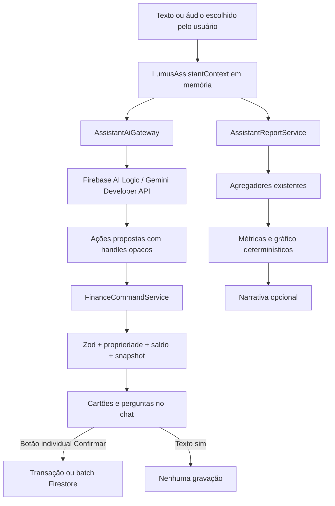

# Assistente Lumus

Conversa financeira em português que transforma texto ou áudio em rascunhos estruturados, pergunta somente o que falta e apresenta um cartão de revisão para cada operação. O Firebase AI Logic interpreta a intenção; somente o código determinístico do Lumus valida e grava no Firestore.

## Como funciona

1. A rota protegida `/lumus-assistant` importa `LumusAssistantProvider` e sua tela diretamente, sem `React.lazy`/`Suspense`, para que o Native Stack abra a tela imediatamente. Enquanto preferências, Remote Config e disponibilidade são verificados, o hero e o painel da própria tela ficam visíveis com um estado interno de preparação; a IA e o compositor só são liberados ao fim dessa verificação. O gateway Android continua adiando apenas os imports do React Native Firebase até confirmar um runtime compatível e obter o token de App Check. A boundary local ficou restrita à recuperação de erro inesperado da tela, sem criar um gate de navegação. A sessão permanece em memória enquanto a rota estiver montada e o UID atual estiver autenticado.
2. No primeiro uso, o usuário precisa aceitar o aviso sobre envio de texto, áudio e contexto mínimo ao Gemini. O consentimento e a opção de leitura automática são persistidos por UID; mensagens, catálogos e rascunhos nunca são persistidos.
3. O aplicativo carrega somente documentos graváveis do UID atual e cria handles opacos com salt aleatório da sessão. Eles permanecem estáveis durante a conversa, mudam ao limpar/logout e nunca contêm o ID real. UID, e-mail, token e configuração Firebase também não entram no prompt.
4. O modelo pode chamar apenas `prepare_financial_actions` e `request_financial_report`. Nenhuma ferramenta fornecida ao modelo grava dados.
5. Propostas passam por schemas Zod por ação. Valores permanecem em centavos, datas civis usam `America/Sao_Paulo`, e campos ausentes viram perguntas interativas.
6. Quando vários rascunhos precisam do mesmo banco ou categoria, a pergunta oferece **Aplicar também aos semelhantes**.
   Uma resposta digitada ou transcrita no compositor também preenche a pergunta aberta quando houver correspondência local inequívoca; isso não consome uma chamada de IA.
   Rascunhos preparados pela mesma resposta aparecem em uma única entrada do chat, com um cartão visível por vez. A paginação numerada, a etapa atual e a contagem de ações concluídas ficam em uma faixa fixa **abaixo do histórico rolável e imediatamente acima do compositor**, seguindo a navegação numérica de [[Configurações]]. A faixa não aplica fundo próprio e herda a superfície do painel. O grupo avança um cartão acionável por vez, respeitando dependências; cartões futuros ficam desabilitados até que a etapa atual seja confirmada ou cancelada, e ações já concluídas podem ser reabertas para consulta. Uma confirmação concluída seleciona automaticamente o próximo cartão; falha ou resultado incerto mantém a etapa atual para correção ou nova conferência. Cancelar uma ação também cancela seus dependentes e encaminha para a próxima ação disponível. Perguntas obrigatórias selecionam sua ação e impedem a troca de página no grupo até a resposta. Cada cartão conserva seu `clientActionId`, estado, edição, dependências e confirmação individual. Nos estados editáveis, todos os campos aparecem como controles desde a abertura do cartão: texto/textarea, moeda ou número, data civil, horário e seletor de opção. Web usa campos Mantine com tema da tela; mobile usa Gluestack e os seletores nativos. Banco, categoria e demais referências exibem rótulos usando handles opacos; opções indisponíveis não aceitam texto livre. Alterações em texto, moeda e número são validadas ao sair do campo; antes de **Revisar e confirmar**, o cartão aguarda e valida todas as edições pendentes. A escolha de opções atualiza o rascunho assim que é feita. Essas edições chamam apenas `financeCommandService.updateDraft`; somente a confirmação individual grava a operação financeira. Com valores ocultos, campos monetários e taxas não revelam o conteúdo atual e permitem informar um substituto. Os campos do cartão não têm divisores horizontais; o espaçamento vertical separa os valores. Pedidos posteriores criam grupos separados, cada qual com sua linha de paginação. Campos de nome são respondidos individualmente para cada registro, sem aplicação em lote. Toda resposta selecionada ou reconhecida como válida no compositor atualiza o mesmo rascunho e seu cartão principal, que passa a exibir o campo preenchido. A pergunta concluída e a resposta digitada não viram mensagens separadas no histórico; a interface mantém somente a pergunta ativa, enquanto uma tentativa inválida continua visível com seu aviso. Depois da última resposta, o grupo de cartões passa ao fim do histórico para revisão e confirmação individual, sem acumular as perguntas concluídas. A ordenação visual não duplica mensagens nem altera IDs ou a execução financeira.
   A faixa lista somente grupos com ações em aberto, inclusive as que aguardam correção ou confirmação. Quando todas as ações de um grupo terminam como concluídas ou canceladas, sua paginação some; grupos de novos pedidos continuam aparecendo enquanto tiverem ações pendentes.
   Enquanto qualquer grupo paginado estiver aberto, o compositor de comandos fica desabilitado em Web e mobile, incluindo envio por texto/voz e sugestões. Os inputs do cartão/pergunta ativa continuam habilitados para preencher os campos solicitados. O envio também confere esse bloqueio antes de encaminhar um comando.
   O cabeçalho não desenha divisor inferior e a faixa de paginação não desenha divisor superior, deixando o histórico rolável integrado visualmente ao restante do chat. O indicador vertical de rolagem fica oculto em Web e mobile; a área continua rolável.
7. Cada cartão passa por `ready → confirming → executing`. **Revisar e confirmar** só aparece depois que os campos obrigatórios do cartão foram preenchidos; **Confirmar agora** executa somente o próprio cartão. A mudança para `confirming` atualiza imediatamente a referência da sessão usada pela execução, inclusive se o usuário tocar rapidamente nos dois botões. Uma mensagem ou áudio dizendo “sim” nunca executa.
8. Edições, exclusões e desfazimentos guardam fingerprint do documento. O serviço lê novamente o registro antes do commit e marca o cartão como `stale` quando os dados mudaram.
9. IDs de documentos criados pelo assistente são derivados de `personId + clientActionId + operação`. O `clientActionId` é gerado pelo aplicativo para cada novo cartão, nunca reutilizado diretamente do rótulo proposto pelo modelo; referências `action:` e dependências da mesma resposta são remapeadas juntas. Isso permite dois pedidos em mensagens diferentes com o mesmo rótulo do modelo e mantém a repetição segura da confirmação de um cartão.
10. Notificações de recorrências são agendadas somente depois do commit financeiro. Falha local gera aviso sem reverter a escrita concluída.
   O aviso oferece nova tentativa que atua somente sobre a agenda local e nunca repete o commit financeiro.
11. O comando local “Limpar conversa” é interceptado antes da IA e apaga imediatamente a sessão em memória sem revogar o consentimento.
12. Quando a disponibilidade Android falha por App Check ou configuração, o aviso do chat oferece **Tentar novamente**. A ação `refreshAvailability()` mostra estado de verificação, força nova resolução de Remote Config e executa outro preflight; ela atualiza somente configuração/disponibilidade e não limpa consentimento, conversa nem a sessão financeira.
13. Em desenvolvimento, Auth, Firestore e Functions permanecem no projeto sintético `demo-lumus-financas` do Emulator Suite. Como AI Logic e Remote Config não possuem emuladores locais, somente AI Logic, App Check e Remote Config usam o app remoto `finances-app-e8685`, com App Check Debug. A tela identifica explicitamente esse modo híbrido; nenhum dado é lido ou gravado no Firestore remoto.
14. Pedidos de **pagar contas/gastos obrigatórios** ou **receber ganhos/receitas obrigatórios pendentes** abrem diretamente a pergunta local de seleção, sem depender de o modelo escolher entre relatório e ação. As opções vêm apenas do catálogo gravável da conta atual, com handles opacos; itens já concluídos no ciclo de `America/Sao_Paulo`, parcelas encerradas e itens de leitura relacionada são excluídos. O aplicativo prepara **um** rascunho com a data civil de hoje, pergunta qual obrigação e onde registrar, e mantém edição/revisão antes da confirmação. Pedidos explícitos de relatório continuam no fluxo de leitura. Selecionar a opção ou mudar de página não grava nada.

## Ações suportadas

| Área | Ações |
|---|---|
| Despesas e ganhos | criar, editar e excluir lançamentos não vinculados |
| Saldo mensal | criar ou atualizar por banco e ciclo `YYYY-MM` |
| Transferências | criar o registro e o par saída/entrada de forma atômica |
| Dinheiro | registrar e desfazer saque |
| Gastos obrigatórios | criar, editar, excluir, pagar ciclo e desfazer pagamento |
| Ganhos obrigatórios | criar, editar, excluir, receber ciclo e desfazer recebimento |
| Investimentos | criar, editar, excluir, aportar, resgatar, sincronizar e desfazer movimentos |
| CDI | registrar ou atualizar taxa por vigência |
| Bancos | criar com saldo inicial, editar e excluir conforme o comportamento atual |
| Categorias | criar, editar e excluir conforme o comportamento atual |

Transferências, lançamentos recorrentes vinculados e movimentos de investimento não entram na edição genérica. Criação de usuário, exclusão de conta e administração de relacionamentos não são ferramentas do assistente. Dados relacionados podem entrar nos agregadores de relatório, identificados como escopo de leitura, mas não entram no catálogo gravável.

## Voz e leitura

- `expo-audio` grava somente depois do toque, nunca em segundo plano, por no máximo 60 segundos e 20 MB.
- O arquivo temporário é transformado em base64 somente para a chamada de transcrição e apagado após transcrição, cancelamento, revogação, logout ou desmontagem da tela. Na desmontagem, a tela limpa somente timer, arquivo e modo de áudio: o `useAudioRecorder` já libera o `AudioRecorder`, portanto nenhuma operação assíncrona consulta ou interrompe esse objeto nativo depois disso.
- A transcrição aparece no compositor e pode ser editada antes do envio financeiro.
- `expo-speech` lê localmente em `pt-BR`. A leitura automática começa desligada e é persistida por UID.
- No modo de privacidade, valores são mascarados na tela e antes do TTS.
- O adaptador Android nativo exige development build porque Expo Go não contém os módulos React Native Firebase. A matriz oficial do [Firebase JavaScript SDK](https://firebase.google.com/docs/web/environments-js-sdk) não lista AI Logic como suportado em React Native, e a [documentação Expo Firebase](https://docs.expo.dev/guides/using-firebase/) confirma que React Native Firebase requer código nativo. Para testar a IA sem build no Android, `assistantPlatform.expoGo.ts` usa `fetch` no transporte Firebase AI Logic e o endpoint oficial de troca do App Check Debug. Esse caminho aceita somente `__DEV__` com `EXPO_PUBLIC_FIREBASE_TARGET=emulator`; Auth, Firestore e Functions continuam no Emulator Suite.
- O Expo Go exige um token App Check Debug registrado para o app Web de desenvolvimento. `app.config.ts` só copia esse valor para `expo.extra` em execução/build de desenvolvimento com alvo Emulator; os adapters leem essa configuração em vez de embutir diretamente a variável no bundle. O token assinado é trocado em memória, enviado somente no cabeçalho App Check à Firebase AI Logic e nunca anexado ao prompt nem à sessão financeira. A ponte é de desenvolvimento, não é provider de atestação para distribuição.
- O Firebase Remote Config SDK não está disponível nesse runtime. Expo Go usa os defaults locais versionados para modelo e limites, portanto mudanças remotas do kill switch só chegam via Web ou app nativo com Remote Config; o aviso da tela informa essa limitação. `npm run start:expo-go` inicia Metro forçando a abertura no Expo Go.
- Expo Router, `expo-audio`, `expo-file-system` e `expo-speech` estão incluídos no Expo Go usado por este projeto. Provider e tela montam diretamente, sem avaliar RNFirebase no Expo Go; configuração ausente aparece como indisponibilidade dentro do painel, e a recovery boundary cobre falhas inesperadas sem derrubar Login, Home ou o Stack.
- O código do adapter também seleciona o caminho Expo Go em iOS quando roda dentro de um host StoreClient compatível. O projeto usa Expo SDK 57; a [documentação Expo](https://docs.expo.dev/troubleshooting/expo-go-version-mismatch/) informa que o Expo Go da App Store para iOS fica no SDK 54 e que SDK 55+ exige instalar um host Expo Go próprio. Por isso essa rota iOS não pode ser validada pela instalação comum da App Store nesta versão do SDK.

## Relatórios

`AssistantReportService` reutiliza `HomeFirebase`, `CategoryAnalysisFirebase`, `FinancialForecastFirebase` e as consultas de recorrências para produzir:

- visão mensal;
- maior ou menor despesa ou ganho de um mês;
- movimentos por banco ou dinheiro;
- pesquisa de transações;
- análise de categorias;
- previsão de fluxo;
- obrigações pendentes;
- carteira de investimentos.

Totais, séries e escolha de gráfico (`line`, `bar` ou `donut`) são sempre do aplicativo. O Gemini recebe um objeto compacto com as métricas já calculadas apenas para escrever uma explicação simples. Se a narrativa falhar, o cartão continua com métricas, gráfico e `deterministicSummary` local.
Na narrativa opcional de um relatório amplo, a pergunta original também é enviada ao modelo para que ele responda ao ponto pedido usando somente as métricas disponíveis; se elas não bastarem, a instrução exige que informe a limitação. Isso não muda os cálculos nem concede escrita ao modelo.

Perguntas pontuais como “qual foi meu maior/menor gasto este mês?” usam `largest_expense`, `smallest_expense`, `largest_gain` ou `smallest_gain`, não `monthly_overview`. O gateway confere palavras explícitas de maior/menor e gasto/ganho no pedido quando o modelo devolve uma consulta desse grupo ou um panorama genérico; se a escolha contradiz a pergunta inequívoca, ajusta somente o tipo de leitura. O serviço lê todos os lançamentos elegíveis do mês solicitado, até o instante atual quando o mês ainda está em curso, e responde diretamente no chat com nome, centavos formatados e data civil em `America/Sao_Paulo`. No legado, a consulta é limitada aos UIDs legíveis e exclui transferências e movimentos de investimento; no grupo migrado, usa somente os lançamentos `expense`/`income` do razão e ignora transferências. O retorno da ferramenta para o modelo confirma apenas a solicitação: o resumo calculado é apresentado diretamente pelo aplicativo, sem texto preliminar genérico, segunda narrativa ou envio de IDs reais ao modelo. A frase pontual fica em memória para exibição e leitura por voz, mas não entra nos turnos seguintes enviados ao modelo. Perguntas gerais sem necessidade de dados da conta podem receber resposta conversacional; nenhuma resposta textual confirma ou grava operações. Os relatórios amplos continuam em cartões quando solicitados.

## Acompanhamento do processamento

Durante `sendMessage`, o contexto mantém em memória somente a etapa observável atual e as etapas já concluídas: consulta dos dados necessários, interpretação do pedido pelo gateway, preparação determinística dos cartões, montagem do relatório e narrativa opcional. Web e mobile mostram esses estados com `AssistantActivityTrace`; a tela não recebe nem apresenta raciocínio privado do modelo. O histórico de progresso é apagado ao concluir/cancelar a chamada, trocar de usuário ou limpar a sessão e nunca é persistido. Os rótulos não contêm texto do pedido, valores financeiros, argumentos de ferramentas ou identificadores.

As etapas são atualizadas junto aos serviços que realmente as executam. Um erro mantém a mensagem de recuperação produzida pelo classificador existente; o indicador não substitui o diagnóstico nem afirma que a operação terminou.

## Limites e estados

- Entrada: 4.000 caracteres.
- Resposta: no máximo 20 ações.
- Loop de ferramentas: no máximo oito chamadas.
- Se uma resposta do modelo trouxer mais chamadas que o limite, o aplicativo rejeita as excedentes e devolve uma resposta para cada chamada recebida antes de encerrar o ciclo. Ao atingir o limite de ações, novas propostas são rejeitadas sem informar falsamente que viraram rascunhos.
- Contexto: resumo ativo e até 12 turnos recentes, em pares completos usuário/modelo. O pedido atual vai apenas em `sendText`, não é duplicado no histórico. Perguntas anteriores sem resposta textual do modelo, inclusive após respostas financeiras determinísticas excluídas por privacidade, não formam pares e não entram no próximo prompt. Isso preserva a alternância exigida pelo Firebase AI Logic quando comandos são enviados em sequência.
- Ritmo local: no máximo 10 chamadas por minuto por UID autenticado.
- Concorrência: uma chamada ativa por conversa.
- Estados: `draft → needs_input → ready → confirming → executing → succeeded | failed | cancelled | stale`.
- Erros de rede, App Check, autenticação, cota `429`, indisponibilidade `5xx`, requisição inválida `400`/`422` e resposta inválida viram mensagens sem detalhes internos. O SDK pode usar o código `fetch-error` para qualquer erro HTTP; status `400`/`429`/`5xx` não significa falta de internet. `ai/invalid-content` sugere limpar a conversa; erros genéricos de leitura ou interpretação pedem nova tentativa sem mencionar gravação financeira, que não ocorreu nesse fluxo. Somente um código Firebase que confirme token/sessão inválido, expirado, usuário desabilitado ou inexistente pede novo login; um `401`/`403` genérico, falha de App Check, integração nativa ou configuração pendente não é apresentado como sessão expirada.
- Quando a conversa falha por cota ou indisponibilidade do modelo escolhido no Remote Config, o gateway faz no máximo uma nova tentativa com `gemini-3.5-flash-lite`, modelo estável do nível gratuito com chamadas de função e entrada de áudio. Um aviso no histórico informa o uso da alternativa. Falhas de App Check, configuração, sessão, rede e pedido inválido não acionam essa tentativa. Não há troca de backend nem fallback pago.
- Uma resposta `404` que identifique o modelo ou a configuração de AI Logic recebe diagnóstico próprio. A mensagem de erro da conversa vem de `mapAssistantError()` no `catch` de `sendMessage()`. Em 2026-09-25, a frase “Sem conexão com o assistente” foi rastreada ao classificador de `fetch-error`: a versão anterior também a mostrava para respostas HTTP reais da IA.
- A confirmação financeira distingue `permission-denied` do resultado incerto de transporte: se as regras negam acesso, o cartão informa que não conseguiu acessar os registros e orienta conferir a conta, sem encerrar a sessão. O cliente não registra o pagamento nessa falha.
- Após um commit confirmado, o cartão é marcado como concluído antes da atualização do catálogo e dos cartões dependentes. Se essa atualização falhar, a operação concluída permanece visível e surge um aviso; não se repete a escrita financeira automaticamente. Uma falha de transporte durante o commit tem resultado incerto e pede conferência dos registros antes de tentar novamente.
- O comando de pagamento/recebimento lê o lançamento determinístico do `clientActionId` dentro da transação antes de atualizar o ciclo. Em um primeiro pagamento esse documento ainda não existe; `firestore.rules` permite somente a leitura unitária da ausência para usuário autenticado, mantendo a regra de proprietário nos documentos existentes e as restrições de escrita. Sem essa exceção, `resource.data.personId` negava o `BatchGetDocuments` antes da gravação. Se o mesmo cartão já gerou o lançamento, a repetição não incrementa parcelas nem cria outra movimentação. Outro cartão para um ciclo já concluído recebe erro de ciclo concluído; a verificação de snapshot continua protegendo alterações concorrentes.
- Respostas assíncronas de perguntas, edições, preparação de cartões e relatórios conferem a conta ativa antes de atualizar a sessão em memória. Conversas canceladas também conferem o sinal de aborto antes de publicar resultados; limpar a conversa ou trocar de usuário não restaura cartões de uma requisição antiga.

## Integração Firebase por plataforma

### Web

- `firebase/ai` com `GoogleAIBackend`.
- `firebase/app-check` inicializado com `ReCaptchaEnterpriseProvider` antes da primeira chamada de IA.
- A site key pública fica em `EXPO_PUBLIC_FIREBASE_APP_CHECK_RECAPTCHA_ENTERPRISE_KEY`; ela não é uma chave Gemini.
- No alvo Emulator Web, um app Firebase nomeado `LUMUS_ASSISTANT_DEVELOPMENT` usa os identificadores públicos do projeto remoto somente para AI Logic, App Check e Remote Config. No Expo Go, a configuração do mesmo app Web é usada apenas no transporte HTTP do AI Logic/App Check. O `app` primário e o `SECONDARY` continuam ligados ao Auth/Firestore/Functions locais.
- No alvo Emulator Web, o SDK ativa o App Check Debug inclusive no export local em modo production, gera um token quando nenhum foi fornecido e mantém o assistente indisponível até conseguir emitir um token válido. O token deve ser cadastrado no Console e nunca versionado; os scripts de deploy Web limpam esse token antes do export remoto.
- `firebase@12.19.0` incorpora `@firebase/ai@2.16.0` no import `firebase/ai`. Essa versão envia `functionResponse` como conteúdo `user`, aceito pelos modelos Gemini 3.x. A versão anterior emitia `role: function`, rejeitado pelo serviço com HTTP `400`. O adaptador mantém o `id` da chamada ao devolver o resultado da ferramenta.

### Android

- `@react-native-firebase/ai`, `app-check` e `remote-config` em versões alinhadas.
- App Check usa `debug` somente em desenvolvimento/preview e Play Integrity em produção. `EXPO_PUBLIC_FIREBASE_APP_CHECK_ANDROID_PROVIDER` explicita o provider do perfil; o token de debug é fornecido separadamente e cadastrado no console.
- Auth e Firestore existentes continuam no Firebase JS. O adaptador nativo expõe ao SDK de IA apenas uma fachada com `getIdToken()` do usuário atual.
- No alvo Emulator, o app continua exigindo um usuário autenticado localmente, mas não envia o ID token de `demo-lumus-financas` ao AI Logic de `finances-app-e8685`. A chamada remota é atestada pelo App Check Debug; em preview/produção, a fachada de Auth volta a acompanhar a chamada normalmente.
- `google-services.json` fica fora do Git e entra localmente ou por `GOOGLE_SERVICES_JSON` no EAS. Todo build EAS Android (`development`, `preview`, `production` e `production-apk`) falha cedo sem esse arquivo; assim, não é possível instalar um client EAS que abra o app sem conter os módulos nativos da IA. Fora do EAS, o plugin `@react-native-firebase/app` continua condicional para que Expo Go e o app-base preservem o diagnóstico de indisponibilidade.
- A disponibilidade nativa só fica positiva depois de inicializar o App Check e obter um token string não vazio. Falhas nesse preflight mantêm o restante do aplicativo e a sessão financeira disponíveis e mostram o diagnóstico de App Check/configuração no painel do assistente; o usuário pode disparar novo preflight pelo botão **Tentar novamente**.
- `@react-native-firebase/ai@25.1.0` ainda atribui `role: function` a `chat.sendMessage(functionResponse)`. O adaptador Android usa `generateContent` com histórico local da conversa e devolve a ferramenta em um conteúdo `user`, preservando `id` e as partes originais da resposta do modelo. O resultado continua sendo apenas uma proposta; nenhum comando financeiro é executado nesse adaptador. A correção nativa exige gerar e instalar um novo development client para validação em aparelho.

### Remote Config

| Chave | Padrão | Limite local |
|---|---:|---:|
| `lumus_ai_enabled` | `true` | kill switch |
| `lumus_ai_model` | `gemini-3.8-flash` | aceita a versão estável principal e `gemini-3.5-flash-lite`; rejeita outros nomes não validados, preview/experimental/`-latest` e modalidades não conversacionais |
| `lumus_ai_max_context_turns` | `12` | 2–12 |
| `lumus_ai_max_actions` | `20` | 1–20 |
| `lumus_ai_max_tool_calls` | `8` | 1–8 |
| `lumus_ai_max_requests_per_minute` | `10` | 1–10 |

Falha ao buscar ou inicializar Remote Config usa padrões seguros locais. Um valor de kill switch já ativado continua prevalecendo quando o fetch falha. No plano Spark não existe fallback pago; a única alternativa local em erro de cota/indisponibilidade é o modelo gratuito documentado acima.

Expo Go não consegue inicializar o SDK de Remote Config e usa os defaults locais acima, mantendo `remoteConfigLoaded=false`. O kill switch remoto não é observado nesse runtime; rode Web ou um development build nativo para receber valores remotos. O caminho Expo Go só é habilitado em desenvolvimento com alvo Emulator.

O arquivo `remote_config.json` foi publicado em 2026-09-21 como versão 1 no projeto `finances-app-e8685`. O mesmo modelo está no fallback Web/Android. A configuração de geração mantém somente `maxOutputTokens` (e `responseMimeType` na transcrição), pois os parâmetros amostrais antigos foram removidos para compatibilidade com Gemini 3.x.
Esse registro de publicação é histórico. Em 2026-09-25, a CLI leu o template remoto ativo sem alterá-lo e confirmou `lumus_ai_enabled=true` e `lumus_ai_model=gemini-3.8-flash`; não havia condições no template. Uma sonda sem dados pessoais confirmou troca do token App Check Debug (`200`), pedido simples ao modelo principal (`200`), sobrecarga no pedido com prompt e ferramentas reais (`500`), cota em uma tentativa posterior (`429`) e ciclo de chamada de função com `gemini-3.5-flash-lite` (`200` na primeira resposta e na continuação com `role: user`). A continuação com `role: function` foi rejeitada com `400`. Essas sondas não substituem um teste de ponta a ponta autenticado no navegador ou em aparelho.

## Consentimento e proteção de dados

- O aviso informa que não há escuta em segundo plano, o áudio é temporário e a conversa não vai para o Firestore.
- Também informa que, no nível gratuito da Gemini Developer API, o Google pode usar conteúdo enviado para melhorar produtos; a opção contrária pertence ao nível pago.
- Revogar consentimento aborta a chamada ativa, limpa mensagens/rascunhos/catálogo, interrompe TTS e manda a tela apagar gravações temporárias.
- Troca de UID e logout limpam toda a sessão em memória.
- App Check deve ter enforcement somente para Firebase AI Logic nesta entrega. Firestore Android continua no SDK JS e não deve receber enforcement até sua migração/auditoria.

## Arquivos principais

- `screens/mobile/LumusAssistantScreen.tsx`, `screens/web/LumusAssistantScreen.web.tsx` e os adaptadores em `app/*/lumus-assistant.tsx` — composições próprias por plataforma com montagem direta; o hero Web replica as camadas explícitas do cadastro de despesas, e o painel informa a preparação assíncrona sem bloquear a navegação.
- `design-system/assistant.ts` — contrato visual compartilhado de superfícies, compositor, estados, cards e ações do assistente.
- `components/uiverse/assistant/assistant-composer-frame.*.tsx` — envolve o compositor com o feixe amarelo/dourado enquanto o campo está em foco; Web usa `border-beam`, e Android/iOS desenham o feixe com SVG + Reanimated já instalados.
- `components/uiverse/assistant/assistant-draft-pages.tsx` — páginas numeradas dos cartões da mesma resposta, sem alterar o fluxo de execução.
- `components/uiverse/assistant/assistant-route-boundary.tsx` — recuperação para erro inesperado de renderização, sem loading normal da rota.
- `components/uiverse/assistant/assistant-activity-trace.tsx` — acompanhamento acessível das etapas observáveis de envio, compartilhado entre Web e mobile; não exibe raciocínio privado.
- `contexts/LumusAssistantContext.tsx` — sessão, consentimento, perguntas, confirmação, TTS e `refreshAvailability()` para repetir a resolução de Remote Config/preflight sem descartar a conversa.
- `components/mobile/assistant/assistant-cards.native.tsx` / `components/web/assistant/assistant-cards.web.tsx` — perguntas, revisão e relatórios; os gráficos usam gifted-charts no mobile e Mantine no navegador, mantendo o mesmo contrato de dados e privacidade.
- `services/lumusAssistant/assistantPlatform.web.ts` / `.native.ts` — Firebase AI, App Check e Remote Config.
- `services/lumusAssistant/assistantGatewayCore.ts` — limites, exclusão mútua e loop de function calling.
- `services/lumusAssistant/assistantCatalogService.ts` — handles opacos e fingerprints.
- `utils/lumusAssistant.ts` — reconhecimento local dos pedidos amplos de pagar/receber obrigações pendentes; não interpreta outros comandos financeiros.
- `services/lumusAssistant/financeCommandService.ts` — validação/autorização e execução financeira.
- `services/lumusAssistant/assistantReportService.ts` — relatórios determinísticos.
- `utils/lumusAssistantSchemas.ts`, `utils/lumusAssistant.ts` e `types/lumusAssistant.ts` — contratos de domínio.
- `utils/lumusAssistantErrors.ts` — classificação estruturada de falhas de sessão, App Check, configuração e disponibilidade antes da mensagem exibida no chat.
- `utils/lumusAssistantAppCheck.ts` — preflight isolado que aceita somente token string não vazio do provider, sem expô-lo ao estado da interface.
- `utils/lumusAssistantLayout.ts` — calcula a altura do hero e a sobreposição do painel para o viewport regular ou compactado pelo teclado Android.
- `utils/lumusAssistantAudio.ts` e `utils/assistantPreferencesStorage.ts` — áudio temporário e preferências.
- `app.config.ts` — plugin `expo-audio` e ativação condicional do plugin React Native Firebase conforme a presença de `google-services.json`; qualquer perfil EAS Android falha cedo sem `GOOGLE_SERVICES_JSON`, evitando development clients, APKs de preview ou AABs sem a IA nativa. `expo-asset` permanece dependência peer direta de `expo-audio`.
- `app.json` — declara `android.softwareKeyboardLayoutMode: "resize"` para que o teclado Android redimensione a janela do chat.

## Layout da tela

- As composições mobile e Web mantêm a identidade das telas do Lumus: título **Lumus IA** e ilustração própria sobre o wallpaper amarelo, com a conversa em um painel arredondado logo abaixo. Na Web, o hero replica a estrutura de `AddRegisterExpensesScreen.web.tsx`: wrapper relativo de largura `w-screen`, imagem `RNImage` absoluta com dimensões explícitas, `Grainient` animado sobre ela, `StrokeText` e `AnimatedContent`. Manter cada camada dimensionada dentro do wrapper evita que o fundo do shell fique exposto ao lado do wallpaper. A tela Web possui arquivo e composição próprios, preservando adaptação e controles específicos sem perder esse padrão visual.
- O aviso de consentimento, o histórico do chat e o compositor permanecem no painel; a ilustração não é repetida na área inicial da conversa. As sugestões rápidas abrem em um modal pelo botão de lâmpada ao lado de **Limpar conversa**, sem ocupar a lateral que fica sob a navegação Web. O botão de configurações abre um `Drawer` à direita, sem inserir conteúdo no histórico.
- Os exemplos de perguntas ficam em um `Modal` aberto pelo botão de lâmpada entre limpar conversa e configurações. O estado vazio permanece compacto; escolher um exemplo fecha o modal e envia o texto pelo mesmo fluxo do compositor.
- O layout reutiliza `useScreenStyles()` para insets e superfícies adaptadas ao tema, mantendo o padrão de [[Componentes UI]] e [[Sistema de Temas]]. O hero mede sua altura real com `onLayout` e reduz sua área de sobreposição quando a janela Android é redimensionada.
- O acesso fica no menu do botão **Home** do `navigator.tsx` enquanto **Lumus IA** estiver visível neste aparelho. O switch em [[Visibilidade de Rotas]] pode ocultá-lo; nesse estado o `Stack.Protected` também bloqueia `/lumus-assistant` por deep link ou navegação programática.
- A conversa usa as primitivas compostas `Conversation`, `ConversationContent`, `ConversationEmptyState`, `Message` e `PromptInput` de `components/ui/chatAi`, adaptadas do Chat AI do Gluestack à versão estável usada pelo app. Mensagens e cartões financeiros continuam sob controle do Lumus; o componente não cria persistência nem executa ações.
- As mensagens enviadas pela pessoa usam o amarelo semântico `lumus-accent` (e sua variante escura `lumus-accent-dark`) no balão, com texto `lumus-on-accent` para manter contraste; Web e mobile consomem o mesmo contrato em `design-system/assistant.ts`.
- No mobile, `PromptInputTextarea` usa `Input` e `InputField` do Gluestack; na Web, o compositor usa `Textarea` do Mantine dentro de um `MantineProvider` com o tema da tela. O foco amarelo aparece somente no campo Web, não na superfície externa do compositor. O texto digitado mantém o contraste do tema; o placeholder Web usa `#5A6A7F` em ambos os temas via token `textPlaceholder` e variável CSS do Mantine. Enter envia a mensagem; Shift+Enter insere uma nova linha na Web, e a tecla de envio do teclado mobile aciona o mesmo fluxo do botão. O campo mantém valor controlado, limite de caracteres e crescimento até quatro linhas; na Web, `flex-1 min-w-0` faz a textarea ocupar o espaço restante entre os botões. A moldura usa `w-full` e permanece centralizada com limite máximo de largura, preenchendo o dock sem encolher ao conteúdo. O dock não desenha uma borda superior entre o histórico e o input. O compositor fica fixo no rodapé do painel, imediatamente acima do `navigator.tsx`; somente o histórico é rolável. No Android, `softwareKeyboardLayoutMode: "resize"` redimensiona a janela nativamente, sem um segundo `KeyboardAvoidingView`; no iOS, o `KeyboardAvoidingView` preserva o comportamento equivalente. O compositor e o navigator permanecem no fluxo inferior redimensionado, sem cobrir o texto digitado.
- Quando a disponibilidade estiver pendente no Android ou Web, o aviso no histórico mantém o diagnóstico e oferece **Tentar novamente**. O botão fica desabilitado e mostra **Verificando…** durante `isRefreshingAvailability`, evitando tentativas concorrentes.
- No alvo Emulator, um card informativo diferencia os serviços financeiros locais dos três serviços remotos necessários à IA, evitando que o modo híbrido seja confundido com leitura ou escrita em produção.
- O compositor usa uma única superfície agrupada, com foco visível no contêiner e controles de microfone/envio de pelo menos 44px (`h-touch`/`w-touch`). O feixe dourado é ativado somente enquanto a caixa de texto está focada e fica parado quando `prefers-reduced-motion`/redução nativa de movimento está habilitada. `assistant-composer-frame.web.tsx` usa o pacote React `border-beam@1.4.1`; como esse pacote publicado exige DOM, `assistant-composer-frame.native.tsx` fornece o feixe móvel usando apenas `react-native-svg` e Reanimated já presentes no app. A composição mobile mantém `useScreenStyles()` apenas como fachada legada para tema, hero, insets e APIs nativas; o novo Web importa os contratos de `design-system/assistant.ts` diretamente e não cria outro consumidor do hook.
- Cards de pergunta, rascunho, relatório e mensagens usam o mesmo contrato semântico de superfícies, raios, texto, foco, estados e ações. A ação amarela usa o foreground escuro `lumus-on-accent`; gráficos continuam como exceção resolvida por Mantine no Web e gifted-charts no mobile.
- O `Drawer` de configurações usa o `Switch` padrão de `components/ui/switch` para a leitura automática; suas cores vêm de `useScreenStyles()` e o ícone de informação abre um `Popover` com a explicação da leitura local. A revogação ocupa um card próprio com ação destrutiva à direita, fecha o drawer e preserva o fluxo existente de abortar a chamada, limpar a sessão e interromper o TTS.
- Ao abrir a rota, o hero e o painel aparecem antes da consulta de preferências, Remote Config e disponibilidade. O estado **Preparando o Lumus IA** é interno ao painel; ele não substitui a tela inteira nem deixa a navegação em `Suspense`.

## Testes

- `tests/lumusAssistant.test.ts` cobre centavos, datas fixas em São Paulo, Zod, campos ausentes, dependências, handles por sessão, estados, privacidade, limites, erros — incluindo a diferença entre sessão realmente inválida e App Check/configuração — e o cenário de 18/19 de julho de 2026.
- `tests/lumusAssistantGateway.test.ts` cobre limites do Remote Config, validação/fallback de modelos, resumo ativo + 12 turnos, 20 ações, chamada exclusiva, cota por UID, ponte de token Auth, seleção Debug/Play Integrity e narrativa sanitizada.
- `tests/lumusAssistantTargetedReport.test.ts` cobre a maior despesa além dos seis movimentos da Home, exclusão de transferências e investimento, ganho, razão migrado, mês vazio e limites civis do mês em São Paulo; todas as leituras são simuladas sem escrita financeira.
- Os testes de gateway e protocolo Web reproduzem a falha de histórico com dois turnos `user` consecutivos no SDK instalado e verificam que uma nova pergunta usa apenas pares completos. As consultas de menor despesa/ganho e a correção de uma ferramenta `largest_expense` para um pedido explícito de menor gasto também são cobertas.
- `tests/lumusAssistantFirebaseProtocol.test.ts` usa o SDK Web real com transporte simulado para fixar `role: user` no retorno da função; `tests/lumusAssistantNativeProtocol.test.ts` verifica o histórico e o mesmo protocolo no adaptador Android com módulos isolados.
- `tests/lumusAssistantPreparation.test.ts` cobre IDs locais distintos entre mensagens, remapeamento de dependências e referência desconhecida convertida em pergunta.
- `tests/lumusAssistantCommand.test.ts` usa Firestore isolado em memória para comprovar que confirmar o mesmo cartão duas vezes escreve uma vez e que um pedido posterior com o mesmo rótulo do modelo escreve um segundo documento.
- `tests/lumusAssistantWebPlatform.test.ts` cobre App Check ausente/configurado, autenticação obrigatória, Remote Config carregado ou indisponível, modelo legado, ordem App Check→AI, resposta válida e function calling devolvido apenas como rascunho.
- O mesmo teste Web cobre o app dedicado da ponte híbrida e confirma que a instância de AI Logic usa `finances-app-e8685` enquanto a configuração financeira principal permanece fora desse adaptador.
- `tests/lumusAssistantNativePlatform.test.ts` garante que o Expo Go não avalie `RNFBAppModule` durante o bootstrap e encaminhe as chamadas para o adaptador JavaScript; `tests/lumusAssistantExpoGoAdapter.test.ts` verifica o preflight App Check, histórico, chamadas de função, continuidade do modelo e bloqueio fora do ambiente local.
- `tests/lumusAssistantAppCheck.test.ts` cobre o preflight do App Check: disponibilidade somente quando o provider emite token string não vazio e bloqueio para falha, token vazio, ausente ou inválido.
- `tests/lumusAssistantLayout.test.ts` cobre o hero regular, a compactação quando o teclado reduz o viewport e a geometria segura para alturas muito pequenas.
- `tests/assistantRouteBootstrap.test.ts` garante que provider e tela sejam montados diretamente, sem `React.lazy`/`Suspense` na entrada da rota.
- `tests/appConfigFirebase.test.ts` garante que todos os perfis EAS Android sejam recusados sem `GOOGLE_SERVICES_JSON`, usem seus ambientes EAS esperados e habilitem o plugin Firebase quando o arquivo estiver provisionado.

## Configuração externa obrigatória

1. Os apps Web e Android já foram confirmados no projeto `finances-app-e8685`, e o `google-services.json` local corresponde ao package Android. É obrigatório manter `GOOGLE_SERVICES_JSON` como variável de arquivo nos ambientes EAS `development`, `preview` e `production` antes dos builds usados no smoke test; a EAS CLI não estava autenticada nesta auditoria.
2. Para testar no Expo Go, executar `npm run start:expo-go`, escanear o QR pelo Expo Go compatível, entrar com uma conta do Emulator e usar **Tentar novamente**. O comando inicia a Suite local, semeia a conta de teste e força `expo start --go --lan`. Configure os identificadores públicos e o token App Check Debug local; confirme que o token está cadastrado no app Web do projeto remoto. Não é preciso gerar development build para a IA de texto/voz em Android Expo Go. Com SDK 57, iOS precisa de um host Expo Go instalado por TestFlight/EAS Go ou de outro client compatível.
3. Play Integrity está registrado; ainda confirmar o SHA-256 e os tokens de debug usados por builds development/preview.
4. reCAPTCHA Enterprise está registrado; ainda confirmar a site key e os domínios Web permitidos, pois a lista de domínios do Authentication não carregou no Console.
5. Firebase AI Logic está ativo com Gemini Developer API no plano Spark; Agent Platform permanece desativada. O código exige usuário autenticado antes de criar o modelo, mas o modo global **usuários autenticados** do AI Logic não está aplicado. Se esse modo for habilitado, o fluxo híbrido deverá receber uma estratégia explícita de Auth do projeto remoto em vez do token do Emulator.
6. Remote Config publicado como versão 1 em 2026-09-21; preservar `remote_config.json` como fonte versionada do template.
7. App Check aparece como **Registrado (aplicado)** para Web e Android no AI Logic; Firestore permanece sem enforcement nesta etapa.
8. Auditar e implantar regras Firestore que limitem escrita ao proprietário.

## Observações importantes

- Nada fica executando continuamente: existe chamada somente ao enviar texto/áudio ou pedir narrativa.
- A central opcional **Testes do aplicativo** consulta somente `getAvailability()` e `getConfig(true)` para diagnosticar App Check e Remote Config. Ela não cria chat, não envia prompt ou contexto financeiro ao Gemini e não altera o Firestore.
- A confirmação é individual e sequencial; não existe **Confirmar tudo**. Uma falha mantém o cartão atual selecionado e não libera ações futuras.
- O assistente não substitui regras Firestore nem deve ser tratado como fronteira de autorização.
- A narrativa não é recomendação financeira e nunca substitui as métricas calculadas pelo Lumus.
