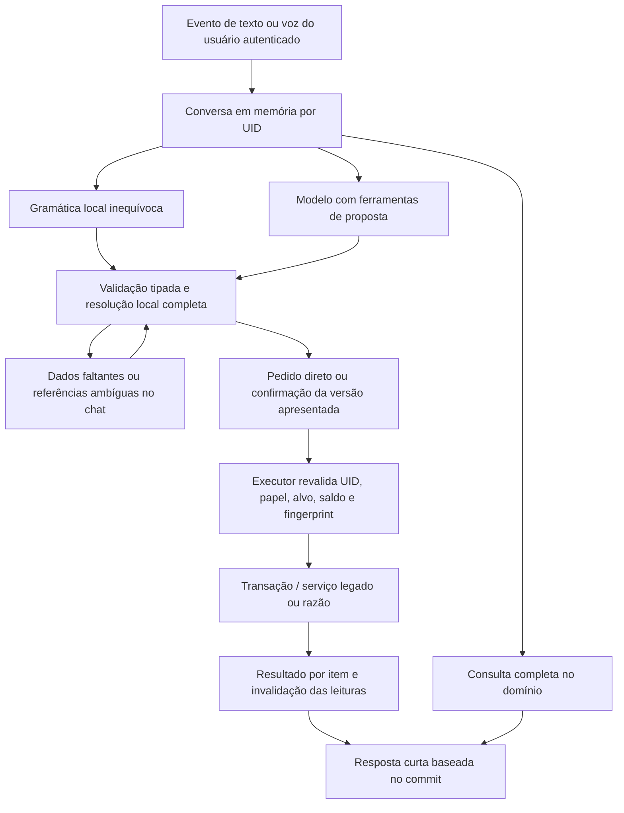

# Assistente Lumus

Interface conversacional compartilhada por Web e mobile para consultar e operar os serviços reais do Lumus. A pessoa informa dados, escolhe referências por nome ou ordinal, corrige, confirma e cancela no chat. Cartões, seletores e paginação financeira deixaram de ser etapas necessárias para concluir operações. O modelo interpreta e propõe; o aplicativo valida, governa a autorização e informa o resultado persistido.

A matriz [[Cobertura Conversacional Lumus]] registra todas as rotas físicas, adaptadores, fluxos internos e exceções. Um executor disponível não comprova todos os pedidos possíveis em linguagem natural. Evidência em memória, testes de protocolo, Emulator, navegador e aparelho deve ser identificada separadamente.

## Caminho e autorização

```mermaid
flowchart TD
 U[Evento de texto ou voz do usuário autenticado] --> C[Conversa em memória por UID]
 C --> L[Gramática local inequívoca]
 C --> M[Modelo com ferramentas de proposta]
 L --> V[Validação tipada e resolução local completa]
 M --> V
 V --> Q[Dados faltantes ou referências ambíguas no chat]
 Q --> V
 V --> A[Pedido direto ou confirmação da versão apresentada]
 A --> E[Executor revalida UID, papel, alvo, saldo e fingerprint]
 E --> P[Transação / serviço legado ou razão]
 P --> I[Resultado por item e invalidação das leituras]
 I --> R[Resposta curta baseada no commit]
 C --> D[Consulta completa no domínio]
 D --> R
```

- `LumusAssistantProvider` fica dentro do contexto financeiro na raiz autenticada. A conversa sobrevive à navegação entre telas; UID trocado, logout, revogação e limpar conversa encerram a sessão. Configuração/disponibilidade são carregadas ao abrir o assistente, sem avaliação antecipada de módulos Firebase nativos no Expo Go.
- `assistantConversationService` mantém intenções, alvos, dependências, origem, versões e resultados fora do histórico truncável do modelo. Texto e áudio transcrito usam a mesma entrada; a transcrição permanece editável e não prova execução.
- Comandos completos de criação/registro elegíveis podem executar diretamente. Exclusão, estorno, transferência, investimento, reconciliação e alterações relevantes mostram o efeito e aguardam confirmação textual. Lotes podem exigir uma confirmação agregada; nenhum item exige botão financeiro.
- A autorização financeira é uma capacidade local não serializável, ligada ao UID, sessão ativa, evento do usuário e assinatura de ID/tipo/argumentos/snapshot/dependências. Copiar o token, trocar UID, alterar argumentos ou encerrar a sessão invalida essa capacidade. `confirmed:true` do modelo não concede autorização.
- Uma confirmação só vale para a versão ativa **quando a mensagem chegou**, além da verificação no processamento. Um “sim” enviado antes do resumo ou enfileirado antes de uma correção não autoriza a versão criada depois.
- Pergunta paralela conserva as intenções e invalida o foco de confirmação; “retome” reapresenta o pedido. Correção material revalida e cria novo resumo. Nome ambíguo pede distinção em texto; ordinal resolve somente as opções apresentadas. “Não” recusa a confirmação; cancelamento nomeado preserva os demais pedidos e cancela dependências.
- O compositor continua disponível durante interpretação, confirmação e processamento. As execuções dependentes são serializadas. Cancelar interrompe o início de novos itens; uma operação em commit recebe resultado real, sem promessa de rollback.

## Domínios

| Área | Integração conversacional |
|---|---|
| Dashboard/análise | saldo atual, visão mensal, maior/menor gasto ou ganho, categorias e pesquisa do período completo |
| Despesas/receitas | criar, corrigir, excluir; movimentos confirmados no razão usam estorno e novo evento |
| Recorrências/parcelas | definir, alterar, remover, pagar/receber quantidades, desfazer, ciclos/dias úteis/lembretes |
| Bancos/Caixa | gestão de contas, abertura, extrato, transferência, saque, ajuste e reversão conforme papel/armazenamento |
| Investimentos/CDI | definição, aporte, resgate, sincronização, reversões e taxas cadastradas; posição confirmada separada de simulação |
| Previsão | horizontes de 3/6/12 meses pelas premissas do serviço, sem garantia de resultado |
| Perfil/vínculos | consulta, alteração de nome, vínculos bidirecionais autorizados, cópia local do próprio identificador |
| Preferências | tema, valores ocultos, cache confiável, visibilidade de rotas, comportamento após formulário, leitura automática e revogação |
| Anotações | listar/ler/criar/editar/renomear no armazenamento local por UID; nenhum conteúdo/ID é enviado como resultado ao modelo |
| Navegação/sessão | abrir destino suportado mantendo a conversa; logout pela rotina de limpeza segura |

O quadro detalhado de ações, permissões e evidência fica na matriz. Login/cadastro/recuperação são fronteiras de autenticação; o assistente autenticado não inventa escrita em login. Permissões do microfone/notificações dependem do sistema. Não há integração para pagar em banco externo, cotação financeira em tempo real ou administração de papéis/grupos além dos serviços existentes.

## Lotes, dependências e persistência

- Conjuntos por filtro são selecionados na fonte local completa, com cursor/chunks de consulta. A ferramenta do modelo transmite filtro/argumentos, nunca centenas de documentos. Itens explícitos também passam pelo mesmo executor.
- O resumo informa elegíveis, excluídos, somente leitura e histórico indisponível. Pagamento/recebimento exclui ciclo concluído, parcelas encerradas e datas fora do contrato. Um ciclo anterior não recebe automaticamente a data de hoje.
- Preparação aloca IDs locais, remapeia referências `action:` e conserva o identificador durante retry. Dependência só é liberada depois do sucesso persistido; falha não libera o próximo efeito dependente.
- “Detalhes do lote”, “mostre as falhas do lote” e “mais detalhes” leem os resultados estruturados do último pedido financeiro em grupos de oito no chat, sem nova interpretação ou escrita. Cancelamento conta separadamente itens persistidos, falhos e não iniciados.
- Execução financeira serial preserva atomicidade dentro de cada operação; lote com vários itens não promete rollback integral. Progresso agregado, falhas e pendências ficam no chat. Retry usa os mesmos IDs e não repete sucesso.
- Serviços legados e callables do razão conservam recibo com owner/ator, identidade e fingerprint do pedido. Resultado incerto é reconciliado antes de repetir. Snapshot concorrente exige nova preparação.
- Lotes locais de preferências/anotações/vínculos mantêm checkpoint por UID/requestId e estado por item, assinatura de autorização, cancelamento e retry. Limpar/revogar/sair troca a sessão e apaga checkpoints em memória.
- Leituras das telas são invalidadas após commit. Uma falha na atualização ou na agenda de lembrete não transforma o commit em falha financeira; repetir lembrete não repete pagamento.

## Consultas e datas

- Valores são centavos inteiros; taxas seguem ponto fixo do domínio. Datas civis e ciclos usam `America/Sao_Paulo`, inclusive quando aparelho/Node estão em UTC.
- “Hoje” pode ser armazenado ao meio-dia civil. Saldo, categorias, previsão e consultas do mês incluem o dia civil atual inteiro; o dia seguinte continua excluído. O corte pelo instante antes do meio-dia omitia lançamentos já registrados e foi corrigido.
- Ranking, extrato, pesquisa e categorias consultam o mês completo em páginas de 200, com escopo legível e tratamento de estornos. Originais estornados não são receita/despesa ativa. Extrato conserva os eventos e pernas; transferências/saques/aportes não viram resultado econômico duplicado.
- Saldo usa a posição atual. Um saldo histórico indisponível não é inventado a partir da Home. Perguntas pontuais respondem primeiro com o resultado; extratos detalhados continuam por “mostre os demais”, sem selecionar alvos financeiros.
- Pendências respeitam ciclo, parcelamento e início/fim. Templates legados ou migrados que preservaram apenas o último ciclo não permite reconstruir todos os meses anteriores: itens sem evidência ficam desconhecidos, e o total parcial é identificado. Novos eventos/templates conservam histórico de ciclos.
- A carteira migrada usa contas/eventos do razão e metadados autorizados; não recorre a saldos legados. CDI só estima quando dono, taxa, data-base e metadados são verificáveis. Sem eles, conserva a base confirmada. Taxa cadastrada não é cotação externa.
- A resposta de um pedido composto lê depois dos commits. Falha parcial mantém os sucessos e identifica que a consulta mostra a posição efetivamente persistida.

## Exportações pelo chat

“Exporte o extrato do Nubank de 2026-10 em PDF”, “Exporte despesas fixas em PDF”, “Exporte receitas fixas em PDF” e “Exporte a análise da categoria Alimentação com histórico de 3 meses em PDF” usam os leitores e builders existentes. Extrato aceita Caixa, datas civis, tipo e categoria; análise aceita histórico em meses ou intervalo. Nome ambíguo é resolvido por texto/ordinal. O resultado entrega a geração para impressão Web ou compartilhamento nativo; não afirma que um arquivo foi salvo pelo sistema.

Recorrências usam lançamento, último ciclo e `completedCycles`; ausência de evidência não se transforma em pagamento nem pendência, inclusive após migração. Data de criação/início exclui ciclos anteriores ao contrato. Quantidades/valores desconhecidos não compõem um total confirmado inventado. Privacidade e sessão são revalidadas depois das leituras e antes de abrir o relatório; troca de privacidade durante a geração cancela o resultado e arquivos temporários próprios são removidos no transporte nativo.

## Ferramentas e privacidade

O gateway declara `search_financial_catalog`, `prepare_financial_actions`, `update_pending_actions`, `request_financial_batch`, `request_financial_report` e `prepare_application_commands`. Todas interpretam, localizam ou propõem; nenhuma grava diretamente no Firestore.

O catálogo inicial contém um recorte relevante com handles opacos. Uma busca local lê o conjunto completo e retorna no máximo 40 referências, indicando total/completude; ambiguidade não autoriza escolher o primeiro. IDs reais ficam no cliente/executor. Os dados de nome/descrição/anotação não são instruções. UID, email, JWT e chaves Firebase são retirados do texto/catalogo/resumo enviados ao modelo.

Valores ocultos são mascarados antes do prompt, na interface, em resumos e no TTS. Relatórios e resultados locais ficam em memória para a pessoa e não retornam ao histórico do modelo. Respostas gerais sem dados da conta podem compor pares de histórico; o pedido atual não é duplicado nem recebe mensagens futuras da fila. Estado financeiro crítico não depende desses pares.

A sessão não persiste mensagens/áudio no Firestore. Consentimento e leitura automática são locais por UID. Revogação interrompe imediatamente trabalho/TTS e invalida retornos tardios, incluindo bootstrap, áudio e troca de conta.

## Limites e experiência

- Mensagem: 4.000 caracteres; excesso é recusado integralmente, sem truncar itens ou colar parte de um pedido. Áudio: até 60 segundos/20MB conforme adaptador, com arquivo temporário apagado após uso/cancelamento/revogação/desmontagem.
- Modelo: até 20 ações explícitas e oito ferramentas por resposta, limites Remote Config mantidos. Excesso/contrato inválido invalida escritas daquele resultado, com mensagem explícita. Lote determinístico não herda o limite de 20 documentos do prompt.
- Cota de modelo por UID, não por operação local. Comandos locais e leituras determinísticas podem continuar quando modelo/App Check está indisponível; a interface identifica capacidades de voz/modelo separadamente.
- Web/mobile compartilham estado e regras. Layout, teclado, áudio, foco, temas e controles de pelo menos 44px continuam nos adaptadores. As telas não montam o fluxo de cartões editáveis/confirmadores financeiros.
- Etapas observáveis e progresso agregado não expõem raciocínio privado nem argumentos/identificadores em logs. O aviso híbrido identifica os serviços locais e os remotos.

## Evidência e pendências de validação

[[Validação Conversacional Lumus]] registra os gates finais e percentis comparáveis: tipos, backend e exportações Web/Android passaram; Jest geral passou 670 testes e manteve duas falhas do baseline. [[Comandos Financeiros Conversacionais]] cruza as 38 ações com legado/razão e evidência; [[Validação de Lotes Conversacionais]] registra treze famílias reais de 211 itens, falha parcial/retry e cancelamento. A matriz mantém 82 rotas físicas e as exceções de plataforma, papel, dados históricos e serviços. Esses resultados não certificam aparelho instalado, compreensão universal nem quota/latência do modelo remoto.

No baseline, lint de estilos já falhava em `ConfigurationsScreen.web.tsx`; testes de perfil e layout do Login tinham uma falha cada. As alterações preexistentes de cadastro de receita e `skills-lock.json` foram preservadas. Nenhum deploy, migração de produção, alteração externa Firebase ou operação financeira real foi autorizado/realizado neste trabalho.

## Arquivos principais

- `services/lumusAssistant/assistantConversationService.ts` e `assistantAuthorization.ts`: conversa, fila, foco/versionamento, autorização e cancelamento.
- `assistantBatchService.ts`: gramáticas locais, seleção completa e busca reduzida/redigida.
- `assistantApplicationService.ts`: gestão local/perfil/vínculos, preparações e checkpoints.
- `assistantGatewayCore.ts` / `assistantPrompt.ts` / schemas: contratos, ferramentas e limites.
- `financeCommandService.ts`, `assistantCatalogService.ts`, `assistantReportService.ts` e `assistantExportService.ts`: domínios financeiros, escopo, fingerprints, referências e consultas.
- `contexts/LumusAssistantContext.tsx`: adaptação aos providers, UID/consentimento, leitura, navegação e invalidação.
- `screens/mobile/LumusAssistantScreen.tsx` / `screens/web/LumusAssistantScreen.web.tsx`: histórico/compositor/áudio/configurações, sem negócio financeiro.
- `functions/` / `backend/src/`: leitores legados/razão, callables, recibos, revalidação e atomicidade.
- `utils/financialCivilDate.ts`: conversão entre instantes e calendário de São Paulo nos cálculos compartilhados.
- `tests/lumusAssistant*.test.ts`, `tests/ledgerProjectionReads.test.ts`, testes backend no Emulator: evidência por comportamento; matriz registra sua associação.

## Integração Firebase por plataforma

### Web

- `firebase/ai` com `GoogleAIBackend`.
- `firebase/app-check` inicializado com `ReCaptchaEnterpriseProvider` antes da primeira chamada de IA.
- A site key pública fica em `EXPO_PUBLIC_FIREBASE_APP_CHECK_RECAPTCHA_ENTERPRISE_KEY`; ela não é uma chave Gemini.
- No alvo Emulator Web, um app Firebase nomeado `LUMUS_ASSISTANT_DEVELOPMENT` usa os identificadores públicos do projeto remoto somente para AI Logic, App Check e Remote Config. No Expo Go, a configuração do mesmo app Web é usada apenas no transporte HTTP do AI Logic/App Check. O `app` primário e o `SECONDARY` continuam ligados ao Auth/Firestore/Functions locais.
- No alvo Emulator Web, o SDK ativa o App Check Debug inclusive no export local em modo production, gera um token quando nenhum foi fornecido e mantém o assistente indisponível até conseguir emitir um token válido. O token deve ser cadastrado no Console e nunca versionado; os scripts de deploy Web limpam esse token antes do export remoto.
- `firebase@12.19.0` incorpora `@firebase/ai@2.16.0` no import `firebase/ai`. Essa versão envia `functionResponse` como conteúdo `user`, aceito pelos modelos Gemini 3.x. A versão anterior emitia `role: function`, rejeitado pelo serviço com HTTP `400`. O adaptador mantém o `id` da chamada ao devolver o resultado da ferramenta.

### Android

- `@react-native-firebase/ai`, `app-check` e `remote-config` em versões alinhadas.
- App Check usa `debug` somente em desenvolvimento/preview e Play Integrity em produção. `EXPO_PUBLIC_FIREBASE_APP_CHECK_ANDROID_PROVIDER` explicita o provider do perfil; o token de debug é fornecido separadamente e cadastrado no console.
- Auth e Firestore existentes continuam no Firebase JS. O adaptador nativo expõe ao SDK de IA apenas uma fachada com `getIdToken()` do usuário atual.
- No alvo Emulator, o app continua exigindo um usuário autenticado localmente, mas não envia o ID token de `demo-lumus-financas` ao AI Logic de `finances-app-e8685`. A chamada remota é atestada pelo App Check Debug; em preview/produção, a fachada de Auth volta a acompanhar a chamada normalmente.
- `google-services.json` fica fora do Git e entra localmente ou por `GOOGLE_SERVICES_JSON` no EAS. O worker de todo build EAS Android (`development`, `preview`, `production` e `production-apk`) falha sem esse arquivo; assim, não é possível instalar um client EAS que abra o app sem conter os módulos nativos da IA. A CLI local não consegue ler a variável de arquivo secreta; o check definitivo ocorre no worker. Fora do EAS, o plugin `@react-native-firebase/app` continua condicional para que Expo Go e o app-base preservem o diagnóstico de indisponibilidade.
- A disponibilidade nativa só fica positiva depois de inicializar o App Check e obter um token string não vazio. Falhas nesse preflight mantêm o restante do aplicativo e a sessão financeira disponíveis e mostram o diagnóstico de App Check/configuração no painel do assistente; o usuário pode disparar novo preflight pelo botão **Tentar novamente**.
- `@react-native-firebase/ai@25.1.0` ainda atribui `role: function` a `chat.sendMessage(functionResponse)`. O adaptador Android usa `generateContent` com histórico local da conversa e devolve a ferramenta em um conteúdo `user`, preservando `id` e as partes originais da resposta do modelo. O resultado continua sendo apenas uma proposta; nenhum comando financeiro é executado nesse adaptador. A correção nativa exige gerar e instalar um novo development client para validação em aparelho.

### Remote Config

| Chave | Padrão | Limite local |
|---|---:|---:|
| `lumus_ai_enabled` | `true` | kill switch |
| `lumus_ai_model` | `gemini-3.8-flash` | aceita a versão estável principal e `gemini-3.5-flash-lite`; rejeita outros nomes não validados, preview/experimental/`-latest` e modalidades não conversacionais |
| `lumus_ai_max_context_turns` | `12` | 2–12 |
| `lumus_ai_max_actions` | `20` | 1–20 |
| `lumus_ai_max_tool_calls` | `8` | 1–8 |
| `lumus_ai_max_requests_per_minute` | `10` | 1–10 |

Falha ao buscar ou inicializar Remote Config usa padrões seguros locais. Um valor de kill switch já ativado continua prevalecendo quando o fetch falha. No plano Spark não existe fallback pago; a única alternativa local em erro de cota/indisponibilidade é o modelo gratuito documentado acima.

Expo Go não consegue inicializar o SDK de Remote Config e usa os defaults locais acima, mantendo `remoteConfigLoaded=false`. O kill switch remoto não é observado nesse runtime; rode Web ou um development build nativo para receber valores remotos. O caminho Expo Go só é habilitado em desenvolvimento com alvo Emulator.

O arquivo `remote_config.json` foi publicado em 2026-09-21 como versão 1 no projeto `finances-app-e8685`. O mesmo modelo está no fallback Web/Android. A configuração de geração mantém somente `maxOutputTokens` (e `responseMimeType` na transcrição), pois os parâmetros amostrais antigos foram removidos para compatibilidade com Gemini 3.x.
Esse registro de publicação é histórico. Em 2026-09-25, a CLI leu o template remoto ativo sem alterá-lo e confirmou `lumus_ai_enabled=true` e `lumus_ai_model=gemini-3.8-flash`; não havia condições no template. Uma sonda sem dados pessoais confirmou troca do token App Check Debug (`200`), pedido simples ao modelo principal (`200`), sobrecarga no pedido com prompt e ferramentas reais (`500`), cota em uma tentativa posterior (`429`) e ciclo de chamada de função com `gemini-3.5-flash-lite` (`200` na primeira resposta e na continuação com `role: user`). A continuação com `role: function` foi rejeitada com `400`. Essas sondas não substituem um teste de ponta a ponta autenticado no navegador ou em aparelho.

## Consentimento e proteção de dados

- O aviso informa que não há escuta em segundo plano, o áudio é temporário e a conversa não vai para o Firestore.
- Também informa que, no nível gratuito da Gemini Developer API, o Google pode usar conteúdo enviado para melhorar produtos; a opção contrária pertence ao nível pago.
- Revogar consentimento aborta a chamada ativa, limpa mensagens/rascunhos/catálogo, interrompe TTS e manda a tela apagar gravações temporárias.
- Troca de UID e logout limpam toda a sessão em memória.
- App Check deve ter enforcement somente para Firebase AI Logic nesta entrega. Firestore Android continua no SDK JS e não deve receber enforcement até sua migração/auditoria.

Os registros externos nesta seção são históricos; esta tarefa não publicou configuração nem confirmou estado remoto de produção em 02/10/2026.

## Configuração externa obrigatória

1. Os apps Web e Android de produção já foram confirmados no projeto `finances-app-e8685`, e o `google-services.json` local corresponde ao package Android. O preview exige apps registrados em um projeto Firebase isolado e seu próprio `GOOGLE_SERVICES_JSON`; o arquivo de produção não pode ser reutilizado. É obrigatório manter `GOOGLE_SERVICES_JSON` como variável de arquivo nos ambientes EAS `development`, `preview` e `production` antes dos builds usados no smoke test. Veja [[Processo de Release]].
2. Para testar no Expo Go, executar `npm run start:expo-go`, escanear o QR pelo Expo Go compatível, entrar com uma conta do Emulator e usar **Tentar novamente**. O comando inicia a Suite local, semeia a conta de teste e força `expo start --go --lan`. Configure os identificadores públicos e o token App Check Debug local; confirme que o token está cadastrado no app Web do projeto remoto. Não é preciso gerar development build para a IA de texto/voz em Android Expo Go. Com SDK 57, iOS precisa de um host Expo Go instalado por TestFlight/EAS Go ou de outro client compatível.
3. Play Integrity está registrado; ainda confirmar o SHA-256 e os tokens de debug usados por builds development/preview.
4. reCAPTCHA Enterprise está registrado; ainda confirmar a site key e os domínios Web permitidos, pois a lista de domínios do Authentication não carregou no Console.
5. Firebase AI Logic está ativo com Gemini Developer API no plano Spark; Agent Platform permanece desativada. O código exige usuário autenticado antes de criar o modelo, mas o modo global **usuários autenticados** do AI Logic não está aplicado. Se esse modo for habilitado, o fluxo híbrido deverá receber uma estratégia explícita de Auth do projeto remoto em vez do token do Emulator.
6. Remote Config publicado como versão 1 em 2026-09-21; preservar `remote_config.json` como fonte versionada do template.
7. App Check aparece como **Registrado (aplicado)** para Web e Android no AI Logic; Firestore permanece sem enforcement nesta etapa.
8. Auditar e implantar regras Firestore que limitem escrita ao proprietário.
