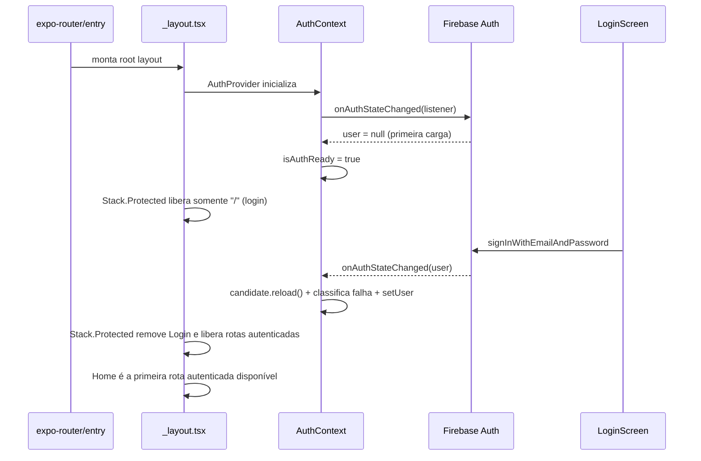

# Autenticação

Gerencia o estado de autenticação do usuário via Firebase Auth, expondo o contexto para toda a aplicação e controlando o redirecionamento de rotas com base no estado de login.

## Como funciona



1. `AuthContext.tsx` registra um listener `onAuthStateChanged` do Firebase ao montar. O contexto não usa `onIdTokenChanged`, pois chamar `candidate.reload()` dentro de um listener de token pode disparar um novo evento e criar um loop de renovação
2. Quando um usuário é detectado por uma mudança de autenticação, chama `candidate.reload()` antes de propagar. Cada callback recebe uma versão monotônica; somente a resolução mais recente e cujo UID ainda coincide com `auth.currentUser` pode atualizar o contexto. Erros de token expirado/inválido, usuário desabilitado ou inexistente limpam a sessão; falhas transitórias de rede/serviço preservam o usuário atual para não transformar uma oscilação em logout
3. Atualiza `user` (Firebase User completo) e marca `isAuthReady = true`
4. `_layout.tsx` (Expo Router 6) consome `useAuth()` e mantém um único `Stack` com guards declarativos:
   - `Stack.Protected guard={!isAuthenticated}` contém somente `index` (`/`)
   - `Stack.Protected guard={isAuthenticated}` contém todas as demais rotas registradas em `APP_ROUTE_PATHS`, com `home` primeiro
   - Quando o guard muda, rotas agora protegidas são retiradas do histórico pelo próprio Router; não há `Redirect` ou ação imperativa concorrendo com a desmontagem
5. Durante a inicialização (`!isAuthReady || isLoadingTheme`), exibe o `AuthBootstrapScreen` com `<Loader />`
6. `LoginScreen.tsx` chama `signInWithEmailAndPassword` com proteção de throttle via [[Segurança de Login]]
7. A tela de login aceita pull-to-refresh para limpar erros locais e reconsultar o cooldown de tentativas do email digitado
8. A interface tem implementações por plataforma: a partir de 768px, o navegador preenche toda a coluna esquerda com o painel de identidade em gradiente e o texto SVG animado **Finances**, na fonte padrão do sistema, centralizado sobre ele, enquanto centraliza verticalmente o conteúdo de acesso na coluna direita. Nessa composição desktop, a tela não rola; abaixo disso, os blocos se empilham e conservam a rolagem e o comportamento de teclado do mobile. Android e iOS preservam a composição mobile histórica com wallpaper, logo adaptado ao tema e cartão sobreposto, sem remover a proteção do teclado

## AuthContext API

```typescript
type AuthContextValue = {
  user: User | null;       // Firebase User completo ou null
  isAuthReady: boolean;    // true após primeira resolução do auth
  isAuthenticated: boolean; // Boolean(user)
};
```

- `useAuth()` — hook para consumir o contexto (lança erro se fora do `AuthProvider`)

## Arquivos principais

- `contexts/AuthContext.tsx` — Provider e hook `useAuth()`
- `app/_layout.tsx` — Root layout com `Stack.Protected` e `AuthBootstrapScreen`
- `screens/LoginScreen.tsx` — Interface mobile histórica para Android e iOS, com wallpaper, logo adaptado ao tema e cartão de formulário sobreposto
- `screens/LoginScreen.web.tsx` — Interface de login e painel de identidade responsivo do navegador
- `app/index.tsx` — Rota `/` mapeada para LoginScreen
- `utils/authSession.ts` — Classifica os códigos definitivos do Firebase Auth que exigem encerrar a sessão local
- `utils/firebaseAuthStorage.ts` — Persistência segura para o app secundário

## Integrações

- [[Firebase Config]] — `auth` instance (memory-only) usada para `onAuthStateChanged` e `signInWithEmailAndPassword`
- [[Segurança de Login]] — Throttle de tentativas antes de chamar Firebase
- [[Navegação]] — `_layout.tsx` usa `useAuth()` para controlar a disponibilidade das rotas via `Stack.Protected`
- [[Gerenciamento de Usuários]] — `user.uid` é o `personId` usado em todas as queries
- [[Notificações]] — Ativa/reconcilia a agenda do UID autenticado; troca de conta e logout explícito limpam o UID anterior

## Configuração

- Firebase Auth configurado em `FirebaseConfig.ts`
- Antes de o `AuthProvider` montar, [[Firebase Config]] resolve o alvo a partir de variáveis `EXPO_PUBLIC_*` incorporadas diretamente pelo Metro. Development usa o Emulator; preview e releases usam produção. Uma release local com credenciais completas também infere produção, evitando exceção de bootstrap antes da Login e permanência na splash nativa.
- **App primário usa persistência memory-only** — ao fechar o app, a sessão é encerrada e o usuário volta para a tela de login
- O `user=null` inicial de uma abertura fria não é tratado como logout explícito pelo motor de notificações; isso preserva os alarmes locais do último UID enquanto a sessão precisa ser refeita
- O botão **Sair** bloqueia toques concorrentes, confirma que o UID originador ainda é o usuário do Firebase e chama `clearMandatoryReminderAccount(uid)` antes de `signOut(auth)`. A limpeza é recusada se outra conta já tiver assumido a sessão; ao entrar com outro UID, a ponte de `_layout.tsx` também limpa qualquer agenda anterior
- A limpeza é preparada em duas fases: `clearMandatoryReminderAccount(uid)` cancela alarmes nativos, mas conserva configurações locais sem IDs como snapshot de rollback; somente depois do `signOut` bem-sucedido `finalizeMandatoryReminderAccountCleanup(uid)` apaga esse mapa
- Se a limpeza nativa falhar, o logout não prossegue e a agenda do UID ainda autenticado é reconciliada novamente. Se o `signOut` falhar depois da limpeza, o snapshot local reconstitui a agenda imediatamente, inclusive offline, antes da tentativa complementar de sincronização com Firestore e da mensagem de erro
- Ao autenticar, `_layout.tsx` ativa o UID e chama `loadMandatoryReminderSyncItems()` para restaurar despesas e receitas do Firestore sem depender de abrir as telas recorrentes
- App secundário usa `firebaseAuthStorage` (SecureStore com fallback AsyncStorage) — usado exclusivamente para criação de contas
- Dual app Firebase: app primário para sessão atual, app secundário para criação de usuários sem afetar sessão

## Observações importantes

- A versão Web da tela usa classes Tailwind/NativeWind para a composição estrutural; cores de tema e dimensões responsivas medidas permanecem tokens/valores de runtime.

- `isAuthReady` é false durante a inicialização — telas não devem renderizar dados antes disso
- O guard em `_layout.tsx` também aguarda `isLoadingTheme` do [[Sistema de Temas|ThemeContext]] para evitar flash de tema
- O `user` retornado é o objeto Firebase User completo
- O `reload()` na resolução de uma mudança de autenticação garante que sessões expiradas, revogadas ou inválidas sejam detectadas sem descartar uma sessão por uma falha transitória
- `reload()` não é executado dentro de `onIdTokenChanged`: a combinação criaria um ciclo de evento de token e nova renovação
- Uma resposta atrasada de `reload()` nunca pode republicar um usuário depois de um evento mais novo de logout ou troca de conta
- Login e logout atualizam os guards automaticamente via `onAuthStateChanged`, mantendo o mesmo Stack raiz montado
- Cada plataforma concentra sua interface completa em `LoginScreen.tsx` ou `LoginScreen.web.tsx`. A Web usa o painel de identidade em gradiente; Android/iOS preservam wallpaper e logos claro/escuro. Inputs, teclado, validação, throttle e Firebase Auth permanecem nativos, sem WebGL, canvas, `ogl` ou WebView.
- Todo novo arquivo de rota autenticada deve entrar primeiro em `APP_ROUTE_PATHS`; o layout deriva desse registro os nomes protegidos, e o teste de navegação verifica a paridade com os arquivos planos em `app/`
- A sessão **não persiste** entre reinicializações do app — isso é intencional (memory-only)
- Os lembretes locais podem persistir entre reinicializações mesmo sem sessão persistida; eles são isolados pelo último UID ativo e nunca são mesclados com uma conta diferente
- O serviço de notificações mantém um epoch/UID síncrono em memória; callbacks assíncronos de telas antigas são ignorados depois que logout ou troca de conta invalidam a sessão
- A limpeza explícita recebe o UID esperado, varre inclusive alarmes nativos órfãos e não pode apagar a agenda de uma conta que se tornou ativa enquanto o logout anterior aguardava I/O
- A finalização do mapa local só acontece após confirmação do Firebase; nunca antecipar a exclusão do snapshot de rollback
