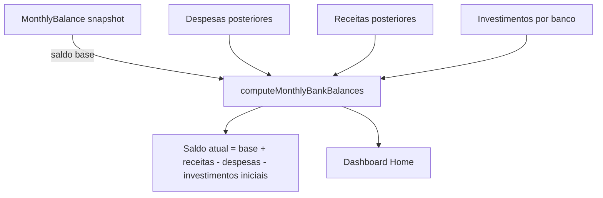

# Balanço Mensal

Sistema de snapshots mensais do saldo de cada banco. Funciona como um "marco" de reconciliação — o saldo real de um banco é calculado a partir do último snapshot + movimentos posteriores a ele.

> **Após o corte do grupo financeiro**, esta rota é uma tela de reconciliação: registra data/hora efetiva, saldo contado e diferença auditável. O saldo passa a ser última reconciliação mais eventos posteriores, não apenas o conjunto de movimentos do mês atual.

## Como funciona



1. `AddRegisterMonthlyBalanceScreen.tsx` registra ou atualiza o **saldo de abertura** de um banco para um mês; o banco é selecionado pelo ActionSheet compartilhado com ícone
2. `MonthlyBalanceFirebase.ts` salva o snapshot no Firestore com: `bankId`, `year`, `month` e `valueInCents`
3. Após salvar um snapshot novo ou existente, `AddRegisterMonthlyBalanceScreen.tsx` aplica [[Comportamento Pós-Registro]] depois do feedback de sucesso
4. O [[Dashboard Home]] usa `HomeFirebase.ts` para:
   - Buscar o `MonthlyBalance` mais recente de cada banco
   - Usar `calculateLegacyBankBalanceInCents()` com despesas, receitas, saques e investimentos posteriores ao snapshot
   - Resultado = saldo atual estimado do banco
   - Avisar por modal quando algum banco registrado não tem snapshot do mês corrente

## Por que snapshots?

Sem snapshots, calcular o saldo exato exigiria buscar **todos** os movimentos desde o início. Com snapshots mensais, o cálculo busca apenas o snapshot recente + movimentos do período posterior — muito mais eficiente.

## `calculateLegacyBankBalanceInCents()`

Função única para o saldo legado em `utils/monthlyBalance.ts`. Ela seleciona o último snapshot mensal elegível e calcula:

`saldo = snapshot + ganhos - despesas - saques em dinheiro - aplicações iniciais`

O rendimento ou valor sincronizado do investimento **não** altera o saldo do banco; apenas aplicação, aporte e resgate movimentam a conta.

```typescript
calculateLegacyBankBalanceInCents({
  bankId,
  snapshots,
  expenses,
  gains,
  cashRescues,
  investments,
  asOfDate,
}): number | null
```

Retorna `null` sem snapshot válido e, caso contrário, um inteiro em centavos. A data de corte do snapshot é o primeiro dia de seu `year`/`month`.

## `shouldIncludeMovementInGainExpenseTotals()`

Filtra movimentos que **não** devem entrar nos totais de ganhos/despesas reais:

| Flag | Exclui | Motivo |
|---|---|---|
| `isFinanceInvestment` | Sim | Movimento de investimento |
| `isInvestmentDeposit` | Sim | Depósito em investimento |
| `isInvestmentRedemption` | Sim | Resgate de investimento |
| `isFinanceInvestmentSync` | Sim | Sincronização de saldo do investimento |
| `isBankTransfer` | Sim | Transferência muda os saldos das contas, mas não é ganho nem gasto |

> **Nota importante:** A versão anterior da documentação mencionava apenas `transfer_in/out`. O código real verifica flags booleanas nos documentos, não tipos string. Transferências e investimentos usam essas flags para serem excluídos dos totais.

## Arquivos principais

- `screens/AddRegisterMonthlyBalanceScreen.tsx` — Formulário de registro de snapshot
- `components/uiverse/bank-actionsheet-selector.tsx` — Seletor de banco do snapshot mensal
- `functions/MonthlyBalanceFirebase.ts` — CRUD de snapshots no Firestore
- `utils/monthlyBalance.ts` — `calculateLegacyBankBalanceInCents()`, `shouldIncludeMovementInGainExpenseTotals()` e types
- `functions/BankFirebase.ts` — leitura centralizada do saldo legado para Home, transferência, saque, investimento e Assistente Lumus
- `app/register-monthly-balance.tsx` — Rota
- `utils/navigation.ts` — Saída explícita para Home pelo voltar físico/navigator
- `hooks/usePostSubmitBehavior.ts` — Aplica retorno/limpeza após salvar

## Types exportados

```typescript
export type LegacyMonthlyBalanceSnapshot = {
  bankId?: string | null;
  year?: number;
  month?: number;
  valueInCents?: number;
};
```

## Integrações

- [[Gerenciamento de Bancos]] — Cada snapshot é vinculado a um banco específico
- [[Dashboard Home]] — Saldo dos bancos calculado via `calculateLegacyBankBalanceInCents()`
- [[Previsão de Fluxo de Caixa]] — Usa o último snapshot não futuro de cada banco como saldo-base do cenário; contas sem snapshot permanecem explicitamente incompletas
- [[Transações de Despesas]] e [[Transações de Receitas]] — Movimentos posteriores ao snapshot são somados
- [[Investimentos]] — Investimentos por banco são considerados no cálculo de saldo
- [[Comportamento Pós-Registro]] — Define retorno/limpeza após salvar snapshots

## Configuração

- Sem configuração especial — operação manual pelo usuário
- Registrar o saldo de abertura no início de cada mês; o formulário não representa uma reconciliação com data/hora dentro do mês

## Observações importantes

- No legado, snapshots são a base disponível. No razão, a reconciliação é a referência auditável e o lançamento de ajuste correspondente é imutável.
- Snapshots legados são migrados com origem legacyMonthStart e aproximação explícita, pois não possuem horário exato.
- No legado, o snapshot representa sempre o início do mês. Uma reconciliação com data/hora pertence ao razão financeiro pós-corte.

- Snapshots são a única fonte de verdade para saldo — sem snapshot, saldo parte de zero (`initialBalanceInCents = null` → `currentBalanceInCents = null`)
- Ao cadastrar um banco, deve-se registrar o saldo inicial como um `MonthlyBalance`
- Após salvar um saldo mensal, banco, mês, valor e estado de saldo existente só são limpos quando a preferência da tela manda permanecer e limpar; o submit usa trava síncrona para impedir toques repetidos durante o upsert
- A [[Dashboard Home]] usa o último snapshot disponível; o lembrete mensal continua incentivando o registro do saldo de abertura atual
- Bancos sem movimentação no período ainda aparecem no resumo com saldo base preservado
- A resolução do valor de investimento segue prioridade: `currentValueInCents` → `lastManualSyncValueInCents` → `valueInCents` → `initialValueInCents` → 0
- A [[Previsão de Fluxo de Caixa]] não deve supor saldo zero como dado real para banco sem snapshot. Ela pode calcular compromissos futuros, mas precisa sinalizar que o saldo de abertura global está incompleto.

## Integração com o Assistente Lumus

- [[Assistente Lumus]] usa `upsert_monthly_balance` com banco, ciclo `YYYY-MM` e centavos; somente bancos do UID autenticado podem ser atualizados.
- O saldo inicial solicitado junto à criação de banco é atômico com o novo documento do banco.
