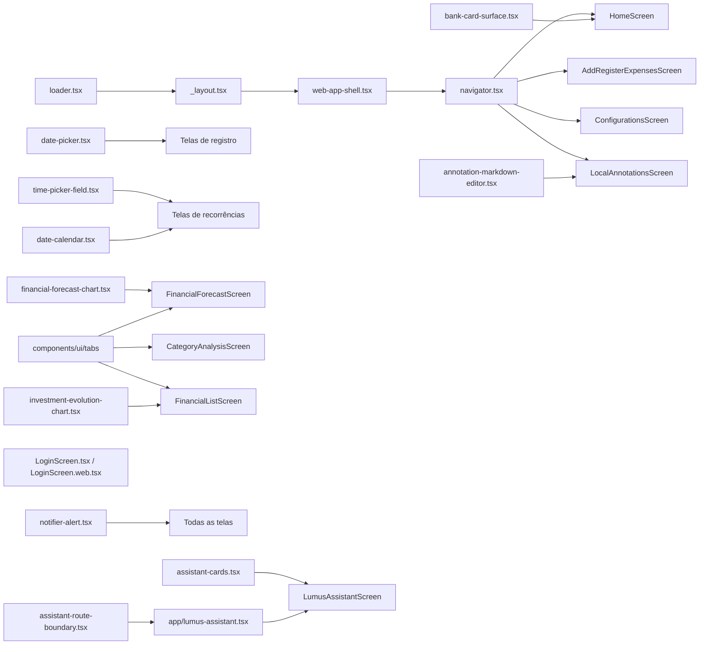

# Componentes UI

Design system do app composto por dois grupos: componentes base do **Gluestack UI** estilizados com **NativeWind** e componentes customizados (**uiverse**) para funcionalidades específicas do domínio.

## Componentes Gluestack UI (`components/ui/`)

Componentes primitivos baseados em `@gluestack-ui/core` com estilos Tailwind:

| Componente | Uso |
|---|---|
| `button/` | Botões com variantes, spinner de loading e suporte a ícones |
| `text/` | Tipografia com estilos responsivos |
| `input/` | Campos de texto com foco e validação |
| `modal/` | Diálogos modais |
| `drawer/` | Navegação lateral |
| `select/` | Dropdowns de seleção |
| `checkbox/` | Seleção múltipla |
| `radio/` | Seleção única |
| `switch/` | Toggle booleano |
| `form-control/` | Wrapper com label, helper text e mensagem de erro |
| `card/` | Container de conteúdo com bordas |
| `box/` | Layout wrapper genérico |
| `vstack/` | Coluna flexível vertical |
| `hstack/` | Linha flexível horizontal |
| `grid/` | Layout em grade |
| `table/` | Tabela de dados |
| `badge/` | Indicadores de status |
| `alert/` | Mensagens de alerta inline |
| `heading/` | Títulos hierárquicos |
| `icon/` | Wrapper de ícones (suporta `lucide-react-native`) |
| `image/` | Exibição de imagens |
| `divider/` | Separador visual |
| `popover/` | Popup flutuante |
| `skeleton/` | Placeholder de carregamento |
| `menu/` | Opções de menu |
| `accordion/` | Conteúdo expansível/colapsável |
| `actionsheet/` | Bottom sheet de ações |
| `textarea/` | Campo de texto multilinha |
| `chatAi/` | Primitivas compostas `Conversation`, `Message` e `PromptInput` para chats nativos, adaptadas do Chat AI do Gluestack à linha estável instalada |
| `tabs/` | Tabs controladas com lista, gatilhos, conteúdo e indicador animado amarelo, compatibilizadas com o toolchain estável do app |
| `gluestack-ui-provider/` | Provider de tema — aplica modo claro/escuro |

## Componentes Customizados (`components/uiverse/`)

| Componente | Descrição |
|---|---|
| `navigator.tsx` / `.web.tsx` | Navegação por plataforma: Android/iOS preservam barra inferior e menus Gluestack; o navegador abre `StaggeredMenu` pela esquerda a partir de 1024px. As duas variantes compartilham grupos, atalhos contextuais, rotas de `utils/navigation.ts`, rótulos dinâmicos e logout seguro |
| `web-app-shell.tsx` | Mantém o workspace autenticado no navegador sem alterar a hierarquia de rotas; não reserva uma coluna fixa enquanto o menu deslizante está fechado |
| `web/StaggeredMenu.jsx` / `.css` | Componente React DOM adaptado para a navegação Web: um único painel desktop navy/amarelo, recortado a uma rail fixa de 68px quando fechado e expandido por animação contínua para mostrar as seções Home/Controle/Config e o perfil do usuário autenticado; mantém foco visível, Escape/clique externo e variante de movimento reduzido |
| `web/AnimatedContent.jsx` | Wrapper React DOM baseado em GSAP/ScrollTrigger para revelar e ocultar conteúdo Web com deslocamento, opacidade e escala configuráveis; aceita `trigger="mount"`, `visible` e respeita movimento reduzido |
| `web/StrokeText.jsx` / `.css` | Texto SVG desenhado por GSAP na montagem; usado no título do hero da Home Web para criar o efeito de entrada |
| `web/Grainient.jsx` / `.css` | Fundo Web em WebGL com stops de cor dinâmicos para o hero e painéis expandidos |
| `screens/HomeScreen.web.tsx` | Dashboard Web responsivo que reutiliza `useHomeScreenData`, `useValueVisibility` e as regras de saldo, mostrando resumo, ações rápidas, contas, lançamentos e investimentos |
| `annotation-markdown-editor.tsx` | Expo DOM Component do editor visual de anotações: toolbar funcional para H1/H2/H3, negrito, itálico, sublinhado, tópicos e checklist, com aparência rica durante a escrita e Markdown portátil devolvido à tela |
| `bank-card-surface.tsx` | Cartão de banco com gradiente linear baseado na cor do banco |
| `bank-actionsheet-selector.tsx` | Seletor ActionSheet de bancos com ícone/monograma, nome, helper contextual e estado selecionado |
| `tag-actionsheet-selector.tsx` | Seletor ActionSheet de categorias com ícone, nome, estado selecionado, descrição opcional por opção, uso em filtros administrativos e ação interna opcional para criar categoria |
| `date-picker.tsx` | Modal de seleção de data no formato DD/MM/YYYY (brasileiro), com suporte a `accessibilityLabel` customizado, header alinhado ao botão de fechar, navegação mensal em faixa full-width e rodapé `Cancelar`/`Hoje` no mesmo padrão dos modais de confirmação do sistema |
| `time-picker-field.native.tsx` / `.web.tsx` | Campo reutilizável para horários: abre o seletor nativo Android/iOS e mantém fallback input type=time no web, sempre retornando HH:MM |
| `financial-forecast-chart.tsx` | Expo DOM Component que encapsula `LineChart` de Mantine/Recharts para a previsão de caixa, recebendo somente props serializáveis, mantendo o fundo transparente nos dois temas, sem contorno de foco ao toque e com rolagem horizontal para séries longas |
| `home-expense-chart.tsx` | Expo DOM Component que encapsula `Sparkline` de Mantine para tendências compactas de ganhos/gastos, com dados serializáveis, fundo transparente e sem interação |
| `home-expense-line-chart.tsx` | Expo DOM Component que encapsula `LineChart` de Mantine para os gastos diários dos últimos três meses, com dados serializáveis, fundo transparente e tooltip/eixos protegidos pela privacidade |
| `home-activity-heatmap.tsx` | Expo DOM Component que encapsula `Heatmap` Mantine para as contagens diárias de lançamentos financeiros no ano atual, com meses, dias da semana e tooltip em português |
| `investment-evolution-chart.tsx` | Expo DOM Component que encapsula `AreaChart` Mantine/Recharts para comparar capital líquido e patrimônio estimado somente pelas linhas, com pontos, grade e eixos no padrão visual do gráfico de previsão, fundo transparente, sem contorno de foco e rolagem horizontal para séries longas |
| `date-calendar.tsx` | Widget de calendário para seleção de período, com `displayValueInCents` para valor previsto/real e `reminderSummary` para a configuração versionada do lembrete |
| `notifier-alert.tsx` / `.web.tsx` | Canal único de feedback in-app; Android/iOS usam `react-native-notifier` e o Web usa `Alert` do Mantine fixo no canto superior direito via portal no `document.body`, com entrada horizontal por `AnimatedContent` |
| `screens/LoginScreen.tsx` / `.web.tsx` | Tela de Login completa por plataforma: a Web usa painel de identidade em gradiente; Android/iOS preservam o wallpaper, logo adaptado ao tema e cartão sobreposto da tela mobile original, sem `ogl`, WebGL ou WebView |
| `loader.tsx` | Spinner de carregamento animado |
| `lumus-assistant/assistant-cards.tsx` | Cartões de pergunta, revisão individual, mensagens, métricas e gráficos controlados do [[Assistente Lumus]] |
| `assistant-route-boundary.tsx` | Recovery boundary para erro inesperado ao renderizar o assistente; não é um loading gate da rota |

### Relação entre componentes uiverse

## Arquivos principais

- `components/ui/` — Todos os componentes primitivos
- `components/uiverse/` — Componentes customizados do domínio
- `components/uiverse/home-expense-chart.tsx` — Sparkline Mantine Web em Expo DOM para as tendências compactas dos cards de resumo da Home
- `components/uiverse/web-app-shell.tsx` — Casca responsiva usada pelo layout autenticado no Web
- `components/ui/gluestack-ui-provider/index.tsx` — Configuração do provider de tema

## Integrações

- [[Sistema de Temas]] — `GluestackUIProvider` aplica o tema; `useScreenStyles` retorna estilos condicionais
- [[Autenticação]] — `LoginScreen.tsx` e `.web.tsx` concentram apresentação, formulário, validação, throttle e feedback do Login
- [[Notificações]] — `notifier-alert` exibe avisos in-app e `date-calendar` apresenta o resumo dos lembretes locais
- [[Gerenciamento de Bancos]] — `bank-card-surface` exibe cards de bancos no carrossel
- [[Navegação]] — `navigator.tsx`/`.web.tsx` usam `APP_ROUTE_PATHS`/helpers de `utils/navigation.ts`; Web tem painel deslizante e Android/iOS usam menus nativos, sem criar rotas paralelas
- [[Versão Web]] — `web-app-shell.tsx`, `navigator.web.tsx`, `StaggeredMenu` e `HomeScreen.web.tsx` preservam a identidade visual e os guards do app no Firebase Hosting
- [[Anotações Locais]] — Usa o editor visual em Expo DOM no `uiverse`; a tela mantém a persistência local por UID em Markdown e os controles nativos Gluestack ao redor do editor
- [[Hooks Customizados]] — `useTagIcons` fornece `<TagIcon />` para renderização de ícones
- [[Previsão de Fluxo de Caixa]] — Consome o gráfico Mantine por Expo DOM e `components/ui/tabs` para definir o horizonte
- [[Dashboard Home]] — Consome `home-expense-chart.tsx` para as tendências mensais compactas dos cards de ganhos/gastos na Home Web
- [[Dashboard Home]] — Consome `home-expense-line-chart.tsx` para o gráfico detalhado diário de gastos na Home Web
- [[Dashboard Home]] — Consome `home-activity-heatmap.tsx` para a atividade financeira anual na Home Web
- [[Análise por Categoria]] — Usa `components/ui/tabs` para alternar o relatório entre gastos e ganhos sem recarregar os dados
- [[Monitoramento de Investimentos]] — Usa `components/ui/tabs` para o período da rentabilidade e `investment-evolution-chart.tsx` para a evolução consolidada da carteira
- [[Assistente Lumus]] — Combina `chatAi/` com cards nativos; o `modal/` organiza exemplos de perguntas, o `drawer/` organiza preferências e o `switch/` controla a leitura automática

## Configuração

- `global.css` — Entrada mínima do Tailwind 3 com `base`, `components` e `utilities`
- `tailwind.config.js` — Conteúdo escaneado, preset NativeWind e tokens/safelist do Gluestack
- `metro.config.js` — Combina `withNativeWind({ input: './global.css' })` com o transformer de SVG e extensão CJS
- `babel.config.js` — Mantém somente `babel-preset-expo`, `nativewind/babel`, o alias `@`/`tailwind.config` e `react-native-worklets/plugin`
- `nativewind@4.2.1`, `tailwindcss@3.4.18`, `@gluestack-ui/core@3.0.12`, `@gluestack-ui/utils@3.0.12`, `@react-stately/color@3.9.2` e `@react-stately/utils@3.10.8` ficam em versões exatas para conservar o toolchain já compatível com Expo 54
- `annotation-markdown-editor.tsx` inicia com `'use dom'`, recebe dados serializáveis e usa um callback assíncrono para devolver Markdown à tela nativa. Ele usa o runtime `react-native-webview` já mantido pelos gráficos Expo DOM; não adicionar `react-native-enriched-markdown`, Tiptap ou um plugin próprio de editor rico.
- Os componentes gerados usam `cssInterop()` do NativeWind 4. O patch de `react-native-css-interop@0.2.1` remove somente o mapeamento legado de `SafeAreaView` retirado do React Native 0.81 e é reaplicado no `postinstall`.
- `@mantine/core`, `@mantine/hooks`, `@mantine/charts` e `recharts` — Dependências do gráfico web isolado
- `home-expense-chart.tsx` recebe séries e agregados serializáveis; não deve importar Firebase nem buscar dados dentro do Expo DOM
- `react-native-webview` — Runtime nativo do Expo DOM Component; mudanças nessa dependência exigem nova build instalada

## Padrão de Cores do Sistema

| Token | Light | Dark |
|---|---|---|
| Foco/Ativo | `#FFE000` / `yellow-400` | `yellow-300` |
| Fundo | `#FFFFFF` | `#020617` (slate-950) |
| Card | `bg-white` | `bg-slate-950` |
| Texto principal | `text-slate-900` | `text-slate-100` |
| Texto auxiliar | `text-slate-500` | `text-slate-400` |
| Borda | `border-slate-200` | `border-slate-800` |

## Observações importantes

- No Android, TimePickerField usa as cores nativas configuradas pelo plugin datetimepicker: amarelo padrão no cabeçalho e no marcador do relógio, com botões Cancelar/OK também amarelos. Após alterar o plugin, é necessário executar o prebuild para sincronizar `android:timePickerStyle` e gerar/instalar uma nova build; estilos de tela ou recarregamento do Metro não alteram esse diálogo.
- TimePickerField deve ser usado para horários operacionais: no Android abre o diálogo do sistema e no iOS apresenta o seletor nativo com confirmação; no web usa input type=time. O valor devolvido ao domínio permanece no formato 24h HH:MM.
- Componentes Gluestack são gerados/copiados do CLI do Gluestack — não editar manualmente os arquivos em `components/ui/` sem cautela
- Em telas `.web.tsx`, use o `Text` de `react-native` quando houver arrays de `StyleSheet`, `numberOfLines` ou props de acessibilidade. O `components/ui/text/index.web.tsx` renderiza um `span` DOM direto e repassa props sem a normalização do React Native Web.
- `tabs/` mantém a API composta `Tabs`/`TabsList`/`TabsTrigger`/`TabsTriggerText`/`TabsIndicator` e usa o indicador no thread de UI; o código é compatível com a linha estável instalada e não deve reintroduzir imports do creator de Tabs do Gluestack 5. Nas telas de previsão, análise e investimentos, a composição deve ficar dentro de um card `notTintedCardClassName`; o indicador preenchido usa o amarelo ativo do sistema e preserva texto/ícone escuros para contraste.
- O Tailwind 3 detecta classes literais pelos caminhos de `content` em `tailwind.config.js`; variantes realmente dinâmicas devem listar as classes completas ou usar a `safelist`.
- `chatAi/` preserva a API de composição documentada pelo Chat AI do Gluestack, mas usa as primitivas da linha estável instalada no app. Não migrar suas dependências para o CLI alpha sem uma atualização coordenada de `@gluestack-ui/core`.
- O compositor de [[Assistente Lumus]] reaproveita `fieldContainerClassNameNotSpace`, `inputField` e `submitButtonClassName` de `useScreenStyles()`: texto, áudio e envio usam o módulo `h-10`, com os controles de ícone em `w-10 rounded-2xl`. Prefira classes NativeWind; valores calculados de hero, insets ou teclado são as únicas exceções para `style`.
- No chat do [[Assistente Lumus]], Android usa `softwareKeyboardLayoutMode: "resize"` para redimensionar a janela; não adicionar um segundo `KeyboardAvoidingView` de altura nessa plataforma. O iOS mantém o `KeyboardAvoidingView`. A altura real do hero vem de `onLayout`, enquanto `Conversation` é a única região rolável e compositor/navigator permanecem no fluxo inferior que recebe a altura redimensionada.
- O aviso de indisponibilidade Android do [[Assistente Lumus]] pode conter a ação **Tentar novamente**. Ela permanece no próprio card de diagnóstico, mostra **Verificando…** e fica desabilitada durante a nova checagem para não multiplicar preflights de App Check.
- As preferências de [[Assistente Lumus]] são abertas pelo `drawer/` à direita, em vez de ocupar o histórico do chat. Use o `switch/` padrão com `switchTrackColor`, `switchThumbColor` e `switchIosBackgroundColor` de `useScreenStyles()` para toggles desse fluxo; o `popover/` concentra explicações auxiliares sem manter texto extra no card.
- Os exemplos rápidos de [[Assistente Lumus]] são exibidos no `modal/`, acionado pelo botão de lâmpada no cabeçalho do chat. O estado vazio não deve repetir esses cards; a escolha fecha o modal e reutiliza o envio normal do compositor.
- `navigator.tsx` e `.web.tsx` não devem importar `router` diretamente; novas opções de menu devem chamar os helpers centralizados de [[Navegação]]
- `bank-card-surface.tsx` mistura a cor do banco com branco/preto para criar gradiente — cores muito claras ou escuras podem ter contraste ruim
- `web/Grainient.jsx` é Web-only e deve ser montado somente quando o painel que o contém estiver visível; o conteúdo textual fica acima do canvas para preservar a leitura. Nos detalhes da timeline, o wrapper Web ocupa toda a largura disponível, o container/canvas usa `inset: 0` e o recorte arredondado contém o canvas nos quatro cantos.
- `web/AnimatedContent.jsx` é Web-only; além do disparo por `ScrollTrigger`, aceita `trigger="mount"` para entradas imediatas, `visible` para executar a saída antes do unmount e `disappearScale` para usos que precisam controlar o recorte durante o fechamento. Na timeline da Home, o wrapper recebe a chave do movimento, reinicia a abertura quando o detalhe é expandido, não escala a superfície do card e remove o card somente após a animação de fechamento.
- Variantes `.web.tsx` existem apenas para incompatibilidades específicas de plataforma
- Novos fluxos devem usar apenas `components/uiverse/navigator.tsx` e sua resolução `.web.tsx` como navegação do domínio: barra inferior em Android/iOS e rail/painel `StaggeredMenu` em Web desktop. Não duplicar os dois formatos na mesma viewport.
- O breakpoint da casca Web é `1024px`. Em desktop, itens do painel devem manter foco visível, estado selecionado e área clicável de pelo menos 44px; em telas menores, a experiência mobile existente prevalece.
- Feedback in-app deve passar por `components/uiverse/notifier-alert.tsx`; a resolução Web usa o `Alert` Mantine global e não deve recriar viewport local ou utilitário alternativo
- `date-picker.tsx` aceita `accessibilityLabel` opcional para cenários em que o título visual do campo precisa ser montado pela própria tela, como em labels com popover contextual
- O modal interno de `date-picker.tsx` reaproveita os tokens de `useScreenStyles()` para container, input e ações de rodapé, evitando variantes paralelas ao padrão visual das telas
- `date-calendar.tsx` suporta `displayValueInCents` para mostrar o valor previsto antes da efetivação e o valor real após o registro do ciclo nas telas recorrentes
- `date-calendar.tsx` aceita `reminderSummary?: string`; quando informado, o card exibe o texto completo calculado pelo domínio, como `3 dias seguidos antes + no vencimento • 09:00`
- Se `reminderSummary` não existir, `date-calendar.tsx` só exibe `Ativado` quando `reminderEnabled === true`; campo ausente resulta em `Desativado`, e as telas devem normalizar configurações legadas com `isMandatoryReminderConfigured()` antes de montar o item
- `tag-actionsheet-selector.tsx` aceita `description` opcional nas opções para telas que precisam explicar o tipo/uso da categoria sem criar um seletor paralelo
- `tag-actionsheet-selector.tsx` aceita ação de criação opcional para manter o atalho de nova categoria dentro do próprio ActionSheet, inclusive quando a lista de categorias está vazia
- `tag-actionsheet-selector.tsx` respeita `isDisabled` como bloqueio total de abertura do ActionSheet; a ação de criação interna não deve contornar as regras de liberação calculadas pela tela
- Filtros de categoria em telas administrativas, como [[Configurações]], também devem reutilizar `tag-actionsheet-selector.tsx` quando abrirem uma lista de opções de categoria/tipo
- `bank-actionsheet-selector.tsx` deve ser usado em fluxos de criação/edição operacional que selecionam banco, usando `iconKey`/`colorHex` quando existirem e fallback por iniciais quando o banco ainda não tem ícone configurado; seu trigger deve usar `fieldBankContainerClassName` para comportar ícone, nome e texto auxiliar sem comprimir o layout
- Inputs editáveis em telas roláveis devem usar `useKeyboardAwareScroll()` de [[Hooks Customizados]] para permanecerem acima do teclado; inputs em modais/action sheets devem ficar dentro de `KeyboardAvoidingView` com área rolável própria quando houver risco de cobertura.
- Modais operacionais usam `ModalContent` com limite de `max-w-[360px]`; telas com vários diálogos, como [[Investimentos]], devem preservar esse limite para não criar variantes visuais de largura.
- Um arquivo Expo DOM deve iniciar com `'use dom'`, expor apenas o componente default e receber somente props serializáveis. Os gráficos permanecem nessa fronteira; o alerta Mantine é uma exceção Web-only renderizada por portal porque precisa compartilhar a árvore React Native com o disparo global. Telas nativas não importam Mantine.
- Cards do assistente nunca renderizam HTML/código do modelo. Referências como banco, categoria e investimento devem ser editáveis por escolhas locais, e a ação de escrita exige o segundo estágio explícito **Confirmar agora**.
