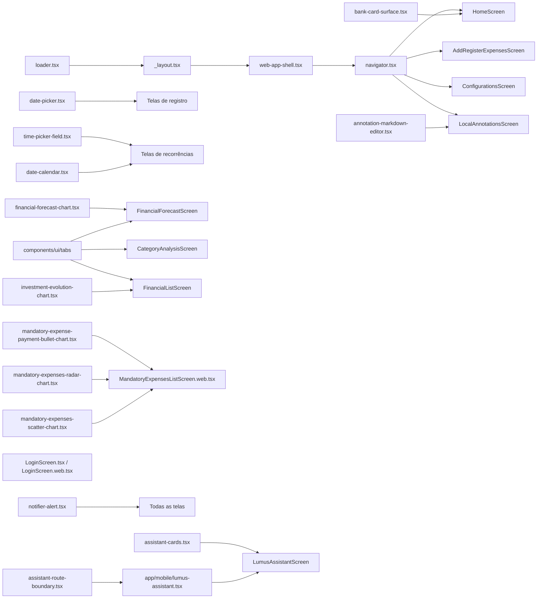

# Componentes UI

Design system do app composto por dois grupos: componentes base do **Gluestack UI** estilizados com **NativeWind** e componentes customizados (**uiverse**) para funcionalidades específicas do domínio. Os contratos lógicos continuam em `components/uiverse/`; as implementações exclusivas de plataforma ficam organizadas em `components/web/` e `components/mobile/`, separadas por sistema funcional.

## Resolução por plataforma

As telas importam o caminho lógico sem extensão. Os adaptadores em `components/uiverse/` encaminham automaticamente para `components/web/` no navegador e `components/mobile/` no Android/iOS. O arquivo base `.tsx` existe como fallback/reexport mobile para TypeScript, Jest e ferramentas que não recebem uma plataforma explícita; ele não deve ser usado para misturar `Platform.OS` entre as duas experiências.

Os componentes com variantes independentes preservam os mesmos tipos públicos, callbacks e regras de privacidade: `date-picker`, `date-calendar`, `bank-actionsheet-selector`, `bank-card-surface`, `tag-actionsheet-selector`, `category-availability-selector`, `loader`, `screen-dismiss-keyboard`, `web-app-shell`, `assistant-cards` e `assistant-route-boundary`. O Web pode usar controles DOM/Mantine ou comportamento de foco próprio em `components/web/`; o mobile mantém suas interações nativas em `components/mobile/`. Os arquivos homônimos de `components/uiverse/` são adaptadores de resolução e não acessam Firebase nem alteram cálculos financeiros.

Gráficos e editor que iniciam com `'use dom'` continuam sendo uma fronteira deliberada de Expo DOM. Eles recebem props serializáveis e executam a mesma implementação em Web e WebView nativo; criar uma cópia nativa desses módulos reduziria a paridade documentada sem resolver uma incompatibilidade de API.

## Organização por sistema

| Pasta | Sistema | Componentes principais |
|---|---|---|
| `uiverse/navigation/` | Navegação e shell Web | `navigator`, `web-app-shell`, `web-route-transition`, `web-screen-hero` |
| `uiverse/shared/` | Infraestrutura compartilhada | `loader`, `screen-dismiss-keyboard`, `date-picker` |
| `uiverse/feedback/` | Feedback in-app | `notifier-alert`, `notifier-boundary` |
| `uiverse/banks/` | Bancos e contas | `bank-actionsheet-selector`, `bank-card-surface` |
| `uiverse/categories/` | Categorias e disponibilidade | `tag-actionsheet-selector`, `category-availability-selector` |
| `uiverse/recurring/` | Despesas/receitas recorrentes | `date-calendar`, `time-picker-field`, `mandatory-expense-payment-bullet-chart`, `mandatory-expenses-radar-chart`, `mandatory-expenses-scatter-chart` |
| `uiverse/dashboard/` | Dashboard Home | gráficos de resumo e atividade da Home |
| `uiverse/reports/` | Relatórios financeiros | `financial-forecast-chart` |
| `uiverse/investments/` | Monitoramento de investimentos | `investment-evolution-chart` |
| `uiverse/annotations/` | Anotações locais | `annotation-markdown-editor` |
| `uiverse/assistant/` | Assistente Lumus | `assistant-cards`, `assistant-route-boundary` |

Os componentes DOM Web de infraestrutura visual ficam em `components/web/motion/`, `components/web/navigation/` e `components/web/visuals/`. `components/ui/` continua reservado aos primitives Gluestack gerados; não criar componentes de domínio ali.

## Componentes Gluestack UI (`components/ui/`)

Componentes primitivos baseados em `@gluestack-ui/core` com estilos Tailwind:

| Componente | Uso |
|---|---|
| `button/` | Botões com variantes, spinner de loading e suporte a ícones |
| `text/` | Tipografia com estilos responsivos |
| `input/` | Campos de texto com foco e validação |
| `modal/` | Diálogos modais |
| `drawer/` | Navegação lateral |
| `select/` | Dropdowns de seleção |
| `checkbox/` | Seleção múltipla |
| `radio/` | Seleção única |
| `switch/` | Toggle booleano |
| `form-control/` | Wrapper com label, helper text e mensagem de erro |
| `card/` | Container de conteúdo com bordas |
| `box/` | Layout wrapper genérico |
| `vstack/` | Coluna flexível vertical |
| `hstack/` | Linha flexível horizontal |
| `grid/` | Layout em grade |
| `table/` | Tabela de dados |
| `badge/` | Indicadores de status |
| `alert/` | Mensagens de alerta inline |
| `heading/` | Títulos hierárquicos |
| `icon/` | Wrapper de ícones (suporta `lucide-react-native`) |
| `image/` | Exibição de imagens |
| `divider/` | Separador visual |
| `popover/` | Popup flutuante |
| `skeleton/` | Placeholder de carregamento |
| `menu/` | Opções de menu |
| `accordion/` | Conteúdo expansível/colapsável |
| `actionsheet/` | Bottom sheet de ações |
| `textarea/` | Campo de texto multilinha |
| `chatAi/` | Primitivas compostas `Conversation`, `Message` e `PromptInput` para chats nativos, adaptadas do Chat AI do Gluestack à linha estável instalada |
| `tabs/` | Tabs controladas com lista, gatilhos, conteúdo e indicador animado amarelo, compatibilizadas com o toolchain estável do app |
| `gluestack-ui-provider/` | Provider de tema — aplica modo claro/escuro |

## Componentes Customizados (`components/uiverse/`)

| Componente | Descrição |
|---|---|
| `components/mobile/navigation/navigator.native.tsx` / `components/web/navigation/navigator.web.tsx` | Navegação por plataforma: Android/iOS preservam barra inferior e menus Gluestack; o navegador abre `StaggeredMenu` pela esquerda a partir de 1024px. Ambas usam os helpers de `utils/navigation.ts`, aplicam os mesmos guards visuais e delegam o logout seguro para `utils/secureLogout.ts` |
| `components/mobile/navigation/web-app-shell.native.tsx` / `components/web/navigation/web-app-shell.web.tsx` | Mantém o workspace autenticado; o nativo monta somente o frame dos filhos e o Web adiciona fundo, transição DOM e nenhuma coluna fixa enquanto o menu deslizante está fechado |
| `components/mobile/navigation/web-route-transition.native.tsx` / `components/web/navigation/web-route-transition.web.tsx` | O nativo não monta feedback; o Web usa `motion/react` em portal no `document.body`, revela a nova página com opacidade e `scaleX`, não captura ponteiros e respeita `prefers-reduced-motion` |
| `components/web/navigation/StaggeredMenu.jsx` / `.css` | Componente React DOM adaptado para a navegação Web: um único painel desktop navy/amarelo, recortado a uma rail fixa de 68px quando fechado e expandido por animação contínua para mostrar as seções Home/Controle/Config e o perfil do usuário autenticado; mantém foco visível, Escape/clique externo, posicionamento explícito conforme `position` e variante de movimento reduzido |
| `components/web/motion/AnimatedContent.jsx` | Wrapper React DOM baseado em GSAP/ScrollTrigger para revelar e ocultar conteúdo Web com deslocamento, opacidade e escala configuráveis; aceita `trigger="mount"`, `visible` e respeita movimento reduzido |
| `components/web/visuals/StrokeText.jsx` / `.css` | Texto SVG desenhado por GSAP na montagem; usado no título do hero da Home Web para criar o efeito de entrada |
| `components/web/visuals/Grainient.jsx` / `.css` | Fundo Web em WebGL com stops de cor dinâmicos para o hero da Home e painéis expandidos da timeline |
| `screens/web/HomeScreen.web.tsx` | Dashboard Web responsivo que reutiliza `useHomeScreenData`, `useValueVisibility` e as regras de saldo, mostrando resumo, ações rápidas, contas, lançamentos e investimentos |
| `screens/web/AddRegisterGainScreen.web.tsx` | Composição Web do cadastro de ganhos, baseada no shell hero/sheet de despesas e usando `AnimatedContent`, `Grainient`, `StrokeText`, ActionSheets compartilhados e classes estruturais de `useScreenStyles()` |
| `screens/web/AddMandatoryExpensesScreen.web.tsx` | Composição Web do cadastro de gastos obrigatórios, com formulário completo, calendário modal de parcelas, seletor visual de hora/minuto, controle mensal e lembrete informado como indisponível para agendamento no navegador |
| `components/web/shared/web-select-field.tsx` | Select Web reutilizável com trigger no padrão dos campos, valor selecionado visível, seta contextual, hover, seleção, foco de teclado e menu no fluxo vertical; usa os tokens de `useScreenStyles()` |
| `screens/web/MandatoryExpensesListScreen.web.tsx` | Composição Web da listagem de gastos obrigatórios, com `date-calendar`, resumo mensal, timeline expansível, atualização manual, modais de confirmação e exportação para impressão/PDF |
| `mandatory-expense-payment-bullet-chart.tsx` | Expo DOM Component Web-only que exibe o progresso dos pagamentos obrigatórios: total do ciclo como limite e total pago como preenchimento, sem consulta própria |
| `mandatory-expenses-radar-chart.tsx` | Expo DOM Component que encapsula `RadarChart` de Mantine para somar os valores exibidos por categoria; recebe dados serializáveis e neutraliza a escala no modo de privacidade |
| `mandatory-expenses-scatter-chart.tsx` | Expo DOM Component que encapsula `ScatterChart` de Mantine para cruzar dia da semana e dia do mês dos vencimentos do ciclo atual; separa pendentes de pagos/concluídos |
| `annotation-markdown-editor.tsx` | Expo DOM Component do editor visual de anotações: toolbar funcional para H1/H2/H3, negrito, itálico, sublinhado, tópicos e checklist, com aparência rica durante a escrita e Markdown portátil devolvido à tela |
| `components/mobile/{banks,categories,recurring,shared}/` / `components/web/{banks,categories,recurring,shared}/` | Seletores de banco/categoria, calendário, data, horário, loader e dismiss de teclado ficam separados por plataforma, mantendo os mesmos contratos públicos |
| `financial-forecast-chart.tsx` | Expo DOM Component que encapsula `LineChart` de Mantine/Recharts para a previsão de caixa, recebendo somente props serializáveis, mantendo o fundo transparente nos dois temas, sem contorno de foco ao toque e com rolagem horizontal para séries longas |
| `home-expense-chart.tsx` | Expo DOM Component que encapsula `Sparkline` de Mantine para tendências compactas de ganhos/gastos, com dados serializáveis, fundo transparente e sem interação |
| `home-expense-line-chart.tsx` | Expo DOM Component que encapsula `LineChart` de Mantine para os gastos diários dos últimos três meses, com dados serializáveis, fundo transparente e tooltip/eixos protegidos pela privacidade |
| `home-activity-heatmap.tsx` | Expo DOM Component que encapsula `Heatmap` Mantine para as contagens diárias de lançamentos financeiros no ano atual, com meses, dias da semana e tooltip em português |
| `investment-evolution-chart.tsx` | Expo DOM Component que encapsula `AreaChart` Mantine/Recharts para comparar capital líquido e patrimônio estimado somente pelas linhas, com pontos, grade e eixos no padrão visual do gráfico de previsão, fundo transparente, sem contorno de foco e rolagem horizontal para séries longas |
| `components/mobile/recurring/date-calendar.native.tsx` / `components/web/recurring/date-calendar.web.tsx` | Widget de calendário para seleção de período, com `displayValueInCents` para mostrar valor previsto/real, `reminderSummary` para a configuração versionada do lembrete e `modalSize` para a largura responsiva do resumo diário Web |
| `components/mobile/feedback/notifier-alert.native.tsx` / `components/web/feedback/notifier-alert.web.tsx` | Canal único de feedback in-app; Android/iOS usam `react-native-notifier` e o Web usa `Alert` do Mantine fixo no canto superior direito via portal no `document.body`, com entrada horizontal por `AnimatedContent` |
| `components/mobile/navigation/web-screen-hero.native.tsx` / `components/web/navigation/web-screen-hero.web.tsx` | Cabeçalho das telas: o nativo usa Gluestack e a Web usa wallpaper, Grainient, StrokeText e animação DOM sem alterar o contrato da tela |
| `screens/mobile/LoginScreen.tsx` / `.web.tsx` | Tela de Login completa por plataforma: a Web usa painel de identidade em gradiente; Android/iOS preservam o wallpaper, logo adaptado ao tema e cartão sobreposto da tela mobile original, sem `ogl`, WebGL ou WebView |
| `components/mobile/shared/loader.native.tsx` / `components/web/shared/loader.web.tsx` | Spinner de carregamento; o mobile preserva o SVG animado e o Web usa o indicador acessível do navegador |
| `components/mobile/assistant/assistant-cards.native.tsx` / `components/web/assistant/assistant-cards.web.tsx` | Cartões de pergunta, revisão individual, mensagens, métricas e gráficos controlados do [[Assistente Lumus]]; gifted-charts fica no mobile e Mantine no Web |
| `components/mobile/assistant/assistant-route-boundary.native.tsx` / `components/web/assistant/assistant-route-boundary.web.tsx` | Recovery boundary independente por plataforma para erro inesperado ao renderizar o assistente; não é um loading gate da rota |

### Relação entre componentes uiverse

## Arquivos principais

- `components/ui/` — Todos os componentes primitivos
- `components/uiverse/` — Componentes customizados do domínio
- `components/uiverse/dashboard/home-expense-chart.tsx` — Sparkline Mantine Web em Expo DOM para as tendências compactas dos cards de resumo da Home
- `components/uiverse/recurring/mandatory-expense-payment-bullet-chart.tsx` — Bullet de pagamentos obrigatórios em Expo DOM, com faixa de 0 ao total do ciclo e preenchimento pelo valor efetivamente pago
- `components/web/navigation/web-app-shell.web.tsx` / `components/mobile/navigation/web-app-shell.native.tsx` — Cascas independentes do layout autenticado por plataforma
- `components/web/navigation/web-route-transition.web.tsx` / `components/mobile/navigation/web-route-transition.native.tsx` — Véu Motion isolado do Stack para transições entre páginas Web
- `components/ui/gluestack-ui-provider/index.tsx` — Configuração do provider de tema
- `screens/web/AddRegisterExpensesScreen.web.tsx`, `AddRegisterGainScreen.web.tsx`, `AddMandatoryExpensesScreen.web.tsx`, `AddRegisterMonthlyBalanceScreen.web.tsx`, `TransferScreen.web.tsx`, `AddRescueScreen.web.tsx`, `AddRegisterUserScreen.web.tsx`, `AddRegisterTagScreen.web.tsx` e `AddUserRelationScreen.web.tsx` — formulários Web com labels `WEB_EXPENSE_CLASS_NAMES.fieldLabel`, espaçamento `mb-2` e linhas `sectionLabel` para alinhar ícones de informação aos títulos.

## Integrações

- [[Sistema de Temas]] — `GluestackUIProvider` aplica o tema; `useScreenStyles` retorna estilos condicionais
- [[Autenticação]] — `LoginScreen.tsx` e `.web.tsx` concentram apresentação, formulário, validação, throttle e feedback do Login
- [[Notificações]] — `notifier-alert` exibe avisos in-app e `date-calendar` apresenta o resumo dos lembretes locais
- [[Gerenciamento de Bancos]] — `bank-card-surface` exibe cards de bancos no carrossel
- [[Navegação]] — `navigator.tsx`/`.web.tsx` usam `APP_ROUTE_PATHS`/helpers de `utils/navigation.ts`; Web tem painel deslizante e Android/iOS usam menus nativos, sem criar rotas paralelas
- [[Organização do Código]] — `components/app/app-root.tsx` concentra a composição global; tela, UI, persistência e utilitários mantêm fronteiras explícitas
- [[Versão Web]] — `web-app-shell.tsx`, `navigator.web.tsx`, `StaggeredMenu` e `HomeScreen.web.tsx` preservam a identidade visual e os guards do app no Firebase Hosting
- [[Anotações Locais]] — Usa o editor visual em Expo DOM no `uiverse`; a tela mantém a persistência local por UID em Markdown e os controles nativos Gluestack ao redor do editor
- [[Hooks Customizados]] — `useTagIcons` fornece `<TagIcon />` para renderização de ícones
- [[Previsão de Fluxo de Caixa]] — Consome o gráfico Mantine por Expo DOM e `components/ui/tabs` para definir o horizonte
- [[Dashboard Home]] — Consome `home-expense-chart.tsx` para as tendências mensais compactas dos cards de ganhos/gastos na Home Web
- [[Dashboard Home]] — Consome `home-expense-line-chart.tsx` para o gráfico detalhado diário de gastos na Home Web
- [[Dashboard Home]] — Consome `home-activity-heatmap.tsx` para a atividade financeira anual na Home Web
- [[Análise por Categoria]] — Usa `components/ui/tabs` para alternar o relatório entre gastos e ganhos sem recarregar os dados
- [[Monitoramento de Investimentos]] — Usa `components/ui/tabs` para o período da rentabilidade e `investment-evolution-chart.tsx` para a evolução consolidada da carteira
- [[Assistente Lumus]] — Combina `chatAi/` com cards nativos; o `modal/` organiza exemplos de perguntas, o `drawer/` organiza preferências e o `switch/` controla a leitura automática

## Configuração

- `global.css` — Entrada mínima do Tailwind 3 com `base`, `components` e `utilities`
- `tailwind.config.js` — Conteúdo escaneado, preset NativeWind e tokens/safelist do Gluestack
- `metro.config.js` — Combina `withNativeWind({ input: './global.css' })` com o transformer de SVG e extensão CJS
- `babel.config.js` — Mantém somente `babel-preset-expo`, `nativewind/babel`, o alias `@`/`tailwind.config` e `react-native-worklets/plugin`
- `nativewind@4.2.1`, `tailwindcss@3.4.18`, `@gluestack-ui/core@3.0.12`, `@gluestack-ui/utils@3.0.12`, `@react-stately/color@3.9.2` e `@react-stately/utils@3.10.8` ficam em versões exatas para conservar o toolchain já compatível com Expo 54
- `annotation-markdown-editor.tsx` inicia com `'use dom'`, recebe dados serializáveis e usa um callback assíncrono para devolver Markdown à tela nativa. Ele usa o runtime `react-native-webview` já mantido pelos gráficos Expo DOM; não adicionar `react-native-enriched-markdown`, Tiptap ou um plugin próprio de editor rico.
- Os componentes gerados usam `cssInterop()` do NativeWind 4. O patch de `react-native-css-interop@0.2.1` remove somente o mapeamento legado de `SafeAreaView` retirado do React Native 0.81 e é reaplicado no `postinstall`.
- `nativewind-env.d.ts` complementa os tipos dos submódulos concretos do React Native 0.81 para que `className` continue tipado em telas Web que usam `View`, `Text`, `Image`, `ScrollView` e `KeyboardAvoidingView` diretamente. Assets SVG/PNG/JPG são referenciados pela mesma entrada global.
- `@mantine/core`, `@mantine/hooks`, `@mantine/charts` e `recharts` — Dependências do gráfico web isolado
- `home-expense-chart.tsx` recebe séries e agregados serializáveis; não deve importar Firebase nem buscar dados dentro do Expo DOM
- `mandatory-expense-payment-bullet-chart.tsx` recebe somente centavos já agregados pela tela e entrega a escala dinâmica, o preenchimento e a linha-alvo ao `BulletChart` oficial; recebe `0`/`1` neutros quando a privacidade está ativa
- `react-native-webview` — Runtime nativo do Expo DOM Component; mudanças nessa dependência exigem nova build instalada

## Padrão de Cores do Sistema

| Token | Light | Dark |
|---|---|---|
| Foco/Ativo | `#FFE000` / `yellow-400` | `yellow-300` |
| Fundo | `#FFFFFF` | `#020617` (slate-950) |
| Card | `bg-white` | `bg-slate-950` |
| Texto principal | `text-slate-900` | `text-slate-100` |
| Texto auxiliar | `text-slate-500` | `text-slate-400` |
| Borda | `border-slate-200` | `border-slate-800` |

## Observações importantes

- No Android, TimePickerField usa as cores nativas configuradas pelo plugin datetimepicker: amarelo padrão no cabeçalho e no marcador do relógio, com botões Cancelar/OK também amarelos. Após alterar o plugin, é necessário executar o prebuild para sincronizar `android:timePickerStyle` e gerar/instalar uma nova build; estilos de tela ou recarregamento do Metro não alteram esse diálogo.
- TimePickerField deve ser usado para horários operacionais: no Android abre o diálogo do sistema e no iOS apresenta o seletor nativo com confirmação; no web usa input type=time. O valor devolvido ao domínio permanece no formato 24h HH:MM.
- Componentes Gluestack são gerados/copiados do CLI do Gluestack — não editar manualmente os arquivos em `components/ui/` sem cautela
- Em telas `.web.tsx`, use o `Text` de `react-native` quando houver arrays de `StyleSheet`, `numberOfLines` ou props de acessibilidade. O `components/ui/text/index.web.tsx` renderiza um `span` DOM direto e repassa props sem a normalização do React Native Web.
- `tabs/` mantém a API composta `Tabs`/`TabsList`/`TabsTrigger`/`TabsTriggerText`/`TabsIndicator` e usa o indicador no thread de UI; o código é compatível com a linha estável instalada e não deve reintroduzir imports do creator de Tabs do Gluestack 5. Nas telas de previsão, análise e investimentos, a composição deve ficar dentro de um card `notTintedCardClassName`; o indicador preenchido usa o amarelo ativo do sistema e preserva texto/ícone escuros para contraste.
- O Tailwind 3 detecta classes literais pelos caminhos de `content` em `tailwind.config.js`; variantes realmente dinâmicas devem listar as classes completas ou usar a `safelist`.
- `chatAi/` preserva a API de composição documentada pelo Chat AI do Gluestack, mas usa as primitivas da linha estável instalada no app. Não migrar suas dependências para o CLI alpha sem uma atualização coordenada de `@gluestack-ui/core`.
- O compositor de [[Assistente Lumus]] reaproveita `fieldContainerClassNameNotSpace`, `inputField` e `submitButtonClassName` de `useScreenStyles()`: texto, áudio e envio usam o módulo `h-10`, com os controles de ícone em `w-10 rounded-2xl`. Prefira classes NativeWind; valores calculados de hero, insets ou teclado são as únicas exceções para `style`.
- No chat do [[Assistente Lumus]], Android usa `softwareKeyboardLayoutMode: "resize"` para redimensionar a janela; não adicionar um segundo `KeyboardAvoidingView` de altura nessa plataforma. O iOS mantém o `KeyboardAvoidingView`. A altura real do hero vem de `onLayout`, enquanto `Conversation` é a única região rolável e compositor/navigator permanecem no fluxo inferior que recebe a altura redimensionada.
- O aviso de indisponibilidade Android do [[Assistente Lumus]] pode conter a ação **Tentar novamente**. Ela permanece no próprio card de diagnóstico, mostra **Verificando…** e fica desabilitada durante a nova checagem para não multiplicar preflights de App Check.
- As preferências de [[Assistente Lumus]] são abertas pelo `drawer/` à direita, em vez de ocupar o histórico do chat. Use o `switch/` padrão com `switchTrackColor`, `switchThumbColor` e `switchIosBackgroundColor` de `useScreenStyles()` para toggles desse fluxo; em variantes Web que precisam personalizar somente a bolinha ativa, use também `switchActiveThumbColor`/`activeThumbColor`; o `popover/` concentra explicações auxiliares sem manter texto extra no card.
- Os exemplos rápidos de [[Assistente Lumus]] são exibidos no `modal/`, acionado pelo botão de lâmpada no cabeçalho do chat. O estado vazio não deve repetir esses cards; a escolha fecha o modal e reutiliza o envio normal do compositor.
- `navigator.tsx` e `.web.tsx` não devem importar `router` diretamente; novas opções de menu devem chamar os helpers centralizados de [[Navegação]]
- O fluxo de saída é único em `utils/secureLogout.ts`; renderers do navigator apenas o disparam e não repetem limpeza de lembretes ou `signOut`.
- `bank-card-surface.tsx` mistura a cor do banco com branco/preto para criar gradiente — cores muito claras ou escuras podem ter contraste ruim; a raiz aceita `className` para que a Home Web aplique layout Tailwind sem duplicar `StyleSheet` na tela
- `web/Grainient.jsx` é Web-only e deve ser montado somente quando o painel que o contém estiver visível; o conteúdo textual fica acima do canvas para preservar a leitura. Nos detalhes da timeline, o wrapper Web ocupa toda a largura disponível, o container/canvas usa `inset: 0` e o recorte arredondado contém o canvas nos quatro cantos. O componente mantém um gradiente CSS sob o canvas para que a identidade visual não desapareça quando WebGL2 não estiver disponível; os shaders GLSL ES 3.00 não devem ser executados em WebGL1.
- `web/AnimatedContent.jsx` é Web-only; além do disparo por `ScrollTrigger`, aceita `trigger="mount"` para entradas imediatas, `visible` para executar a saída antes do unmount e `disappearScale` para usos que precisam controlar o recorte durante o fechamento. Na timeline da Home, o wrapper recebe a chave do movimento, reinicia a abertura quando o detalhe é expandido, não escala a superfície do card e remove o card somente após a animação de fechamento.
- `web-route-transition.web.tsx` é Web-only e reage apenas a mudanças de pathname autenticado; não deve controlar navegação, alterar o Stack ou capturar foco/interações. Mantenha a animação limitada a opacidade e transformações e preserve a saída imediata para `prefers-reduced-motion`.
- Variantes `.web.tsx` e `.native.tsx` existem para incompatibilidades de API, evento, foco, animação ou dependência. Dentro de telas e componentes, use o caminho lógico sem extensão para que o Expo escolha a plataforma correta. A única exceção são os adaptadores de rota em `app/`, que podem importar explicitamente a composição `.web.tsx` no navegador e `.tsx`/`.native.tsx` no Android/iOS para garantir a seleção da tela inteira.
- Novos fluxos devem usar apenas `components/uiverse/navigation/navigator.tsx` e sua resolução `.web.tsx` como navegação do domínio: barra inferior em Android/iOS e rail/painel `StaggeredMenu` em Web desktop. Não duplicar os dois formatos na mesma viewport.
- O breakpoint da casca Web é `1024px`. Em desktop, itens do painel devem manter foco visível, estado selecionado e área clicável de pelo menos 44px; em telas menores, a experiência mobile existente prevalece.
- Feedback in-app deve passar por `components/uiverse/feedback/notifier-alert.tsx`; a resolução Web usa o `Alert` Mantine global e não deve recriar viewport local ou utilitário alternativo
- `date-picker.native.tsx` e `date-picker.web.tsx` aceitam o mesmo `accessibilityLabel` opcional para cenários em que o título visual do campo precisa ser montado pela própria tela, como em labels com popover contextual
- As duas variantes de `date-picker` retornam sempre o texto brasileiro `DD/MM/AAAA` e uma `Date` local; os tokens de `useScreenStyles()` continuam sendo usados em ambas sem compartilhar handlers de abertura, foco ou modal
- `date-calendar.tsx` suporta `displayValueInCents` para mostrar o valor previsto antes da efetivação e o valor real após o registro do ciclo nas telas recorrentes
- `date-calendar.tsx` aceita `reminderSummary?: string`; quando informado, o card exibe o texto completo calculado pelo domínio, como `3 dias seguidos antes + no vencimento • 09:00`
- `date-calendar.tsx` aceita `modalSize="lg"` para o resumo diário Web ocupar uma superfície fluida até 640 px; o padrão `md` preserva os diálogos compactos das telas nativas. Na Web, esse resumo mantém `ModalContent`, `ModalBody`, o content container e o card expandido com crescimento flexível desabilitado para ajustar a altura ao conteúdo e rolar apenas quando necessário
- No resumo diário de `date-calendar.tsx`, Web, Android e iOS usam a mesma linha de item: ícone, nome/categoria à esquerda, valor/data e seta à direita. Não há trilho ou marcador exclusivo do navegador; o estado expandido permanece associado ao item
- No resumo diário Web, os itens do dia são ordenados com pendentes antes dos concluídos/recebidos e depois por nome; o detalhe usa uma superfície intrínseca, com rolagem somente no corpo do modal quando necessário, e mantém foco visível nas ações
- O detalhe expandido do resumo diário Web reutiliza `Grainient` como fundo contextual, com stops derivados do tom do item e conteúdo em camada superior; a montagem ocorre apenas enquanto o item está aberto e mantém o fallback CSS do componente para ambientes sem WebGL2
- Os itens consecutivos do resumo diário Web mantêm espaçamento próprio, sem divisor/borda entre gastos ou ganhos; as bordas da navegação mensal do `date-picker.web.tsx` não fazem parte dessa regra
- Os botões de ação e a linha clicável do resumo diário Web não exibem estado visual de hover por enquanto; o foco visível permanece disponível
- No detalhe expandido do resumo diário Web, o valor previsto/real não é repetido dentro do card Grainient; ele permanece na linha principal do item, enquanto o detalhe concentra status e metadados
- O detalhe expandido do resumo diário Web usa `AnimatedContent` com `trigger="mount"`, deslocamento/opacidade curtos e saída antes do unmount, mantendo o comportamento de movimento reduzido do componente compartilhado
- A linha compacta do resumo diário Web não aplica padding horizontal interno antes do ícone; o alinhamento inicial fica sob responsabilidade do container do modal
- A ação **Excluir** do resumo diário Web usa ícone e texto brancos para permanecer coerente com a superfície Grainient; o foco continua explícito
- A identidade do resumo diário mostra o nome da despesa obrigatória ao lado do ícone, mantém a categoria como subtítulo e usa truncamento seguro para não invadir a coluna de valor/data; nomes vazios recebem fallback acessível
- Se `reminderSummary` não existir, `date-calendar.tsx` só exibe `Ativado` quando `reminderEnabled === true`; campo ausente resulta em `Desativado`, e as telas devem normalizar configurações legadas com `isMandatoryReminderConfigured()` antes de montar o item
- `tag-actionsheet-selector.tsx` aceita `description` opcional nas opções para telas que precisam explicar o tipo/uso da categoria sem criar um seletor paralelo
- `tag-actionsheet-selector.tsx` aceita ação de criação opcional para manter o atalho de nova categoria dentro do próprio ActionSheet, inclusive quando a lista de categorias está vazia
- `tag-actionsheet-selector.tsx` respeita `isDisabled` como bloqueio total de abertura do ActionSheet; a ação de criação interna não deve contornar as regras de liberação calculadas pela tela
- Filtros de categoria em telas administrativas, como [[Configurações]], também devem reutilizar `tag-actionsheet-selector.tsx` quando abrirem uma lista de opções de categoria/tipo
- `bank-actionsheet-selector.tsx` deve ser usado em fluxos de criação/edição operacional que selecionam banco, usando `iconKey`/`colorHex` quando existirem e fallback por iniciais quando o banco ainda não tem ícone configurado; seu trigger deve usar `fieldBankContainerClassName` para comportar ícone, nome e texto auxiliar sem comprimir o layout
- No Web, `components/ui/actionsheet/index.tsx` limita o `ActionsheetContent` a `1120px`, centralizado e com `w-full` até esse limite; backdrop permanece em viewport inteira. `bank-actionsheet-selector.tsx` e `tag-actionsheet-selector.tsx` devem manter trigger e lista fluidos dentro dessa superfície. Essa adaptação é exclusiva da apresentação Web e preserva o comportamento nativo.
- `RadioGroup` mantém apenas o espaçamento base; cada tela deve definir o limite do próprio contêiner. Na composição Web de despesas, o grupo usa `w-full max-w-[1120px] self-center` para acompanhar a largura útil da superfície principal sem ocupar a viewport inteira.
- `web-screen-hero.tsx` / `.web.tsx` centraliza o cabeçalho animado das telas convertidas para Web. A variante Web combina wallpaper, `Grainient`, `StrokeText` e `AnimatedContent`; a variante nativa mantém o cabeçalho Gluestack estático. A superfície externa do formulário não deve receber uma borda adicional apenas para a composição Web.
- Os labels dos campos em formulários Web devem usar `WEB_EXPENSE_CLASS_NAMES.fieldLabel` (`text-xs`, caixa alta, peso forte, tracking e `mb-2`). Quando o título divide a linha com um `Popover`, o contêiner deve usar `sectionLabel mb-2`, o label deve neutralizar sua margem com `!mb-0` e o espaçamento deve permanecer na linha; isso mantém o texto e o ícone no mesmo eixo sem colar o campo abaixo.
- Telas Web de cadastro com formulário recorrente, incluindo `AddMandatoryExpensesScreen.web.tsx`, devem reutilizar `webDashboardClassNames`, `WEB_EXPENSE_CLASS_NAMES` e o shell visual de `AddRegisterExpensesScreen.web.tsx`; campos específicos podem variar, mas hero, sheet, grid, labels, foco e espaçamento permanecem compartilhados. Na despesa obrigatória, o dia fica em input fixo e o switch de dias úteis expande para baixo dentro da mesma superfície do `Accordion` **Mais opções do vencimento**; os títulos centralizados usam a tipografia auxiliar. Parcelamento e lembrete também expandem para baixo dentro da mesma superfície do `Accordion` **Mais opções**; a quantidade de parcelas usa `NumberInput` do Mantine com os limites já validados pela tela e a mesma superfície do `Select` compartilhado (altura, contorno, foco, preenchimento e controles). O seletor de antecedência do lembrete usa uma lista Web própria no fluxo do formulário para evitar o menu nativo cinza do navegador; Android/iOS preservam o seletor nativo. Ações de ciclo dependem de um template persistido.
- `useScreenStyles()` mantém as variantes Web de `fieldContainerClassName` e `textareaContainerClassName`; inputs textuais/númericos e textareas das telas convertidas seguem a mesma geometria, fundo e foco amarelo de `AddRegisterExpensesScreen.web.tsx` e `AddRegisterGainScreen.web.tsx`, sem alterar o estilo nativo.
- O sheet Web das telas convertidas deve permanecer em `web:relative web:z-[3]`, acima do hero absoluto; sem essa camada, a sobreposição visual pode capturar o primeiro clique dos campos.
- Inputs editáveis em telas roláveis devem usar `useKeyboardAwareScroll()` de [[Hooks Customizados]] para permanecerem acima do teclado; inputs em modais/action sheets devem ficar dentro de `KeyboardAvoidingView` com área rolável própria quando houver risco de cobertura.
- O `Modal` compartilhado usa `lg` como tamanho padrão; diálogos operacionais compactos devem declarar `size="sm"`/`md` e um limite explícito como `max-w-[360px]`. Composições Web que exibem listas ou mensagens longas podem declarar `size="lg"` com largura fluida, como os modais da listagem de [[Despesas Fixas]], sem alterar os limites nativos.
- Um arquivo Expo DOM deve iniciar com `'use dom'`, expor apenas o componente default e receber somente props serializáveis. Os gráficos permanecem nessa fronteira; o alerta Mantine é uma exceção Web-only renderizada por portal porque precisa compartilhar a árvore React Native com o disparo global. Telas nativas não importam Mantine.
- O baseline Expo 54 usa `@mantine/charts@9.5.1`, `@mantine/core@9.5.1`, `@mantine/hooks@9.5.1` e React/React DOM `19.2.0`; o bullet de pagamentos usa o `BulletChart` oficial dentro do Expo DOM Component. Mantine permanece restrito à Web e a troca deve preservar a escala pelo total, o preenchimento pelo pago e a neutralização da privacidade.
- Cards do assistente nunca renderizam HTML/código do modelo. Referências como banco, categoria e investimento devem ser editáveis por escolhas locais, e a ação de escrita exige o segundo estágio explícito **Confirmar agora**.
