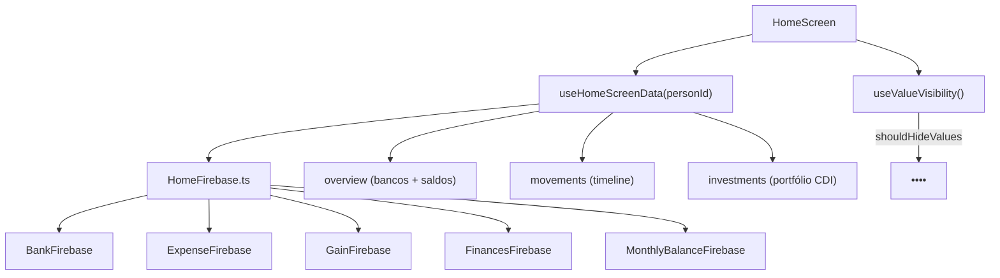

# Dashboard Home

Tela principal do app após login. Exibe uma visão consolidada de todas as contas bancárias, resumo de entradas/saídas, linha do tempo de movimentos e portfólio de investimentos do usuário.

## Como funciona

1. `HomeScreen.tsx` chama o hook `useHomeScreenData(personId)` que retorna três seções com estados independentes:
   - **overview** — lista de bancos com saldos, total em caixa, total geral
   - **movements** — timeline de movimentos recentes (despesas e receitas)
   - **investments** — portfólio com valores atuais calculados pela taxa CDI por vigência
2. Cada seção tem seu próprio `loading` e `error`, permitindo carregamento parcial
3. O hook usa cache compartilhado TanStack Query por UID com TTL de 10 minutos. Retornar à Home não consulta o Firebase dentro da janela; `reload()` é a recarga manual por pull-to-refresh.
4. A implementação Android/iOS renderiza:
   - Carrossel de cartões bancários (`bank-card-surface.tsx`) com gradiente por cor do banco
   - Gráfico de pizza de distribuição de gastos por tag
   - Timeline de movimentos com ícones coloridos
   - Cards de investimentos com valor atualizado
5. Quando algum banco registrado não tem `MonthlyBalance` do mês corrente, a Home abre um modal de aviso indicando as contas pendentes e oferecendo acesso direto para `/register-monthly-balance`
6. Toggle de privacidade (via [[Privacidade de Valores]]) oculta todos os valores quando ativo
7. As opções [[Análise por Categoria]] e [[Previsão de Fluxo de Caixa]] ficam no grupo Home do navigator para abrir relatórios dedicados sem misturar esses fluxos com o container de abas
8. `HomeScreen.web.tsx` porta a composição visual da Home nativa para o navegador: hero com `wallpaper01.png` e `homeScreen.svg`, cartões bancários com `BankCardSurface`, dois cards de totais mensais de ganhos e gastos entre as contas/investimentos, sparklines Mantine compactos ao lado dos textos e a timeline, distribuição de investimentos, timeline vertical expansível, popovers informativos, modal de saldo mensal pendente e os mesmos ícones por categoria. Os totais e as séries somam os valores mensais por banco e dinheiro já retornados por `overview`, mantêm centavos até a formatação e respeitam a máscara de privacidade; quando os valores estão ocultos, os sparklines usam uma linha neutra. O título do hero usa `StrokeText` para desenhar o texto na entrada da página, e a ilustração usa `AnimatedContent` para entrar verticalmente, enquanto o wallpaper permanece como base estática. A Web adapta o carrossel bancário para rolagem horizontal e mantém o `Navigator` desktop com `StaggeredMenu`; ações, privacidade, erros parciais e valores em centavos permanecem preservados. Ao expandir um movimento, o painel de detalhes usa `Grainient` com três stops derivados da cor daquele tipo de lançamento; a entrada e a saída usam `AnimatedContent`, o canvas só é montado durante a presença do detalhe e o conteúdo permanece em uma camada superior para preservar a leitura.
9. A Home Web exibe um `Sparkline` compacto ao lado de cada total mensal. O card de ganhos usa os totais dos três últimos meses de entradas; o card de gastos usa os totais dos três últimos meses de saídas. O gráfico detalhado `Gastos por dia` permanece abaixo em um Expo DOM separado, com uma série por mês. O snapshot consulta o caminho do razão financeiro pós-corte ou as coleções legadas conforme o grupo, mantendo centavos/exclusões e substituindo as curvas compactas por uma linha neutra quando a privacidade está ativa.
10. A Home Web também exibe `Atividade no ano`: um `Heatmap` Mantine do primeiro ao último dia do ano atual. Cada quadrado conta lançamentos financeiros confirmados naquele dia; no legado, a perna de entrada de uma transferência é ignorada para que uma transferência conte uma vez. No razão financeiro, cada `ledgerTransaction` é uma única ação.
11. Acima de `Últimas Movimentações`, a Home Web exibe `Próximos compromissos` em duas colunas. Cada coluna mostra até três gastos e ganhos obrigatórios pendentes, priorizando o próximo ciclo não concluído, respeitando dia útil/feriado, parcelas ativas e privacidade de valores. O agregado usa a mesma leitura compartilhada da Home para grupos legados e migrados.
12. No caminho legado, o snapshot também lê `tags`, `mandatoryExpenses`, `mandatoryGains` e `financeInvestmentSyncs`; essas coleções têm regras próprias com o mesmo escopo por `personId`/usuários relacionados. A leitura dos compromissos é opcional: se falhar, a Home preserva saldos e indicadores e exibe a seção sem itens. Os saldos legados são consultados em lote com o último snapshot por banco e movimentos posteriores ao corte, sem reler todo o histórico para cada card.

## Container de Abas

`app/home.tsx` é o container de abas. Renderiza diretamente o componente da aba ativa baseado no parâmetro `tab`:

| tab | Componente | Tela |
|---|---|---|
| 0 | `HomeScreen` | Dashboard |
| 1 | `AddRegisterExpensesScreen` | Controle (registro de despesas) |
| 2 | `ConfigurationsScreen` | Configurações |

O container não usa Tab Navigator — apenas alterna componentes com base no índice parseado de `useLocalSearchParams()`.

Enquanto `/home` está focada, o botão físico de voltar do Android encerra o aplicativo. Isso impede que redirects seguros via `REPLACE` revelem uma Home duplicada ou um formulário já concluído que tenha permanecido abaixo no histórico do NativeStack.

## Arquivos principais

- `screens/HomeScreen.tsx` / `.web.tsx` — Dashboard por plataforma, ambos usando a mesma fonte de dados
- `hooks/useHomeScreenData.ts` — Hook de fetching setorizado
- `functions/HomeFirebase.ts` — Agregação de dados do Firestore
- `app/home.tsx` — Rota e container de abas (Home, Control, Settings)
- `components/uiverse/bank-card-surface.tsx` — Card do banco com gradiente
- `components/uiverse/home-expense-chart.tsx` — `Sparkline` Mantine em Expo DOM para tendências compactas de ganhos e gastos
- `components/uiverse/home-expense-line-chart.tsx` — `LineChart` Mantine em Expo DOM para gastos diários dos últimos três meses
- `components/uiverse/home-activity-heatmap.tsx` — `Heatmap` Mantine em Expo DOM para atividade financeira diária no ano
- `utils/homeActivityHeatmap.ts` — agregação pura de contagens diárias de atividade
- `utils/homeMandatorySchedule.ts` — seleção pura dos próximos ciclos obrigatórios pendentes
- `utils/homeExpenseHistory.ts` — Agregação pura dos valores de gasto por dia e mês
- `components/web/Grainient.jsx` / `.css` — Fundo Web animado usado nos detalhes expandidos da timeline e no hero, com fallback CSS quando WebGL2 não está disponível

## Integrações

- [[Hooks Customizados]] — `useHomeScreenData` e `useScreenStyles`
- [[Gerenciamento de Bancos]] — Dados de saldo dos bancos
- [[Transações de Despesas]] e [[Transações de Receitas]] — Movimentos na timeline
- [[Investimentos]] e [[Monitoramento de Investimentos]] — Portfólio usa a taxa CDI persistida por pessoa e vigência; não há taxa anual fixa no código
- [[Balanço Mensal]] — Usa o último snapshot de abertura e os movimentos posteriores via `calculateLegacyBankBalanceInCents()`
- [[Privacidade de Valores]] — Oculta valores sensíveis com `HIDDEN_VALUE_PLACEHOLDER`
- [[Análise por Categoria]] — Relatório acionado pela navegação Home para comparar tags com média histórica
- [[Previsão de Fluxo de Caixa]] — Planejamento de saldo futuro acionado pela mesma navegação Home, em rota própria
- [[Sistema de Temas]] — Estilos adaptativos dark/light via `useScreenStyles()`
- [[Componentes UI]] — Mantine Charts fica isolado no componente Expo DOM Web

## Configuração

- `personId` e o nome exibido no hero vêm do `user` do [[Autenticação|AuthContext]]; o nome persistido é lido de `users/{uid}.name`, com fallback para `displayName`
- Cores dos gráficos de pizza definidas em paleta CDI (8 cores) dentro de `HomeFirebase.ts`
- `investmentCdiRates` é lida junto dos investimentos para simular somente intervalos com taxa configurada

## Observações importantes

- A seção de investimentos da Home só aparece durante carregamento, em erro ou quando a carteira carregada possui investimentos. Quando a consulta termina com uma carteira vazia, a seção é omitida; na Web desktop, os cartões bancários são centralizados.
- Em grupos migrados para o razão financeiro, a carteira da Home é montada a partir das contas `financialAccounts` com `kind: 'investment'`; ela exibe o saldo confirmado do razão sem inventar uma projeção CDI legada.

- A Home Web está em migração gradual para Tailwind/NativeWind. A composição visual deve evitar novos blocos `StyleSheet.create()` e preservar `webDashboardPalette` para tokens dinâmicos de tema.
- A geometria fixa da `HomeScreen.web.tsx` fica centralizada em `WEB_DASHBOARD_CLASS_NAMES` e `WEB_DASHBOARD_DOM_STYLES`, exportados por `hooks/useScreenStyle.ts`; a tela usa `className` Tailwind e mantém em `style` somente valores calculados em runtime, como paleta, altura do hero, safe area e cores por movimento.
- O hero mantém o `Grainient` visível sobre o wallpaper: WebGL2 anima a camada quando disponível e o gradiente CSS subjacente evita revelar o fundo padrão em navegadores sem esse contexto.

- Todos os valores são armazenados em centavos e convertidos para exibição
- O saldo legado dos bancos usa o `MonthlyBalance` mais recente como ponto de partida e somente movimentos posteriores a ele; grupos migrados usam `financialAccounts.currentBalanceInCents`
- No Web, abrir o detalhe de uma movimentação remonta o wrapper `AnimatedContent` com a chave daquele movimento e `trigger="mount"`, reiniciando a entrada vertical suave a cada clique sem depender da posição do scroll. Ao fechar, o card permanece montado até concluir a saída vertical, e reabrir durante a transição interrompe o fechamento. A superfície explicita os quatro raios de canto para recortar também o `Grainient` nos lados direitos, e o wrapper ocupa 100% da coluna sem recuo lateral. O container e o canvas do `Grainient` usam `inset: 0` para preencher toda a superfície. O detalhe usa somente deslocamento e opacidade, sem escala, para manter os cantos estáveis durante a animação; `prefers-reduced-motion` continua respeitado e Android/iOS mantêm a expansão nativa sem dependência DOM.
- Transferências não entram nos indicadores de ganhos/gastos, embora alterem os saldos das contas envolvidas
- Compromissos obrigatórios exibidos na Home são apenas informativos; efetivar o ciclo continua sendo responsabilidade das listas de [[Despesas Fixas]] e [[Receitas Fixas]], que criam a transação real
- As consultas legadas auxiliares da Home são protegidas por regras específicas no `firestore.rules`; usuários em grupos já cortados continuam sem acesso direto às coleções legadas
- Bancos sem snapshot ainda aparecem como saldo indisponível e acionam o modal de lembrete da Home
- A função `HomeFirebase.ts` é a mais complexa do projeto — agrega dados de múltiplas coleções
- O carrossel de bancos usa `react-native-reanimated-carousel` no Android/iOS e o `components/web/Carousel.jsx` baseado no React Bits na versão Web; ambos exibem a mesma coleção de bancos e Dinheiro e preservam a navegação para os movimentos da conta
- Gráficos usam `react-native-gifted-charts`
- O gráfico Web de gastos usa `@mantine/charts` e mostra somente dias com lançamentos; ele não cria previsões nem persiste agregados novos
- O heatmap Web usa `@mantine/charts`, não registra telemetria e somente resume lançamentos financeiros já confirmados no Firestore
- Sem uma taxa CDI vigente, o card da Home conserva o valor-base/sincronizado do investimento em vez de inventar rendimento
- O container de abas não usa navegação stack interna — é apenas renderização condicional de componentes
- O botão físico na rota Home deve encerrar o app; retornos para formulários antigos são proibidos após conclusão de cadastro
