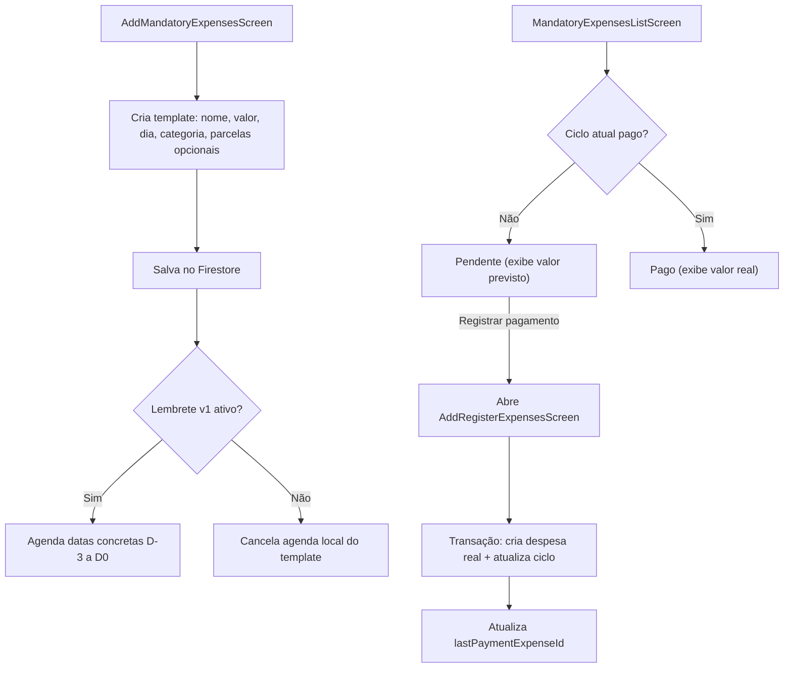

# Despesas Fixas

Gerencia despesas recorrentes mensais (ex: aluguel, streaming, academia) com rastreamento de pagamento por ciclo, lembretes locais de vencimento e aviso remoto aos usuários vinculados quando o template muda.

## Como funciona

1. `AddMandatoryExpensesScreen.tsx` cria a despesa fixa com nome, valor, dia do vencimento, categoria obrigatória e parcelamento opcional; o seletor de categoria usa o ActionSheet customizado das telas de registro, com ícone, nome e ação interna para abrir `AddRegisterTagScreen.tsx` sem perder o contexto
2. Cada despesa fixa tem um controle de ciclo (`YYYY-MM`) para rastrear se já foi paga no mês atual
3. `MandatoryExpensesListScreen.tsx` exibe todas as despesas fixas com status: paga / pendente no ciclo atual
4. Após criar ou editar o template obrigatório, `AddMandatoryExpensesScreen.tsx` aplica [[Comportamento Pós-Registro]] depois do feedback de sucesso
5. Ao registrar o pagamento do mês, o app abre o fluxo de [[Transações de Despesas|despesa]] real; nesse momento o banco e a data do ciclo atual são definidos. O submit cria a despesa e atualiza o ciclo em uma única transação Firestore, seguindo depois a preferência da tela de despesas
6. O card **Lembrete do vencimento** permite escolher quando começar a lembrar (um, dois ou três dias antes), adicionar um aviso no próprio vencimento e definir o horário preferido; os avisos locais são agendados via [[Notificações]]
7. Ao registrar o pagamento real, o app suprime imediatamente os avisos restantes do mesmo ciclo `YYYY-MM`, evitando cobrar um item já pago
8. Enquanto a despesa fixa estiver pendente no ciclo atual, o calendário e a timeline exibem o valor previsto do template; após o registro do mês, passam a mostrar o valor efetivamente salvo na despesa real vinculada via `lastPaymentExpenseId`
9. Quando o parcelamento está ativo, o template mantém `installmentTotal`, `installmentsCompleted`, `installmentStartDate` e `installmentEndDate`; cada pagamento mensal registrado avança uma parcela e a listagem exibe `Parcela X de Y`
10. `MandatoryExpensesListScreen.tsx` exibe um resumo do mês corrente com total do ciclo, valores pagos, valores pendentes, parcelamentos concluídos fora do ciclo e botão para baixar o resumo em PDF via `expo-print`/`expo-sharing`; as ações de baixar PDF e adicionar gasto ficam lado a lado em um `HStack`
11. A lista pode ser recarregada manualmente por pull-to-refresh; na Web, não há botão dedicado de atualizar. Esse recarregamento também reconcilia os lembretes locais com os templates do UID autenticado
12. Quando um usuário tenta registrar uma despesa comum do ciclo atual que parece corresponder a um template obrigatório pendente, `AddRegisterExpensesScreen.tsx` mostra um modal conservador. Ao aceitar, a navegação abre `MandatoryExpensesListScreen.tsx` já na confirmação de registro do template identificado
13. Depois de cada criação, edição ou exclusão confirmada no Firestore, a Function confiável de [[Notificações]] envia um push aos aparelhos registrados do dono e de seus usuários relacionados. A lista continua responsável apenas pela reconciliação de seus lembretes locais.
14. O navegador possui composições independentes em `AddMandatoryExpensesScreen.web.tsx` e `MandatoryExpensesListScreen.web.tsx`: o cadastro usa o calendário modal customizado para início/fim das parcelas, `input type="time"` para o horário e um painel de controle mensal; a lista usa calendário mensal, resumo, timeline expansível, confirmação em modal, recarregamento por pull-to-refresh e impressão do resumo em PDF. Os modais de confirmação e resumo diário da lista Web usam superfície responsiva `lg`, com margem de viewport e rolagem contida; no resumo diário, o corpo se ajusta ao conteúdo e só rola quando necessário, evitando espaços verticais artificiais entre itens. Os diálogos nativos mantêm seus limites compactos. O hero da lista preserva a mesma altura visual das telas Web com sheet sobreposto, ocultando os 64 px finais do `heroHeight` e mantendo 16 px até o calendário. A lógica Firebase e as regras em centavos permanecem as mesmas das telas nativas.

## Chave de Ciclo

- `getCycleKeyFromDate()` em `utils/mandatoryExpenses.ts` retorna `YYYY-MM` para o mês atual
- `isCycleKeyCurrent()` verifica se a chave salva corresponde ao mês vigente
- Ao virar o mês, todas as despesas fixas ficam automaticamente como pendentes

## Lembretes de pagamento

- TimePickerField abre o seletor de hora nativo no Android/iOS e devolve HH:MM; no web, usa input type=time. No Android, o cabeçalho, o marcador e as ações usam o amarelo padrão do sistema configurado no build. A tela converte o valor escolhido para os campos numéricos já persistidos, sem alterar a agenda ou as regras de entrega.
- Um template novo começa com `reminderEnabled: false`, `reminderConfigVersion: 1`, `reminderDaysBefore: 1` e `reminderOnDueDate: false`.
- O seletor **Começar a lembrar** é cumulativo: `1` cria D-1; `2` cria D-2 e D-1; `3` cria D-3, D-2 e D-1.
- O switch **Avisar também no vencimento** acrescenta D0 sem remover os avisos anteriores. Assim, a configuração máxima gera D-3, D-2, D-1 e D0.
- O horário continua salvo em `reminderHour`/`reminderMinute`, mas é um horário preferido no Android: Doze, economia de bateria ou o fabricante podem atrasar a entrega.
- Templates sem `reminderConfigVersion: 1` são legado opt-out. Mesmo que possuam um `reminderEnabled` antigo, a listagem os trata como desativados até o usuário revisar, reativar e salvar o novo card.
- `MandatoryExpensesListScreen.tsx` apresenta `reminderSummary` com antecedência cumulativa, D0 opcional e horário; ausência de configuração nunca deve ser exibida como lembrete ativo.
- A agenda usa datas concretas depois de resolver o vencimento mensal. Isso preserva dia 29/30/31, dias úteis e avisos que caem no mês/ano anterior ao vencimento.
- O serviço mantém horizonte móvel, escopo por UID e período de parcelamento. Ciclos com `lastPaymentCycle` concluído e parcelamentos encerrados não recebem avisos.
- Salvar com o switch desligado ou excluir o template cancela todas as datas locais correspondentes àquela conta e despesa.

## Parcelamento

- Parcelamento é opcional. Sem `installmentTotal`, a despesa continua sendo uma recorrência mensal sem prazo final.
- Com `installmentTotal`, o template passa a representar uma despesa parcelada finita. O valor mensal continua em centavos em `valueInCents`.
- Ao ativar o parcelamento, `AddMandatoryExpensesScreen.tsx` mostra calendário de início preenchido com hoje e calendário final bloqueado até haver uma quantidade válida de parcelas.
- A quantidade e a data final ficam sincronizadas: alterar a quantidade recalcula `installmentEndDate`; alterar a data final recalcula `installmentTotal` pelos meses inclusivos entre início e fim.
- `installmentStartDate` permite backfill de templates antigos: ao editar/salvar ou listar, o app calcula quantas parcelas mensais já transcorreram antes do ciclo atual e mantém o ciclo atual dependente do pagamento real registrado.
- `installmentsCompleted` guarda quantos ciclos já foram efetivados. Ao registrar o pagamento via [[Transações de Despesas]], `registerMandatoryExpensePaymentFirebase()` cria a despesa real e incrementa esse contador uma vez por ciclo na mesma transação.
- Ao reivindicar/desfazer o pagamento do ciclo, `clearMandatoryExpensePaymentFirebase()` remove o vínculo com a despesa real e recua uma parcela quando havia pagamento vinculado.
- Quando `installmentsCompleted >= installmentTotal`, a listagem trata o parcelamento como concluído e bloqueia novos registros para o template.
- A UI usa `formatMandatoryInstallmentLabel()` em `utils/mandatoryInstallments.ts` para exibir `Parcela X de Y` no calendário e na timeline.
- Enquanto houver parcelas restantes, a lista oferece **Quitar parcelas**. O fluxo calcula `installmentTotal - installmentsCompleted` em centavos, abre o lançamento de despesa para escolha do banco e registra o valor total restante em uma única despesa.
- A quitação antecipada usa `settleMandatoryExpenseFirebase()` em uma transação Firestore: a despesa real é criada e o template parcelado é removido atomicamente. O valor informado pode ser menor ou maior que a soma teórica das parcelas para registrar descontos ou outros ajustes concedidos na quitação; a transação continua validando que ainda existem parcelas restantes.
- A sincronização de lembretes trata parcelamentos concluídos como `reminderEnabled: false`, cancelando notificações futuras ao recarregar a lista.

## Arquivos principais

- `screens/AddMandatoryExpensesScreen.tsx` — Formulário de criação/edição
- `screens/MandatoryExpensesListScreen.tsx` — Lista, timeline e controle de pagamento
- `screens/AddMandatoryExpensesScreen.web.tsx` — Composição Web responsiva do cadastro, com calendário/modal e controle mensal
- `screens/MandatoryExpensesListScreen.web.tsx` — Composição Web responsiva da lista, calendário, timeline, modais e resumo imprimível
- `functions/MandatoryExpenseFirebase.ts` — CRUD, validação do vínculo com despesa real e transação atômica de pagamento no Firestore
- `utils/mandatoryExpenses.ts` — Lógica de chave de ciclo
- `utils/mandatoryExpenseSuggestions.ts` — Detecção conservadora de templates obrigatórios em registros comuns
- `utils/mandatoryInstallments.ts` — Normalização e rótulos de parcelamento
- `utils/mandatoryPeriodSummaryPdf.ts` — HTML compartilhado para PDF de resumo mensal de recorrências
- `utils/mandatoryReminderNotifications.ts` — Serviço compartilhado de lembretes obrigatórios
- `utils/mandatoryReminderConfig.ts` — Schema v1, offsets cumulativos e resumo do lembrete
- `utils/mandatoryExpenseNotifications.ts` — Agendamento de notificações (wrapper fino)
- `app/add-mandatory-expenses.tsx` — Rota de criação
- `app/mandatory-expenses.tsx` — Rota da lista
- `utils/navigation.ts` — Saída explícita para Home pelo voltar físico/navigator
- `hooks/usePostSubmitBehavior.ts` — Aplica retorno/limpeza após salvar templates
- `components/uiverse/tag-actionsheet-selector.tsx` — Seletor de categoria obrigatória em ActionSheet
- `components/uiverse/time-picker-field.native.tsx` / `.web.tsx` — Seletor reutilizável de horário do lembrete
- `components/uiverse/date-picker.tsx` e `components/uiverse/date-calendar.tsx` — Calendários customizados usados pelo cadastro e pela listagem em todas as plataformas

## Integrações

- [[Transações de Despesas]] — Marcar como paga cria despesa real no Firestore
- [[Gerenciamento de Bancos]] — Banco é escolhido no lançamento mensal da despesa real
- [[Notificações]] — Agendamento de lembretes de vencimento via `mandatoryReminderNotifications.ts`
- [[Receitas Fixas]] — Módulo paralelo que compartilha o motor de agenda, com regra de momento própria
- [[Gerenciamento de Tags]] — Categoria obrigatória pode ser criada inline
- [[Privacidade de Valores]] — Resumo e PDF respeitam a preferência de ocultar valores
- [[Previsão de Fluxo de Caixa]] — Template pendente é projetado no ciclo correspondente; pagamento real vinculado e parcelas concluídas não são projetados novamente
- [[Comportamento Pós-Registro]] — Define retorno/limpeza após salvar templates

## Configuração

- Notificações requerem permissão do usuário e usam exclusivamente `expo-notifications`
- Expo Go serve para smoke test local; validar canais, segundo plano e comportamento real em development build e produção
- Alterar plugin, manifesto ou dependência nativa exige novo build; detalhes em [[Notificações]]

## Observações importantes

- Despesas fixas **não debitam automaticamente** — o usuário precisa marcar como paga
- No navegador, lembretes continuam sendo salvos no template, mas não são agendados; a própria composição Web informa que a entrega ocorre somente no aplicativo instalado. O calendário e os modais são componentes da aplicação, sem depender do date picker nativo do sistema.
- A [[Previsão de Fluxo de Caixa]] apenas lê os templates pendentes como compromissos estimados; ela nunca efetiva o pagamento nem altera `lastPaymentCycle`
- A lista de gastos obrigatórios é o fluxo correto para efetivar o ciclo. Lançamentos comuns do ciclo atual que batem com qualquer template pendente podem ser interceptados antes de salvar; um nome principal canônico e único (como `Fatura do Aluguel`/`Aluguel`, `Pagamento da Internet Residencial`/`Internet Residencial` ou `Mensalidade da Academia`/`Academia`) basta mesmo quando a categoria e o valor variam. `Luz`, `Conta de Luz` e `Energia Elétrica` são apenas outro exemplo. Para nome apenas parecido, a sugestão exige valor compatível com o template/último pagamento mais categoria igual ou vencimento em até sete dias
- Nomes de marca ou serviço semanticamente distintos, sem palavras em comum com o template, não são inferidos por suposição para não abrir o modal no gasto errado
- Templates já pagos no ciclo, parcelamentos concluídos, parcelas fora de sua vigência e candidatos ambíguos nunca abrem a sugestão. Um vínculo cujo documento de despesa não exista é tratado como pendente para permitir correção pelo fluxo oficial
- O parâmetro de navegação `focusMandatoryExpenseId` abre a confirmação de registro apenas se o template continuar pendente depois da recarga da lista; assim uma atualização concorrente não cria duplicidade
- O ciclo é verificado no momento da listagem — sem jobs background. O formulário de pagamento obrigatório aceita somente datas do ciclo atual, porque o template mantém o vínculo do ciclo vigente
- Se o app for reinstalado, notificações agendadas são perdidas
- A lista reconcilia os lembretes salvos, corrigindo datas ausentes, expiradas ou defasadas na agenda Expo do UID atual
- A autenticação também executa a reconciliação global via `mandatoryReminderAccountSync.ts`, portanto um relogin restaura os lembretes sem exigir que esta lista seja aberta
- O texto da notificação é personalizado com o nome do gasto e orienta que o pagamento deve ser efetuado
- O formulário libera campos progressivamente; se houver alterações pendentes em um template salvo, é preciso salvá-las antes de registrar o ciclo
- Todos os inputs textuais do formulário, incluindo quantidade de parcelas e observações, devem usar a rotina de foco que mantém o campo visível acima do teclado. O horário do lembrete usa o seletor nativo e não abre o teclado.
- Em formulários novos, o switch de lembrete começa desligado e fica desabilitado até nome, valor, dia e categoria serem preenchidos
- Quando a categoria é criada inline, a tela de tags abre com tipo `expense` e obrigatoriedade pré-selecionados, mas editáveis; ao salvar uma categoria compatível, ela retorna já selecionada
- O seletor de categoria obrigatória deve permanecer no ActionSheet compartilhado com `<TagIcon />` e ação interna de criação, sem regressão para o menu padrão do Android ou botão externo ao campo
- O valor no ciclo atual usa `displayValueInCents` do `date-calendar.tsx`: antes da efetivação mostra o template, após mostra o `valueInCents` da despesa real apontada por `lastPaymentExpenseId`
- Salvar ou editar um template obrigatório deve passar por [[Comportamento Pós-Registro]]
- Ao criar um novo template obrigatório, a limpeza dos campos é controlada pela preferência da tela quando o retorno automático está desligado; o submit usa trava síncrona enquanto salva e agenda/cancela lembrete para impedir duplo registro
- Despesas parceladas permanecem no calendário/lista até a conclusão ou quitação antecipada; deixam de aceitar novos registros depois da última parcela
- A quitação antecipada encerra o template e mantém no razão as parcelas já pagas e uma despesa real com o valor agregado das parcelas restantes; não é uma exclusão silenciosa do histórico financeiro
- Templates parcelados criados antes de `installmentStartDate` continuam compatíveis; ao editar, o formulário sugere hoje como início e recalcula o fim pela quantidade atual até o usuário salvar a nova configuração
- O resumo mensal inclui itens pagos no ciclo atual e pendentes do mês; parcelamentos concluídos em ciclos anteriores aparecem como contagem separada e não entram no total financeiro do mês
- O PDF é gerado localmente no dispositivo, compartilhado com nome contextual `Lumus-Financas-Despesas-Fixas-[mes]-[data].pdf` e usa os mesmos valores exibidos na tela, incluindo valores ocultos quando a privacidade está ativa

## Integração com o Assistente Lumus

- [[Assistente Lumus]] cria/edita/exclui templates e registra/desfaz o ciclo por comandos próprios.
- Pagamento e lançamento real são escritos na mesma transação; `lastPaymentExpenseId`, `lastPaymentCycle` e parcelas não podem ficar parcialmente atualizados.
- A agenda local é suprimida ou recalculada somente depois do commit e uma falha de notificação vira aviso sem desfazer o pagamento.
