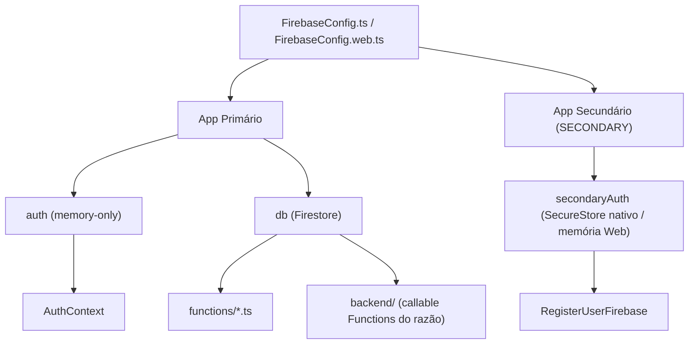

# Firebase Config

Configuração e inicialização do Firebase no projeto. Usa dois apps Firebase de negócio e, somente no desenvolvimento Web, um terceiro app restrito à ponte de IA. Resolve o adaptador de persistência pela plataforma, mantendo Auth e dados financeiros separados da ponte remota.

## Como funciona



### App Primário
- Inicializado em `FirebaseConfig.ts` (Android/iOS) ou `FirebaseConfig.web.ts` (navegador) com `initializeApp(firebaseConfig)`
- Expõe: `app`, `auth` (Firebase Auth) e `db` (Firestore)
- **Persistência memory-only**: no nativo, `memoryOnlyAuthStorage`; no navegador, `inMemoryPersistence` do SDK Firebase — ao fechar o app, a aba ou ao recarregar, a sessão é encerrada
- Isso é intencional: o usuário volta para a tela de login a cada abertura do app
- Usado para autenticação da sessão atual e todas as operações Firestore

### App Secundário
- Inicializado com `initializeApp(firebaseConfig, 'SECONDARY')`
- Expõe: `secondaryApp` e `secondaryAuth`
- No Android/iOS, usa `firebaseAuthStorage.ts` — SecureStore com fallback AsyncStorage — para as credenciais temporárias do fluxo de cadastro
- No navegador, `FirebaseConfig.web.ts` usa `inMemoryPersistence` também para o secundário; nenhuma conta criada deixa sessão em Local Storage, IndexedDB ou cookie
- Usado exclusivamente em `RegisterUserFirebase.ts` para criar novas contas sem afetar a sessão ativa
- Após criar o usuário, o app secundário é deslogado

### Estratégia de Persistência

| Plataforma | App | Persistência | Motivo |
|---|---|---|---|
| Android/iOS | Primário (`auth`) | Memory-only (sem storage) | Sessão encerra ao fechar o app |
| Android/iOS | Secundário (`secondaryAuth`) | SecureStore + AsyncStorage fallback | Mantém credenciais temporárias durante criação de conta |
| Web | Primário (`auth`) | `inMemoryPersistence` | Sessão encerra ao recarregar/fechar a aba ou navegador |
| Web | Secundário (`secondaryAuth`) | `inMemoryPersistence` | O cadastro não persiste credenciais secundárias no navegador |

### Alvos isolados

`utils/firebaseRuntime.ts` é o único resolvedor do alvo dos dados financeiros. `EXPO_PUBLIC_FIREBASE_TARGET=emulator` cria uma configuração sintética para `demo-lumus-financas`, conecta Auth (primário e secundário), Firestore e Functions nas portas 9099, 8080 e 5001. Os emuladores escutam em `0.0.0.0`; o script usa `adb reverse` no Android Emulator e o IP LAN privado para dispositivos físicos. Computador e celular devem estar na mesma rede e o firewall deve permitir essas portas. O fluxo `npm run dev:local` força `expo start --go --lan`; `npm run dev:local:web` inicia a mesma configuração no navegador; o modo `--dev-client` permanece disponível separadamente para validar módulos nativos. Se o processo Expo encerrar inesperadamente, o launcher tenta iniciá-lo novamente após dois segundos sem reiniciar a Suite nem executar o seed de novo; `Ctrl+C` encerra a sessão e os emuladores iniciados nessa execução. O seed imprime no terminal as credenciais da conta demo local, que não existem em produção, e grava essa conta com `adminUser: true` para permitir testar os fluxos administrativos.

AI Logic e Remote Config não fazem parte dos produtos emulados. Por isso, no alvo Emulator existe uma ponte híbrida restrita a AI Logic, App Check e Remote Config: o navegador cria o app nomeado `LUMUS_ASSISTANT_DEVELOPMENT` com os identificadores públicos de `finances-app-e8685`, e o Android usa o app nativo do `google-services.json`. Auth, Firestore e Functions do negócio continuam integralmente em `demo-lumus-financas`; a ponte não exporta `db`, `auth` nem `functions` remotos e nunca grava dados financeiros no projeto real.

`development` só aceita `emulator`. Os perfis instaláveis `preview`, `production` e `production-apk` só aceitam `production`, com o project ID `finances-app-e8685` e todas as credenciais; assim, um APK de preview não aponta para `127.0.0.1` no próprio aparelho. O preview usa App Check `debug`, enquanto produção e `production-apk` usam Play Integrity. Combinações inválidas falham antes de inicializar o SDK. O alias padrão da CLI continua sendo o demo project; deploys devem informar `--project production`.

O snapshot de ambiente usado no cliente acessa cada `process.env.EXPO_PUBLIC_*` diretamente antes de chamar o resolvedor. Esse formato é obrigatório para o Metro incorporar os valores no bundle. Uma release local sem `TARGET` explícito usa produção somente quando todas as credenciais obrigatórias existem e o project ID é o canônico; Metro em desenvolvimento continua escolhendo o Emulator. Não voltar a passar `process.env` inteiro ou a ler essas chaves apenas por índice dinâmico, pois o bundle instalado ficaria sem configuração e falharia antes de substituir a splash nativa.

### Variáveis de Ambiente
```
EXPO_PUBLIC_FIREBASE_API_KEY
EXPO_PUBLIC_APP_ENV
EXPO_PUBLIC_FIREBASE_TARGET
EXPO_PUBLIC_FIREBASE_EMULATOR_HOST
EXPO_PUBLIC_FIREBASE_AUTH_DOMAIN
EXPO_PUBLIC_FIREBASE_PROJECT_ID
EXPO_PUBLIC_FIREBASE_STORAGE_BUCKET
EXPO_PUBLIC_FIREBASE_MESSAGING_SENDER_ID
EXPO_PUBLIC_FIREBASE_APP_ID
EXPO_PUBLIC_FIREBASE_MEASUREMENT_ID
EXPO_PUBLIC_FIREBASE_APP_CHECK_RECAPTCHA_ENTERPRISE_KEY
EXPO_PUBLIC_FIREBASE_APP_CHECK_ANDROID_PROVIDER
EXPO_PUBLIC_FIREBASE_APP_CHECK_DEBUG_TOKEN
```

As credenciais de produção são validadas pelo resolvedor antes da inicialização do SDK financeiro. No modo Emulator, o app principal usa somente a configuração sintética e o host local; os mesmos identificadores públicos podem ser lidos separadamente pelo adaptador Web da IA para formar a ponte híbrida. Chave Gemini, token App Check e segredo de servidor não fazem parte dessa configuração pública.

## Exports

```typescript
export const app: FirebaseApp;           // App primário
export const auth: Auth;                 // Auth memory-only
export const db: Firestore;              // Firestore principal
export const secondaryApp: FirebaseApp;  // App secundário
export const secondaryAuth: Auth;        // Auth secundário (SecureStore nativo / memória Web)
export const firebaseFunctions: Functions; // Functions já conectado ao alvo resolvido
```

## Arquivos principais

- backend/src/index.ts — Callable Functions confiáveis do razão financeiro
- firebase.json, firestore.rules e firestore.indexes.json — Configuração versionada do Firebase
- functions/FinancialLedgerFirebase.ts — Adaptador client para grupos já cortados


- `FirebaseConfig.ts` — Inicialização e exports Android/iOS
- `FirebaseConfig.web.ts` — Inicialização Web com Auth em memória para os dois apps
- `utils/firebaseAuthStorage.ts` — Persistência dual SecureStore/AsyncStorage (usado pelo app secundário)
- `firebase.json` e `.firebaserc` — Configuração do Firebase Hosting e aliases do projeto demo (padrão) e do projeto remoto (`production`)
- `types/firebase-auth.d.ts` — Type declarations Firebase

## Integrações

- Grupos financeiros cortados usam backend/ como única camada de escrita para contas, razão, reconciliações e auditoria.


- [[Autenticação]] — Consome `auth` para `onAuthStateChanged` e `signInWithEmailAndPassword`; o `reload()` de validação não roda em listener de token para não criar loop de renovação
- [[Gerenciamento de Usuários]] — Consome `secondaryApp`/`secondaryAuth` para criar usuários
- Todos os `functions/*.ts` — Consomem `db` (Firestore) para operações CRUD
- [[Segurança de Login]] — `firebaseAuthStorage` configura persistência do `secondaryAuth`
- [[Assistente Lumus]] — Usa Firebase AI Logic, App Check e Remote Config, sem Cloud Functions

## Firebase AI Logic

- Web usa `firebase/ai` e `ReCaptchaEnterpriseProvider`. Em produção, usa o app primário JS; no alvo Emulator, usa somente para IA o app nomeado `LUMUS_ASSISTANT_DEVELOPMENT` do projeto remoto.
- Android usa módulos `@react-native-firebase` 25.1 alinhados para `app`, `app-check`, `ai`, `auth` e `remote-config`.
- O Auth/Firestore financeiro continua no SDK JS. Fora do alvo Emulator, o adaptador Android fornece ao SDK nativo da IA somente `getIdToken()` do usuário atual. No modo híbrido, o usuário local continua obrigatório, mas o token de Auth emitido por `demo-lumus-financas` não é anexado à chamada do projeto remoto.
- App Check Android usa provider `debug` em development/preview e Play Integrity em produção.
- Enforcement deve ser ativado para Firebase AI Logic. Não ativar para Firestore nesta etapa porque o cliente Android financeiro continua no SDK JS.
- Antes de liberar a disponibilidade do Lumus IA no Android, o adaptador inicializa o App Check e solicita um token string não vazio. Falha nesse preflight deixa somente o assistente indisponível como erro de App Check/configuração; não invalida nem pede novo login para a sessão financeira do Firebase JS. `refreshAvailability()` força nova resolução de Remote Config e repete o preflight sob ação explícita do usuário.
- Remote Config controla kill switch, modelo e limites descritos em [[Assistente Lumus]]. Falha de fetch ou de inicialização usa os padrões locais limitados; um valor já ativado continua válido quando apenas o fetch falha.
- O template `remote_config.json` está ligado a `firebase.json` e foi publicado em 2026-09-21 como versão remota 1 no projeto `finances-app-e8685`. A versão usa `gemini-3.8-flash`, limites 12/20/8/10 e os mesmos padrões locais do cliente; modelos fora da lista validada, variantes preview/experimental/`-latest` e modelos dedicados à geração de imagem/áudio não são aceitos como fallback conversacional. O `gemini-3.8-flash` é multimodal e aceita áudio como entrada.
- A versão remota 1 é uma evidência histórica de 2026-09-21. Em 2026-09-25, uma leitura da CLI confirmou no template ativo `lumus_ai_enabled=true` e `lumus_ai_model=gemini-3.8-flash`, sem condições; nenhuma configuração remota foi alterada. A ponte Web local trocou o token App Check Debug com sucesso, mas o modelo principal respondeu `500` por alta demanda a um pedido com ferramentas e `429` em outra tentativa. O erro HTTP era apresentado como falta de internet porque o SDK usa `fetch-error` também para respostas do servidor; [[Assistente Lumus]] descreve o novo mapeamento e a alternativa gratuita limitada. Um teste de navegador autenticado e outro em aparelho ainda são necessários.
- O SDK Web foi atualizado para `firebase@12.19.0`, cujo pacote AI Logic envia resultados de ferramentas como conteúdo `user`; `@react-native-firebase/ai@25.1.0` mantém o papel antigo, então o adaptador Android usa `generateContent` com o mesmo protocolo aceito pelo servidor. Mudança de código nativo exige um novo development client instalado antes da validação Android.
- A Firebase CLI confirmou os apps `1:909478123750:web:bfe59f4e4d9682d20a4327` e `1:909478123750:android:abdf321566d172470a4327`. O `google-services.json` local também foi conferido contra o project ID e package Android e continua fora do Git.
- O Console foi conferido em 2026-09-21: o projeto continua no plano Spark, a Gemini Developer API está ativa, Agent Platform não está ativada, Android usa Play Integrity, Web usa reCAPTCHA Enterprise e ambos aparecem como **Registrado (aplicado)** para AI Logic. O enforcement do Firestore permanece desativado/fora desta entrega. A lista de domínios autorizados do Authentication não carregou no Console e ainda precisa de verificação manual antes do smoke test Web.
- A site key `EXPO_PUBLIC_FIREBASE_APP_CHECK_RECAPTCHA_ENTERPRISE_KEY` é pública e serve somente ao reCAPTCHA Enterprise; não é chave Gemini.
- Não existe Cloud Function nem processo permanente: o aplicativo chama o serviço somente sob ação do usuário.
- App Check Debug continua enforced também no desenvolvimento. O export local com alvo Emulator ativa o provider de debug mesmo com o bundler em modo production. Se o SDK ainda não tiver um token cadastrado, a tela mantém o compositor bloqueado e **Tentar novamente** refaz o preflight após o cadastro no Console.

## Web e Firebase Hosting

- `app.json` declara `web.output: "single"` e `userInterfaceStyle: "automatic"`. O export `npx expo export --platform web` gera os artefatos estáticos em `dist/`.
- `firebase.json` preserva Functions, Firestore e emuladores existentes e acrescenta Hosting com `public: "dist"`, URLs limpas e rewrite de qualquer rota para `/index.html`. Isso permite que o Expo Router e `Stack.Protected` recebam deep links, sem criar Expo API Routes ou backend novo.
- `.firebaserc` mantém o projeto demo como padrão e o alias `production` para `finances-app-e8685`. `npm run web:export` e `web:serve` usam o alvo local escolhido no ambiente; `web:deploy:preview` e `web:deploy` forçam o alvo financeiro remoto e limpam o token App Check Debug antes de exportar. Nenhum deploy foi executado nesta auditoria.
- Configuração manual no Firebase Console, antes do primeiro deploy: adicionar `finances-app-e8685.web.app`, `finances-app-e8685.firebaseapp.com` e todo domínio próprio futuro à lista de domínios autorizados do Firebase Authentication. Registrar esses mesmos hosts no provider reCAPTCHA Enterprise do App Check para que o [[Assistente Lumus]] Web funcione em HTTPS.
- A chave `EXPO_PUBLIC_FIREBASE_APP_CHECK_RECAPTCHA_ENTERPRISE_KEY` continua sendo pública por definição de cliente. Não incluir chave Gemini, segredo de servidor ou credencial administrativa no bundle Web.

## Configuração Expo nativa

- `app.config.ts` preserva a base de `app.json` e mantém somente as decisões dinâmicas: configura `expo-audio` e resolve o arquivo Android do Firebase. O próprio plugin de áudio materializa `RECORD_AUDIO` e `MODIFY_AUDIO_SETTINGS`; `expo-asset` é dependência peer direta, não plugin de configuração.
- `android.googleServicesFile` usa `GOOGLE_SERVICES_JSON` quando fornecido pelo EAS ou `./google-services.json` local. `@react-native-firebase/app` entra na lista de plugins somente quando um desses caminhos existe. Os perfis EAS Android `development`, `preview`, `production` e `production-apk` recusam o build sem o arquivo. No development, o arquivo habilita somente AI Logic/App Check/Remote Config nativos enquanto os dados permanecem no Emulator; preview e produção usam a configuração remota completa.
- `google-services.json` e `GoogleService-Info.plist` ficam no `.gitignore`.
- Esta entrega nativa do assistente é Android. `app.config.ts` não habilita o plugin durante `EAS_BUILD_PLATFORM=ios`; um futuro build iOS com React Native Firebase também deverá fornecer `ios.googleServicesFile` antes de remover essa proteção.
- Qualquer alteração de `expo-audio` ou React Native Firebase requer novo development build; Expo Go não suporta o adaptador Android.
- Provider e tela do assistente montam diretamente para não bloquear a entrada em `/lumus-assistant`. Somente os módulos React Native Firebase continuam com importação tardia, depois da checagem de runtime; Expo Go ou configuração Firebase ausente exibem indisponibilidade dentro do painel da tela. A boundary local recupera erro inesperado sem derrubar o Stack, Login ou Home.

## Configuração

### Razão financeiro e implantação

- As Functions são postMovement, transferFunds, reconcileAccount, reverseTransaction, manageAccount e migrateFinancialGroup.
- As regras negam escrita client-side em contas, razão, reconciliações e auditoria. A leitura é limitada aos membros do grupo ativo.
- As coleções legadas usadas pela Home (`tags`, `mandatoryExpenses`, `mandatoryGains`, `financeInvestmentSyncs` e `investmentCdiRates`) têm regras explícitas de leitura por `personId` para o usuário e seus relacionados; escritas continuam limitadas ao dono do documento e exigem as validações específicas de cada coleção.
- Em coleções legadas usadas por comandos do Lumus, `allow get` aceita para usuário autenticado apenas um documento **ausente** (`resource == null`). As transações de criação/idempotência leem o ID determinístico antes de gravar; sem essa regra, o `get` de uma despesa ou ganho novo falha em `resource.data.personId` com `permission-denied`. Documentos existentes continuam exigindo `personId` próprio ou relacionado; consultas de coleção e escritas não foram ampliadas. O teste isolado `backend/tests/lumusAssistant.rules.test.ts` executa um pagamento no Firestore Emulator e verifica que outra conta não lê o lançamento.
- A migração dry-run não escreve. A execução exige a impressão digital aprovada, é reiniciável por cursor e não altera documentos legados.
- Antes de qualquer preview/produção: exportar Firestore, versionar as regras hoje implantadas, rodar o Emulator e migrar uma cópia de dados. Não fazer deploy cego destas regras sobre o projeto ativo.


- Variáveis via `EXPO_PUBLIC_*` (acessíveis no bundle client-side)
- `firebase` versão exata 12.19.0 (modular SDK); módulos React Native Firebase na versão exata 25.1.0
- O perfil EAS `development` usa o Emulator para Auth/Firestore/Functions e a ponte remota somente para AI Logic/App Check/Remote Config; deve ser aberto pelo script local, que inicia/semeia a Suite e aplica `adb reverse`. Ele exige `GOOGLE_SERVICES_JSON` no ambiente EAS `development` e usa App Check Debug. O `preview` herda as credenciais públicas de `production`, usa o ambiente EAS `preview`, exige o mesmo arquivo nesse ambiente e gera APK com App Check `debug`. `production-apk` estende `production`, usa o ambiente EAS `production` e gera um APK interno com Play Integrity para validar a mesma configuração do AAB destinado à Play Store.
- Projeto EAS: `faae4c50-3b7d-456a-9bfb-e778efd29638`
- A EAS CLI não estava autenticada na auditoria de 2026-09-21; por isso, a variável de arquivo remota e nenhum build novo foram verificados.

## Observações importantes

- Variáveis `EXPO_PUBLIC_*` são expostas no bundle — não armazenar segredos sensíveis aqui
- Regras de segurança do Firestore ficam versionadas em `firestore.rules` e devem ser validadas antes da implantação no projeto ativo
- O ID do projeto EAS está em `app.json` → `extra.eas.projectId`
- Firebase SDK v12 usa API modular — imports como `import { getAuth } from 'firebase/auth'`
- A inicialização verifica `getApps()` para evitar dupla-inicialização (hot reload / dev)
- `createPrimaryAuthInstance` e `createSecondaryAuthInstance` tratam o caso de auth já inicializado com `try/catch` → fallback para `getAuth()`; no Web, o equivalente usa `initializeAuth(..., { persistence: inMemoryPersistence })`
- App Check continua obrigatório para Firebase AI Logic, mas o enforcement não é estendido ao Firestore nesta etapa. O domínio do Hosting precisa estar autorizado no Console para evitar falha de App Check no navegador.
