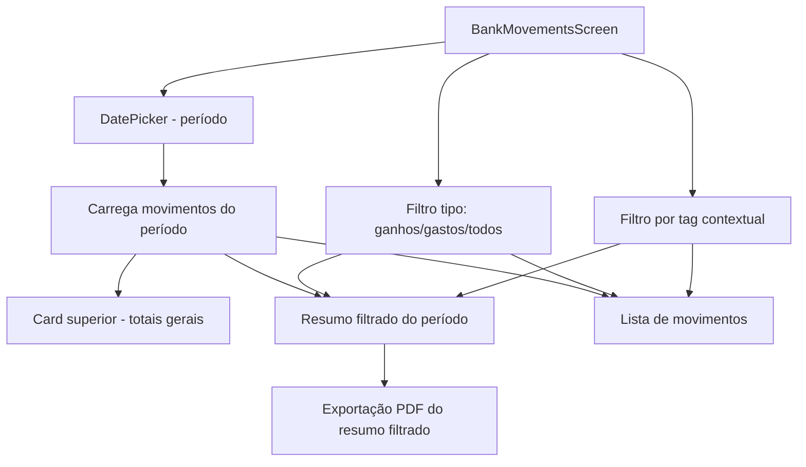

# Gerenciamento de Bancos

Permite criar e gerenciar contas bancárias, visualizar movimentos por período e acompanhar o saldo de cada conta. É o núcleo financeiro do app.

> **Transição do razão (2026-08-11):** o fluxo abaixo continua sendo o legado para grupos ainda não migrados. Após o corte confirmado, bancos passam a ser financialAccounts do tipo bank, Caixa é uma conta do tipo cash e os saldos vêm de eventos imutáveis e reconciliações. Nenhum documento legado é removido; a ligação é preservada pelo legacyBankId.

## Como funciona

### Cadastro de Banco
1. `AddRegisterBankScreen.tsx` coleta nome, cor visual e ícone do banco
2. Chama `BankFirebase.ts` para salvar no Firestore
3. O banco fica disponível como destino/origem de despesas, receitas, investimentos, saques, saldos mensais e transferências via ActionSheet com ícone
4. Após criar ou editar um banco, `AddRegisterBankScreen.tsx` aplica [[Comportamento Pós-Registro]] depois do feedback de sucesso

### Desativação reversível
1. A tabela de bancos em `ConfigurationsScreen.tsx` exibe bancos ativos e desativados, mantendo o registro e o histórico financeiro no Firestore
2. A ação **Desativar banco** grava `isActive: false` no documento existente; a ação muda para **Reativar banco** enquanto o banco estiver desativado
3. Bancos desativados não são retornados por `getAllBanksFirebase()`, `getBanksByPersonFirebase()` ou `getBanksWithUsersByPersonFirebase()`, portanto deixam de aparecer nos seletores de despesas, ganhos, investimentos, saques, transferências e saldos. `getAllBanksFirebase()` mantém o nome legado, mas consulta somente o UID autenticado e seus relacionados; consultas Firestore sem `where('personId', ...)` são rejeitadas pelas Rules, que não funcionam como filtros
4. A alteração é confirmada em modal e o feedback informa que o cadastro/histórico foram preservados; excluir o documento continua sendo uma ação separada e destrutiva

### Visualização de Movimentos

1. `BankMovementsScreen.tsx` exibe todos os movimentos de um banco em um período selecionado; a composição Web equivalente fica em `screens/web/BankMovementsScreen.web.tsx`. Na Web, quando a rota é aberta pelo menu sem `bankId`, o seletor de banco no início dos filtros permite escolher uma conta ativa e carregar seu extrato sem retornar à Home; a visão de Caixa continua sendo uma rota própria.
2. Filtra por data via `DatePicker` customizado
3. Permite refinar a listagem por tipo (`ganhos`, `gastos` ou `todos`) e por tag, usando apenas as tags presentes nas movimentações carregadas para aquele banco/período
4. Na variante nativa, o card superior do banco mantém os totais gerais do período carregado e **não reage** aos filtros de tipo/tag; na variante Web, esse card foi removido para iniciar o fluxo diretamente pelos filtros, e o agrupamento externo dos filtros também não usa card, deixando cada input com seu próprio contorno
5. Um resumo separado do período exibe ganhos, despesas, saldo líquido e quantidade de movimentações de acordo com os filtros ativos
6. O resumo filtrado permite baixar um PDF estilizado do período ativo, incluindo dados do banco/dinheiro, totais gerais, totais filtrados e a lista de movimentações visíveis
7. A lista pode ser recarregada manualmente por pull-to-refresh, preservando o período, o banco/dinheiro e os filtros locais
8. Cada movimento exibe: data, descrição, tag com ícone (via `<TagIcon />`), valor (entrada/saída colorido); despesas obrigatórias usam a paleta visual vermelha de despesa também no ícone, linha, card expandido e valor monetário
9. Edições acionadas pela timeline devem permanecer na tela atual após sucesso; movimentos comuns abrem `AddRegisterGainScreen.tsx`/`AddRegisterExpensesScreen.tsx`, e edição de investimento no modal local segue a mesma regra de permanência
10. O grupo Home do `components/uiverse/navigation/navigator.tsx` e do navigator Web oferece permanentemente a opção **Movimentos do banco**, permitindo abrir o extrato sem passar pelo cartão da Home; quando `BankMovementsScreen.tsx` está aberta, essa opção fica marcada e **Início** continua levando ao Dashboard
11. Transferências bancárias são incluídas no extrato tanto pela associação direta `bankId` quanto pelos metadados `bankTransferSourceBankId`/`bankTransferTargetBankId`, garantindo que o banco de origem veja a saída e o banco de destino veja a entrada

### Saldo Calculado
- Saldo atual = saldo do último `MonthlyBalance` + movimentos posteriores a esse snapshot
- A função `computeMonthlyBankBalances()` em `utils/monthlyBalance.ts` agrega despesas, receitas e investimentos por banco
- `shouldIncludeMovementInGainExpenseTotals()` filtra movimentos internos para evitar dupla contagem
- A [[Análise por Categoria]] usa os bancos como dimensão de distribuição mensal da tag selecionada; movimentos sem `bankId` aparecem como **Dinheiro**
- Na Home, a leitura indexada do último snapshot é processada em grupos de até três bancos. Isso evita sobrecarregar a fila de rede em Android/iOS e mantém o fallback compatível, escopado aos `personId` autorizados, se o índice ainda estiver indisponível.

## Arquivos principais

### Razão após o corte do grupo

- O saldo materializado é verificável: última reconciliação com data/hora exata mais as partidas posteriores.
- Cada evento é balanceado em duas pernas. Despesa/receita usa contrapartida externa; transferência, saque e fluxo de investimento movem duas contas.
- Membros lançam e estornam apenas seus próprios eventos. Administradores também administram contas, reconciliações e migração.
- Banco pode ficar negativo com justificativa; Caixa nunca pode ficar negativo.

- `screens/mobile/AddRegisterBankScreen.tsx` — Formulário de cadastro
- `screens/mobile/ConfigurationsScreen.tsx` — Tabela administrativa com edição, exclusão e ativação/desativação reversível
- `components/uiverse/banks/bank-actionsheet-selector.tsx` — Seletor de banco em ActionSheet com ícone e estado selecionado
- `hooks/useBankIcons.tsx` — Catálogo de ícones/monogramas para bancos brasileiros
- `screens/mobile/BankMovementsScreen.tsx` — Listagem de movimentos por período
- `screens/web/BankMovementsScreen.web.tsx` — Composição Web completa do extrato, com hero animado, seletor de banco e resoluções Web dos componentes compartilhados
- `functions/BankFirebase.ts` — CRUD de bancos e busca de movimentos
- `utils/monthlyBalance.ts` — `computeMonthlyBankBalances()` + filtros de movimentos
- `app/mobile/add-register-bank.tsx` — Rota de cadastro
- `app/mobile/bank-movements.tsx` / `app/web/bank-movements.tsx` — Rotas de movimentos por plataforma
- `app/mobile/bank-summary.tsx` — Redirect para `/home?tab=0` (rota legada)
- `components/uiverse/navigation/navigator.tsx` / `components/web/navigation/navigator.web.tsx` — Oferecem **Movimentos do banco** no grupo Home e marcam a opção quando `/bank-movements` está aberta
- `utils/navigation.ts` — Saída explícita para Home pelo voltar físico/navigator
- `hooks/usePostSubmitBehavior.ts` — Aplica retorno/limpeza após salvar nos formulários de bancos, transferências, saques e saldos

## Integrações

- [[Transações de Despesas]] — Despesas vinculadas a bancos
- [[Transações de Receitas]] — Receitas vinculadas a bancos
- [[Transferências]] — Movimentos de transferência entre bancos
- [[Resgate de Caixa]] — Resgate debita de banco específico
- [[Balanço Mensal]] — Snapshot usado como base do saldo
- [[Gerenciamento de Tags]] — Tags exibidas nos movimentos e disponíveis como filtro
- [[Dashboard Home]] — Bancos aparecem no carrossel e gráficos
- [[Análise por Categoria]] — Exibe quanto da categoria selecionada ocorreu em cada banco/dinheiro no mês atual
- [[Hooks Customizados]] — `useTagIcons` renderiza ícones nos movimentos
- [[Comportamento Pós-Registro]] — Define retorno/limpeza após salvar formulários bancários

## Configuração

- Cada banco tem `colorHex` (hex string) para personalização visual e `iconKey` opcional para exibir ícone/monograma
- Cada banco possui `isActive`; documentos legados sem o campo são tratados como ativos por compatibilidade
- Saldo inicial registrado como `MonthlyBalance` do mês de criação
- A exportação do resumo usa `expo-print` para gerar o PDF local, copia o arquivo para o cache com nome contextual `Lumus-Financas-Movimentos-[Banco|Dinheiro]-[conta]-[periodo]-[data].pdf` e usa `expo-sharing` para abrir o fluxo de download/compartilhamento do dispositivo

## Observações importantes

- Transferências entre bancos geram dois movimentos (débito em um, crédito em outro) — ambos do tipo especial para não duplicar totais
- A busca de movimentos bancários reforça transferências por metadados de origem/destino para exibir a saída no banco remetente e a entrada no banco recebedor, mesmo quando um registro antigo não é retornado apenas pelo `bankId`
- A composição Web de `BankMovementsScreen` aceita o banco por parâmetros de rota do Expo Router, mas não depende deles: ao entrar pelo menu, a pessoa escolhe uma conta ativa no `bank-actionsheet-selector.tsx`; a escolha recarrega o período e limpa apenas filtros/expansões locais. A tela nativa permanece com o contrato original baseado em `bankId`.
- Cores dos bancos são misturadas com gradiente em `bank-card-surface.tsx`
- O catálogo de ícones usa monogramas estilizados, não imagens oficiais externas; bancos sem `iconKey` caem no ícone genérico com iniciais do nome
- Seletores de banco em telas de criação devem usar `bank-actionsheet-selector.tsx`, não o `Select` padrão, para manter ícone, busca visual por instituição e consistência com o seletor de categorias
- Cadastros de banco, saques, transferências e saldos mensais seguem [[Comportamento Pós-Registro]] para retorno/limpeza e mantêm uma trava síncrona de submit enquanto o Firestore responde, evitando registros duplicados por toques repetidos
- O filtro de tags é contextual: as opções exibidas dependem do tipo selecionado e das movimentações já carregadas no período; na Web, `TagsInput` do Mantine apresenta essas opções em um input pesquisável, permite múltiplas seleções, mantém o filtro por IDs e usa a altura base de 48px alinhada aos demais inputs Web, sem alterar a variante nativa
- O resumo filtrado do período muda com os filtros locais; na variante nativa o card superior continua exibindo os totais gerais do período consultado, enquanto a Web mantém esses totais apenas nos cálculos do PDF
- O PDF segue o mesmo escopo do resumo filtrado: tipo/tag ativos, período selecionado e valores mascarados quando a [[Privacidade de Valores]] está ativa
- `BankMovementsScreen.tsx` intercepta o retorno físico pelo `Navigator` para cair em `/home?tab=0` sem depender de `router.back()`
- A opção **Movimentos do banco** permanece visível no grupo Home para abrir o extrato diretamente; ela só recebe estado ativo quando a rota de movimentos está aberta

## Integração com o Assistente Lumus

- Criar banco pelo [[Assistente Lumus]] exige nome, ciclo e saldo inicial; banco e `MonthlyBalance` são criados na mesma transação.
- Bancos enviados ao modelo usam handles opacos. Antes de editar/excluir, o aplicativo recarrega o documento do UID atual e compara o fingerprint mostrado no cartão.
