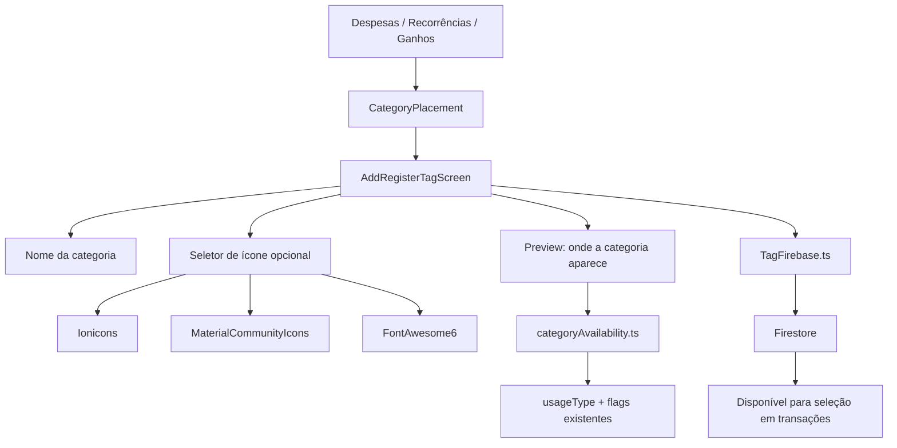

# Gerenciamento de Tags

Sistema de categorização de transações através de categorias personalizadas. Cada categoria tem nome e ícone, com um contexto de disponibilidade que a mantém simples de criar e fácil de entender.

## Como funciona

1. `AddRegisterTagScreen.tsx` cria uma categoria a partir de um objetivo de disponibilidade. A criação normal oferece os mesmos presets da edição, incluindo somente um contexto, todas as despesas, todos os ganhos, lançamentos comuns ou todos os lançamentos. O formulário pede apenas nome e, opcionalmente, ícone; o card de preview explica onde ela aparecerá.
2. Atalhos inline de despesas, ganhos e recorrências continuam passando um `placement` explícito para manter a criação pronta para a tela de origem e a seleção automática no retorno. Em [[Configurações]], o botão **Adicionar categoria** abre o seletor completo de disponibilidade primeiro.
3. `utils/categoryAvailability.ts` converte o contexto e os presets de edição para os campos Firestore existentes (`usageType`, `isMandatoryExpense`, `isMandatoryGain` e `showInBothLists`), sem migração de schema.
4. Na edição, a categoria canônica é carregada por `tagId`. A pessoa escolhe objetivos legíveis de disponibilidade, como usar somente em um contexto, em todas as despesas, em todos os ganhos, em lançamentos comuns ou em todos os lançamentos.
5. Uma combinação legada fora dos presets aparece como **Uso personalizado existente**. Alterar somente nome ou ícone preserva os campos de disponibilidade; os campos só mudam quando um novo objetivo é escolhido.
6. Quando não é fluxo inline, criar ou editar uma categoria aplica [[Comportamento Pós-Registro]]; em fluxo inline, tenta voltar à tela de origem e usa `returnToRoute` como fallback antes de cair na Home.
7. O ícone da categoria aparece nos cards de movimentos via componente `<TagIcon />` do [[Hooks Customizados|useTagIcons]].
8. Os campos de categoria em transações e recorrências usam um ActionSheet customizado com ícone, nome, destaque da categoria selecionada e ação interna para abrir `AddRegisterTagScreen.tsx`, em vez do menu padrão do Android ou de um botão solto ao lado do campo.
9. Em [[Gerenciamento de Bancos|BankMovementsScreen]], as tags podem ser usadas como filtro local da timeline; a lista de opções é formada a partir das movimentações carregadas no período.
10. O gráfico de pizza no [[Dashboard Home]] agrupa despesas por tag.
11. A [[Análise por Categoria]] usa as tags como eixo principal do relatório, com seleção via ActionSheet compartilhado, labels de uso/obrigatoriedade abaixo do nome da categoria, comparação do mês atual com a média histórica de 3 meses e quebra do resultado por banco/dinheiro.
12. Em [[Configurações]], a listagem administrativa usa "categoria" como nomenclatura visual padrão, mostra resumos legíveis de disponibilidade, filtra pelos quatro contextos e abre a edição diretamente.
13. Antes de excluir uma categoria, [[Configurações]] consulta `expenses`, `gains`, `mandatoryExpenses` e `mandatoryGains`. Com referências, bloqueia a exclusão e informa a contagem para que os registros sejam reclassificados; sem referências, confirma e revalida imediatamente antes da remoção.

## Famílias de Ícones Suportadas

| Família (valor no Firestore) | Biblioteca React Native | Exemplos |
|---|---|---|
| `ionicons` | `@expo/vector-icons/Ionicons` | home-outline, cart-outline, car-outline |
| `material-community` | `@expo/vector-icons/MaterialCommunityIcons` | bank-outline, netflix, laptop |
| `font-awesome-6` | `@expo/vector-icons/FontAwesome6` | spotify (brand), github (brand), pix (brand) |

> **Nota:** Versões anteriores da documentação referenciavam `MaterialIcons` e `FontAwesome`. O código real usa `MaterialCommunityIcons` e `FontAwesome6`, com suporte a estilos `brand`, `regular` e `solid`.

O catálogo completo com ~170 ícones é mantido em `hooks/useTagIcons.tsx` e é renderizado pelo componente `<TagIcon />`.

## Arquivos principais

- `screens/AddRegisterTagScreen.tsx` — Criação contextual e edição por objetivo de disponibilidade
- `components/uiverse/tag-actionsheet-selector.tsx` — Seletor reutilizável de categoria em ActionSheet, com descrição opcional abaixo do nome da opção e ação interna opcional para criar categoria
- `components/uiverse/category-availability-selector.tsx` — Seletor reutilizável dos quatro contextos e dos presets de disponibilidade
- `utils/categoryAvailability.ts` — Contextos, presets, mapeamentos Firestore e resumos legíveis
- `utils/categoryReferenceSummary.ts` — Soma e decisão pura para exclusão segura
- `functions/TagFirebase.ts` — CRUD e consulta de referências de categorias no Firestore
- `hooks/useTagIcons.tsx` — Catálogo de ícones, componente `<TagIcon />`, resolução e serialização
- `utils/pendingCreatedTag.ts` — Estado temporário para tag recém-criada (seleção imediata)
- `utils/navigation.ts` — Saída explícita para Home e fallback dos fluxos inline
- `hooks/usePostSubmitBehavior.ts` — Aplica retorno/limpeza nos fluxos não-inline
- `app/add-register-tag.tsx` — Rota

## Integrações

- [[Transações de Despesas]] — Tag categoriza a despesa
- [[Transações de Receitas]] — Tag categoriza a receita
- [[Despesas Fixas]] — Categorias obrigatórias podem ser criadas inline e retornam já selecionadas
- [[Receitas Fixas]] — Categorias obrigatórias podem ser criadas inline e retornam já selecionadas
- [[Dashboard Home]] — Gráfico de pizza usa tags para agrupamento
- [[Análise por Categoria]] — Seleção dinâmica de tag para relatório de variação histórica
- [[Gerenciamento de Bancos]] — Tags exibidas nos movimentos e usadas como filtro
- [[Configurações]] — Cadastro, edição, exclusão e filtro administrativo de categorias
- [[Hooks Customizados]] — `useTagIcons()` centraliza catálogo e renderização
- [[Notificações]] — Feedback via `notifier-alert.tsx`
- [[Comportamento Pós-Registro]] — Define retorno/limpeza nos cadastros normais de categoria

## Configuração

- As telas de lançamento passam `placement` para a criação inline: `expense`, `mandatory-expense`, `gain` ou `mandatory-gain`
- Tags pertencem ao usuário (`personId`) — não são compartilhadas entre usuários não relacionados

## Armazenamento no Firestore

Cada tag salva:
- `iconFamily` — string (`ionicons`, `material-community`, `font-awesome-6`)
- `iconName` — string (nome do ícone na biblioteca)
- `iconStyle` — string ou null (`brand`, `regular`, `solid`)
- `name` — nome da tag
- `usageType` — `expense`, `gain` ou `both`
- `isMandatoryExpense` — disponibilidade em despesas recorrentes
- `isMandatoryGain` — disponibilidade em ganhos recorrentes
- `showInBothLists` — compatibilidade para disponibilidade compartilhada nas listas existentes
- `personId` — ID do usuário

## Observações importantes

- `pendingCreatedTag.ts` armazena temporariamente a última tag criada para seleção imediata após criação, sem necessidade de recarregar a lista
- `AddRegisterTagScreen.tsx` recebe `placement` apenas na criação; na edição, deve sempre buscar o documento canônico pelo `tagId`, nunca depender de dados serializados pela tabela
- Fluxos com `returnAfterCreate` vindos de despesas, ganhos, despesas fixas ou receitas fixas devem passar somente o contexto correspondente. A criação não expõe radios, switches nem termos técnicos de uso.
- Fluxos inline com `returnAfterCreate` devem enviar `returnToRoute` usando uma rota de `APP_ROUTE_PATHS` para que `AddRegisterTagScreen.tsx` tenha fallback determinístico quando não existir histórico de navegação válido
- Fluxos sem `returnAfterCreate` devem passar por [[Comportamento Pós-Registro]] após salvar; não usar `router.back()` nem strings livres de rota
- Fluxos sem `returnAfterCreate` limpam o formulário apenas quando a preferência da tela manda permanecer e limpar; todos os submits usam trava síncrona para impedir criação duplicada por toque repetido
- O ícone é renderizado dinamicamente via `<TagIcon />` baseado em `iconFamily` + `iconName` + `iconStyle`
- Sem tag, a despesa/receita aparece sem ícone nos movimentos
- A seleção de categoria em `AddRegisterGainScreen.tsx`, `AddRegisterExpensesScreen.tsx`, `AddMandatoryExpensesScreen.tsx` e `AddMandatoryGainsScreen.tsx` deve preservar o ActionSheet customizado com `<TagIcon />`; o atalho para criar nova categoria deve ficar dentro do ActionSheet
- O ActionSheet de categoria só pode abrir quando o campo estiver liberado pela tela de origem; pré-requisitos incompletos como nome, valor, data, banco obrigatório ou carregamento devem manter o trigger bloqueado, mesmo que exista atalho interno para criar categoria
- No filtro de movimentações bancárias, apenas tags realmente presentes na consulta atual são oferecidas ao usuário
- Na análise por categoria, tags sem movimentação também podem aparecer para explicitar ausência de dados no relatório
- Na análise por categoria, o ActionSheet pode continuar usando os metadados existentes de `usageType`, `isMandatoryExpense` e `isMandatoryGain`
- A resolução de ícone tem fallback para o ícone padrão "Categoria" (pricetag-outline) quando a seleção é inválida ou incompleta

## Integração com o Assistente Lumus

- [[Assistente Lumus]] trata tags como categorias, cria/edita/exclui apenas documentos do UID atual e envia ao modelo somente nome funcional e handle temporário.
- Categorias de despesa, ganho e recorrências são filtradas pelo uso antes de aparecerem como escolhas no chat; nomes duplicados exigem seleção explícita.
