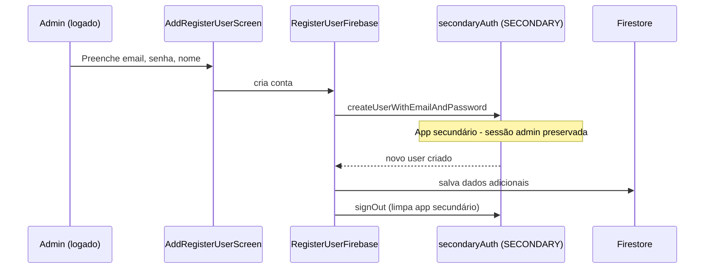

# Gerenciamento de Usuários

Módulo responsável pelo cadastro de novos usuários no sistema e pelo estabelecimento de relacionamentos entre usuários, permitindo visibilidade compartilhada de dados financeiros.

## Como funciona

### Cadastro de Usuário

1. `AddRegisterUserScreen.tsx` coleta email, senha, nome e flag de administrador
2. Usa o **app Firebase secundário** (`secondaryAuth`) sem afetar a sessão atual
3. Após criação na Auth, salva dados adicionais no Firestore via `RegisterUserFirebase.ts`
4. O app secundário é desconectado após o uso
5. Feedback via `notifier-alert.tsx`
6. Após cadastrar o usuário, `AddRegisterUserScreen.tsx` aplica [[Comportamento Pós-Registro]] após o feedback de sucesso

### Relacionamento entre Usuários
1. `AddUserRelationScreen.tsx` permite vincular um usuário a outro pelo email ou ID
2. `RegisterUserFirebase.ts` salva a relação no Firestore
3. Usuários relacionados compartilham visibilidade das transações no [[Dashboard Home]]
4. O `HomeFirebase.ts` busca os `personIds` de usuários relacionados para agregar os dados
5. Após salvar um vínculo, `AddUserRelationScreen.tsx` aplica [[Comportamento Pós-Registro]] após o feedback de sucesso

## Por que dois apps Firebase?

Criar um usuário com Firebase Auth desloga o usuário atual. O app usa um **segundo app Firebase** (`secondaryApp` / `secondaryAuth`, identificado como "SECONDARY") exclusivamente para operações de criação de conta, mantendo a sessão do usuário logado intacta.

## Arquivos principais

- `screens/AddRegisterUserScreen.tsx` — Formulário de cadastro
- `screens/AddUserRelationScreen.tsx` — Vinculação de usuários
- `functions/RegisterUserFirebase.ts` — CRUD de usuários e relacionamentos
- `FirebaseConfig.ts` — Instância secundária do Firebase (`secondaryApp`, `secondaryAuth`)
- `app/add-register-user.tsx` — Rota de cadastro
- `app/add-user-relation.tsx` — Rota de relacionamento
- `utils/navigation.ts` — Saída explícita para Home pelo voltar físico/navigator
- `hooks/usePostSubmitBehavior.ts` — Aplica retorno/limpeza após salvar usuário ou vínculo

## Integrações

- [[Autenticação]] — `user.uid` é o `personId` base; app secundário evita logout
- [[Firebase Config]] — Exporta `secondaryApp`/`secondaryAuth` para uso em cadastro
- [[Dashboard Home]] — Dados de usuários relacionados são agregados na home
- [[Configurações]] — Tabela administrativa de usuários e vínculos
- [[Notificações]] — Feedback via `notifier-alert.tsx`
- [[Comportamento Pós-Registro]] — Define retorno/limpeza após salvar usuários e vínculos

## Configuração

- Flag `isAdmin` no Firestore controla permissões (cadastro de outros usuários, etc.)
- Relacionamento é bidirecional no Firestore

## Observações importantes

- Apenas usuários com permissão de admin podem cadastrar novos usuários (verificado no Firestore, não nas regras do Firebase)
- O app secundário Firebase é inicializado com as mesmas credenciais do app principal
- Após criar o usuário no Firebase Auth via app secundário, o usuário precisa fazer login pela tela de [[Autenticação|Login]]
- O app secundário usa persistência SecureStore (via `firebaseAuthStorage`), diferente do app primário que usa memory-only
- Cadastros e vínculos devem passar por [[Comportamento Pós-Registro]] após sucesso; não usar `router.back()` nem strings livres de rota
- Cadastro de usuário e vínculo entre usuários limpam campos apenas quando a preferência da tela manda permanecer e limpar; ambos usam trava síncrona de submit, incluindo a etapa de consulta do usuário vinculado, para evitar duplicidade por múltiplos toques
