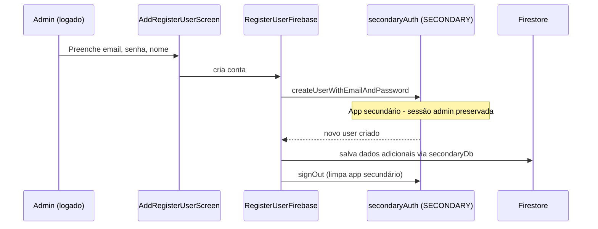

# Gerenciamento de Usuários

Módulo responsável pelo cadastro de novos usuários no sistema e pelo estabelecimento de relacionamentos entre usuários, permitindo visibilidade compartilhada de dados financeiros.

## Como funciona

### Cadastro de Usuário

```mermaid
sequenceDiagram
    participant ADMIN as Admin (logado)
    participant SCREEN as AddRegisterUserScreen
    participant RUF as RegisterUserFirebase
    participant SEC as secondaryAuth (SECONDARY)
    participant FS as Firestore

    ADMIN->>SCREEN: Preenche email, senha, nome
    SCREEN->>RUF: cria conta
    RUF->>SEC: createUserWithEmailAndPassword
    Note over SEC: App secundário - sessão admin preservada
    SEC-->>RUF: novo user criado
    RUF->>FS: salva dados adicionais via secondaryDb
    RUF->>SEC: signOut (limpa app secundário)
```

1. `AddRegisterUserScreen.tsx` coleta email, senha, nome e flag de administrador
2. Usa o **app Firebase secundário** (`secondaryAuth`) sem afetar a sessão atual
3. Após criação na Auth, salva dados adicionais no Firestore secundário (`secondaryDb`), com o UID recém-criado, via `RegisterUserFirebase.ts`
4. O app secundário é desconectado após o uso
5. Feedback via `notifier-alert.tsx`
6. Após cadastrar o usuário, `AddRegisterUserScreen.tsx` aplica [[Comportamento Pós-Registro]] após o feedback de sucesso

### Cadastro público

A tela inicial de acesso oferece **Criar conta** no próprio painel, com nome, email e senha. Reutiliza `registerUserFirebase`, sem passar pelo comportamento pós-registro administrativo: o sucesso volta ao login local, mantém email e limpa senha. Se a gravação de perfil falhar, a função tenta remover a conta recém-criada e sempre tenta encerrar a sessão secundária; uma compensação malsucedida é informada como cadastro incompleto. Ver [[Autenticação]].

### Relacionamento entre Usuários
1. `AddUserRelationScreen.tsx` permite vincular um usuário a outro pelo email ou ID
2. `RegisterUserFirebase.ts` salva a relação no Firestore
3. Usuários relacionados compartilham visibilidade das transações no [[Dashboard Home]]
4. O `HomeFirebase.ts` busca os `personIds` de usuários relacionados para agregar os dados
5. Após salvar um vínculo, `AddUserRelationScreen.tsx` aplica [[Comportamento Pós-Registro]] após o feedback de sucesso

## Por que dois apps Firebase?

Criar um usuário com Firebase Auth desloga o usuário atual. O app usa um **segundo app Firebase** (`secondaryApp` / `secondaryAuth`, identificado como "SECONDARY") exclusivamente para operações de criação de conta, mantendo a sessão do usuário logado intacta.

## Arquivos principais

- `screens/mobile/AddRegisterUserScreen.tsx` / `screens/web/AddRegisterUserScreen.web.tsx` — Formulário de cadastro por plataforma, com labels, popovers e campos alinhados ao padrão Web de despesas
- `screens/mobile/AddUserRelationScreen.tsx` / `screens/web/AddUserRelationScreen.web.tsx` — Vinculação de usuários por plataforma, com label, popover e campo alinhados ao padrão Web de despesas
- `functions/RegisterUserFirebase.ts` — CRUD de usuários e relacionamentos
- `FirebaseConfig.ts` — Instância secundária do Firebase (`secondaryApp`, `secondaryAuth`)
- `app/mobile/add-register-user.tsx` — Rota de cadastro
- `app/mobile/add-user-relation.tsx` — Rota de relacionamento
- `utils/navigation.ts` — Saída explícita para Home pelo voltar físico/navigator
- `hooks/usePostSubmitBehavior.ts` — Aplica retorno/limpeza após salvar usuário ou vínculo

## Integrações

- [[Autenticação]] — `user.uid` é o `personId` base; app secundário evita logout
- [[Firebase Config]] — Exporta `secondaryApp`/`secondaryAuth` para uso em cadastro
- [[Dashboard Home]] — Dados de usuários relacionados são agregados na home
- [[Configurações]] — Tabela administrativa de usuários e vínculos
- [[Notificações]] — Feedback via `notifier-alert.tsx`
- [[Comportamento Pós-Registro]] — Define retorno/limpeza após salvar usuários e vínculos

## Configuração

- Flag `isAdmin` no Firestore controla permissões (cadastro de outros usuários, etc.)
- O seed do Firebase Emulator cria a conta `usuario@demo.lumus.local` com `adminUser: true`, permitindo testar os fluxos administrativos localmente.
- Relacionamento é bidirecional no Firestore

## Observações importantes

- O formulário administrativo de outros usuários continua disponível somente para administradores. O cadastro público no painel de [[Autenticação]] cria exclusivamente uma conta padrão (`adminUser: false`), sem vínculos ou campos de autorização do razão.
- O app secundário Firebase é inicializado com as mesmas credenciais do app principal
- Após criar o usuário no Firebase Auth via app secundário, o usuário precisa fazer login pela tela de [[Autenticação|Login]]
- O app secundário usa persistência SecureStore (via `firebaseAuthStorage`), diferente do app primário que usa memory-only
- Cadastros e vínculos devem passar por [[Comportamento Pós-Registro]] após sucesso; não usar `router.back()` nem strings livres de rota
- Cadastro de usuário e vínculo entre usuários limpam campos apenas quando a preferência da tela manda permanecer e limpar; ambos usam trava síncrona de submit, incluindo a etapa de consulta do usuário vinculado, para evitar duplicidade por múltiplos toques

## Perfil pessoal

[[Perfil do Usuário]] oferece Meu perfil em `/web/profile` e `/mobile/profile`, com telas independentes, nome editável no Firestore, e-mail de acesso/data de cadastro e ID copiável. O menu Config abre o perfil no lugar de Relacionar usuário; a ação de vínculo fica dentro dele e respeita `addUserRelation`. As telas de vínculo oferecem Voltar ao perfil, enquanto o pós-submit configurado permanece preservado.

**Limitação anterior:** as regras versionadas bloqueiam alterações client-side de `relatedIdUsers` e leituras de usuários não relacionados. A função legada de vínculo bidirecional não funciona sob essas regras; mover o acesso ao perfil não modifica esse contrato de segurança.
