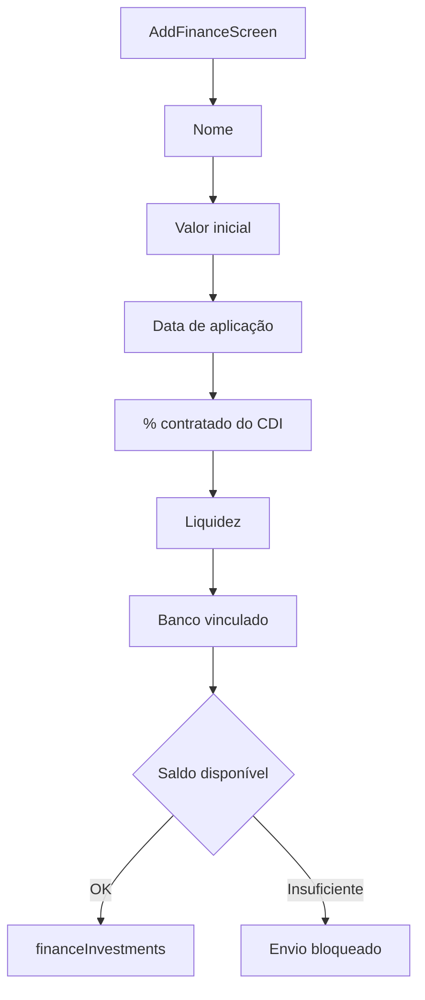
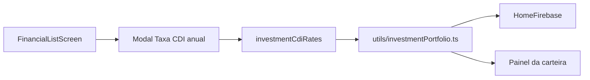

# Investimentos

Módulo de gestão da carteira de investimentos. Hoje o fluxo operacional suporta renda fixa atrelada ao CDI, com aportes, resgates, sincronização manual e acompanhamento por rentabilidade. O modelo de dados já reserva classes para Tesouro Direto, ações e fundos sem aplicar uma precificação automática indevida a esses ativos.

## Como funciona

### Criação de investimento

1. `AddFinanceScreen.tsx` registra renda fixa CDI e persiste tanto o campo legado `cdiPercentage` quanto `cdiPercentageInBasisPoints`, que preserva duas casas decimais sem depender de float no cálculo monetário.
2. Novos documentos recebem `assetType: 'fixed_income'` e `valuationMethod: 'cdi'`. Os tipos futuros possíveis são `treasury`, `stock` e `fund`; enquanto não houver fonte de precificação específica, eles devem usar `valuationMethod: 'manual'` e manter o valor sincronizado.
3. A data da aplicação é a origem da curva de acompanhamento. O `createdAt` só é fallback para documentos legados.
4. A criação continua bloqueada quando o banco selecionado não tem saldo suficiente e aplica [[Comportamento Pós-Registro]] após o feedback de sucesso.

### Taxa CDI configurável e histórico

- A coleção `investmentCdiRates` guarda `personId`, `annualRateInBasisPoints`, `effectiveFrom`, `createdAt` e `updatedAt`.
- Há um registro por pessoa e dia de vigência. Salvar novamente a mesma data corrige aquela vigência; adicionar outra data preserva o histórico anterior.
- A tela de investimentos permite cadastrar a taxa anual e consultar o histórico da pessoa autenticada. Taxas de usuários relacionados são lidas para calcular seus investimentos compartilhados, sem abrir a configuração deles para edição.
- Sem taxa vigente, a projeção não inventa um CDI padrão: conserva o último valor confirmado e explica o motivo na interface.

### Cálculo de projeção e rentabilidade

`utils/investmentPortfolio.ts` é a única fonte para projeções CDI. Todos os valores de moeda entram e saem em centavos inteiros; o cálculo interno usa ponto fixo com `BigInt` para não acumular arredondamento de moeda por `float`.

1. A base operacional é o último valor sincronizado (`currentValueInCents`/`lastManualSyncValueInCents`) e sua data; sem sincronização, a base é o valor e a data inicial do investimento.
2. A taxa aplicável é escolhida por `personId` e `effectiveFrom`. Alterações no histórico dividem a projeção em intervalos, cada qual com sua própria taxa.
3. O modelo é uma estimativa diária proporcional de 365 dias, apropriada para acompanhamento e não para IR, extrato oficial ou apuração de um produto específico.
4. A curva histórica combina aporte inicial, aportes, resgates e sincronizações reais. Uma sincronização substitui a estimativa daquele dia; os movimentos posteriores continuam alterando a base normalmente.
5. Os indicadores da carteira usam:

| Indicador | Regra em centavos |
|---|---|
| Aportes totais | valor inicial + aportes |
| Aplicado líquido | aportes totais − resgates |
| Patrimônio estimado | valor no último snapshot/sincronização + projeção CDI posterior |
| Rendimento acumulado | patrimônio estimado + resgates − aportes totais |
| Resultado do período | patrimônio final + resgates do período − valor inicial do período − aportes do período |

### Painel de carteira

`FinancialListScreen.tsx` mantém a timeline expansível de cada investimento e adiciona uma visão consolidada acima da lista:

1. Taxa CDI anual vigente, atalho de configuração e histórico por vigência.
2. Patrimônio estimado, rendimento acumulado, aplicado líquido e rendimento do próximo dia.
3. Tabs controladas de 30 dias, 6 meses, 12 meses ou todo o histórico para rentabilidade do período. Os quatro gatilhos dividem igualmente a largura disponível, centralizam os rótulos e ficam dentro de um card `notTintedCardClassName`; o indicador amarelo marca o período ativo sem alterar o cálculo e a visualização locais.
4. O título **Evolução da carteira** exibe o ícone de calendário em amarelo adaptado ao tema, no mesmo padrão visual de **Evolução do saldo** da previsão. O gráfico Mantine `AreaChart`, em Expo DOM, compara capital líquido aplicado contra patrimônio estimado somente pelas linhas e pontos, sem preenchimento de área ao fundo. Ele segue o padrão visual do gráfico de previsão — pontos sempre visíveis com o mesmo tamanho, linha de 3px, grade vertical, tipografia padrão dos eixos, fundo transparente nos dois temas, sem contorno de foco ao toque e largura/rolagem horizontal apenas para séries com mais de sete pontos — preservando as duas curvas e a legenda da carteira.
5. Resumo de alocação por banco e ganho correspondente.
6. Em cada card expandido: produto, percentual contratado do CDI, patrimônio estimado, próximo dia, liquidez, sincronização e ações existentes.

O gráfico é explicitamente estimado. A sincronização manual continua sendo o caminho para alinhar a carteira ao extrato/corretora.

### Aportes, resgates e sincronização

1. `Aportar` exige sincronização prévia e cria uma [[Transações de Despesas|despesa]] com `isInvestmentDeposit`.
2. `Resgatar` exige sincronização prévia e cria uma [[Transações de Receitas|receita]] com `isInvestmentRedemption`.
3. Os dois tipos de movimentação e `financeInvestmentSyncs` alimentam a rentabilidade, mas permanecem excluídos dos totais comuns por `shouldIncludeMovementInGainExpenseTotals()`.
4. Nenhuma taxa, gráfico, histórico ou previsão cria aporte, resgate, receita ou despesa automaticamente.

## Arquivos principais

- `screens/AddFinanceScreen.tsx` — Cadastro de renda fixa CDI com percentual em pontos-base
- `screens/FinancialListScreen.tsx` — Painel, taxa CDI, timeline e ações operacionais
- `functions/FinancesFirebase.ts` — CRUD, sincronizações e leitura de aportes/resgates/sincronizações da carteira
- `functions/InvestmentCdiRateFirebase.ts` — Persistência e leitura compartilhada do histórico de CDI
- `utils/investmentPortfolio.ts` — Tipos de ativos, projeção em ponto fixo, indicadores e série do gráfico
- `functions/HomeFirebase.ts` — Portfólio reduzido da Home usando o histórico CDI configurado
- `components/uiverse/investment-evolution-chart.tsx` — `AreaChart` Mantine isolado em Expo DOM
- `tests/investmentPortfolio.test.ts` — Cobertura de vigências, falta de taxa, ativos futuros e fluxos de aporte/resgate

## Integrações

- [[Dashboard Home]] — Usa a mesma taxa histórica, sem CDI anual fixo no código
- [[Transações de Despesas]] — Aportes reais, excluídos do total de despesas
- [[Transações de Receitas]] — Resgates reais, excluídos do total de receitas
- [[Balanço Mensal]] — Valor confirmado do investimento continua afetando o saldo de banco conforme as regras do módulo
- [[Previsão de Fluxo de Caixa]] — Vencimento/liquidez segue sendo apenas aviso; nunca vira resgate automático
- [[Privacidade de Valores]] — Cards, indicadores e eixo/tooltip do gráfico mascaram valores quando ativada
- [[Componentes UI]] — Gráfico Mantine permanece em fronteira Expo DOM; as Tabs do período, a tela e os modais seguem Gluestack/NativeWind

## Observações importantes

- Em grupos migrados para o razão financeiro, a Home lê contas `financialAccounts` com `kind: 'investment'` e exibe o saldo confirmado; como os metadados legados de CDI não são relidos após o corte, essa representação não inventa rendimento estimado.

- Ao verificar referências de aportes, resgates e sincronizações, as consultas incluem o `personId` do usuário autenticado ou relacionado junto ao `investmentId`, mantendo a leitura compatível com as Firestore Rules e os índices versionados.

- CDI anual de referência não é uma cotação oficial em tempo real. O usuário informa a taxa e a vigência conforme sua fonte de confiança.
- O cálculo é para acompanhamento. Impostos, IOF, feriados bancários, marcação a mercado, índices de preço e eventos corporativos não são simulados.
- A arquitetura futura não deve reutilizar o cálculo CDI para Tesouro, ações ou fundos. Cada `valuationMethod` precisa de uma fonte e regras próprias antes de ser habilitado na criação.
- Um valor sincronizado prevalece sobre estimativas anteriores e deixa a visualização mais próxima do extrato real.
- Os modais de taxa CDI, edição, aporte, resgate, sincronização e exclusão usam o limite padrão de 360px do sistema; formulários extensos preservam área rolável e proteção contra o teclado.
- O leitor de atividade consolida movimentos relacionados no dispositivo. Se o volume crescer muito, a próxima evolução deve criar agregados mensais por investimento sem alterar as fórmulas acima.

## Integração com o Assistente Lumus

- [[Assistente Lumus]] oferece criação, edição, exclusão, aporte, resgate, sincronização e desfazimento por ações separadas; movimentos vinculados não entram no editor genérico.
- Aporte/resgate atualiza o investimento e cria a saída/entrada correspondente na mesma transação. Sincronização guarda valor anterior, novo valor e delta para permitir desfazer com validação de estado.
- O relatório de carteira é calculado pelos agregadores do aplicativo; o modelo recebe somente métricas compactas para explicar e nunca escolhe fórmulas ou configuração arbitrária de gráfico.
