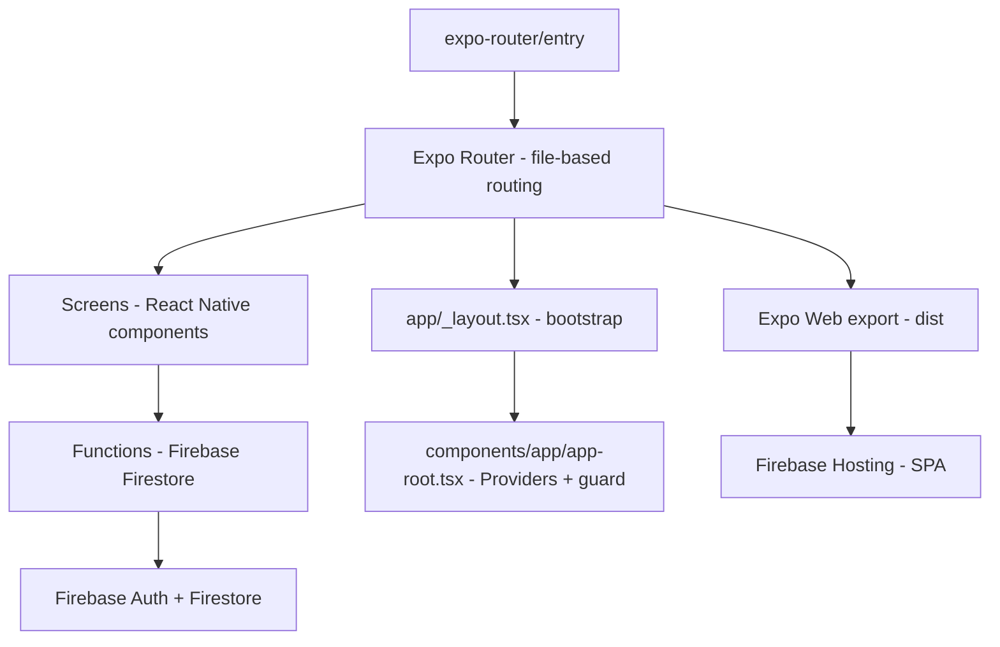
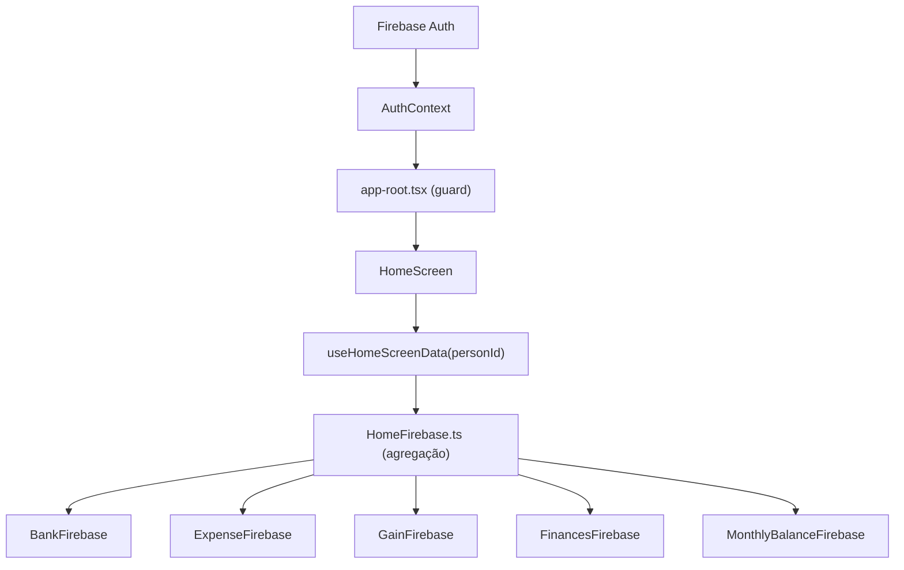
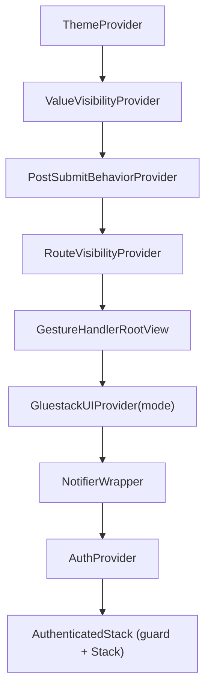

# MOC - Lumus Finanças

> Map of Content principal do projeto **Lumus Finanças** (v2.2.0)
> Aplicação universal de controle financeiro pessoal/familiar, construída com Expo + Firebase para Android/iOS e navegador.

---

## Arquitetura Geral

---

## Módulos por Domínio

### Autenticação & Segurança
- [[Autenticação]] — Login, AuthContext, Firebase Auth, sessão memory-only
- [[Segurança de Login]] — Throttling, armazenamento seguro de credenciais
- [[Gerenciamento de Usuários]] — Cadastro e relacionamento entre usuários

### Financeiro
- [[Assistente Lumus]] — Conversa por texto/voz, formulários financeiros dinâmicos e relatórios com Firebase AI Logic
- [[Dashboard Home]] — Visão consolidada de bancos, movimentos e investimentos
- [[Análise por Categoria]] — Comparação dinâmica de tags contra a média histórica recente
- [[Previsão de Fluxo de Caixa]] — Cenários líquidos de 3, 6 ou 12 meses sem criar movimentos
- [[Gerenciamento de Bancos]] — Contas bancárias, saldo, movimentos por período
- [[Transações de Despesas]] — Registro de saídas financeiras
- [[Transações de Receitas]] — Registro de entradas financeiras
- [[Transferências]] — Movimentação entre contas
- [[Resgate de Caixa]] — Retirada de valores em espécie
- [[Balanço Mensal]] — Snapshots mensais por banco

### Recorrências
- [[Despesas Fixas]] — Gastos mensais obrigatórios com notificações
- [[Receitas Fixas]] — Entradas mensais obrigatórias com notificações

### Investimentos
- [[Investimentos]] — Portfólio, aportes, resgates e produtos de investimento
- [[Monitoramento de Investimentos]] — Taxa CDI por vigência, rentabilidade, evolução e alocação

### Organização
- [[Gerenciamento de Tags]] — Categorias com ícones para transações
- [[Anotações Locais]] — Páginas livres salvas localmente por usuário, sem Firestore

### Sistema
- [[Navegação]] — Expo Router, fluxo de autenticação, rotas
- [[Organização do Código]] — Fronteiras entre rotas, composição global, telas, UI, hooks, Firebase e variantes de plataforma
- [[Firebase Config]] — Configuração dual de apps Firebase, persistência de sessão
- [[Sistema de Temas]] — Modo claro/escuro persistido via AsyncStorage
- [[Privacidade de Valores]] — Toggle de visibilidade financeira
- [[Comportamento Pós-Registro]] — Preferências por tela para retorno e limpeza de campos após salvar formulários
- [[Visibilidade de Rotas]] — Preferência local que oculta telas e bloqueia suas rotas neste aparelho
- [[Notificações]] — Push notifications locais e alertas in-app via `notifier-alert`
- [[Componentes UI]] — Gluestack UI + componentes customizados (uiverse)
- [[Versão Web]] — Export estático, Firebase Hosting, shell responsivo e adaptadores Web
- [[Hooks Customizados]] — useHomeScreenData, useScreenStyles, useTagIcons
- [[Configurações]] — Tela de configurações do app com tabelas administrativas

---

## Tecnologias Principais

| Tecnologia | Versão | Uso |
|---|---|---|
| Expo | ~54.0.36 | Framework mobile |
| React Native | 0.81.5 | Runtime mobile |
| Expo Router | ~6.0.23 | Navegação file-based |
| React Native Web | incluído no Expo | Runtime compartilhado para navegador |
| Firebase | 12.16 | Auth + Firestore + AI Logic web |
| Firebase Hosting | projeto `finances-app-e8685` | Serve a SPA Web exportada em `dist/` |
| React Native Firebase | 25.1 | AI Logic, App Check e Remote Config Android |
| Zod | 4.4 | Validação dos comandos do assistente |
| Expo Audio / Speech | 1.1 / 14.0 | Gravação temporária e TTS local do assistente |
| Gluestack UI | 3.0.12 | Design system base |
| NativeWind | 4.2.1 | Tailwind CSS para RN |
| Mantine Charts + Recharts | 8.3.18 / 3.7.0 | Gráficos de previsão e evolução de investimentos via Expo DOM |
| react-native-webview | 13.15.0 | Ponte nativa dos Expo DOM Components |
| React | 19.1.0 | UI layer |
| TypeScript | 5.9 | Type safety (strict) |
| Lucide React Native | 0.552+ | Ícones vetoriais |
| react-native-notifier | 2.0 | Alertas in-app |
| react-native-gifted-charts | 1.4+ | Gráficos |
| react-native-reanimated-carousel | 4.0+ | Carrossel de bancos |

---

## Fluxo de Dados Principal

---

## Hierarquia de Providers

---

## Fontes Customizadas

O entry ativo do app é `expo-router/entry`; inicializações obrigatórias de runtime devem partir de `app/_layout.tsx` ou de utilitários importados por ele. `App.tsx` permanece como entry alternativo para o fluxo `index.ts`.

Cinco famílias tipográficas estão registradas no projeto:

| Fonte | Arquivo |
|---|---|
| Arimo | `assets/Fonts/Arimo-VariableFont_wght.ttf` |
| IBMPlexSans | `assets/Fonts/IBMPlexSans-VariableFont_wdth,wght.ttf` |
| Metamorphous | `assets/Fonts/Metamorphous-Regular.ttf` |
| Obitron | `assets/Fonts/Obitron-VariableFont_wght.ttf` |
| Raleway | `assets/Fonts/Raleway-VariableFont_wght.ttf` |

As fontes ficam disponíveis para uso via `tailwind.config.js` (`fontFamily`) e estilos inline.

---

## Convenções do Projeto

- Valores monetários armazenados em **centavos** (integers)
- Chaves de ciclo no formato **YYYY-MM** para recorrências
- Modo escuro detectado via `useScreenStyles()` (hook centralizado em `hooks/useScreenStyle.ts`)
- Dois apps Firebase: primário com sessão memory-only; o secundário usa SecureStore no Android/iOS e memória no Web para o cadastro de usuários
- Feedback in-app exclusivamente via `notifier-alert.tsx` — sem sistemas paralelos de toast/alert
- Ícones de tags usam três famílias: `Ionicons`, `MaterialCommunityIcons`, `FontAwesome6`
- Nenhum estado global (Redux/Zustand) — app usa Context API + hooks locais
- O assistente mantém conversa e rascunhos somente em memória; consentimento e leitura automática são as únicas preferências persistidas por UID
- No navegador, sidebar a partir de 1024px substitui a barra inferior; abaixo disso, a interface mobile é preservada. Lembretes agendados continuam exclusivos de aplicativos instalados.

## Publicação Web

O Expo exporta a SPA com `npm run web:export`; `firebase.json` serve `dist/` com URLs limpas e rewrite para `index.html`, permitindo deep links do Expo Router. Use `npm run web:deploy:preview` para validar antes de `npm run web:deploy`.

Antes da primeira publicação, os domínios `finances-app-e8685.web.app`, `finances-app-e8685.firebaseapp.com` e qualquer domínio próprio devem ser autorizados no Firebase Authentication e registrados no reCAPTCHA Enterprise/App Check. Veja [[Versão Web]] e [[Firebase Config]].
