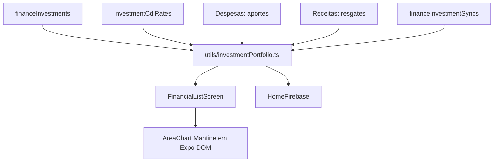

# Monitoramento de Investimentos

Camada de observabilidade da carteira. Organiza taxas CDI por vigência, fluxos de aporte/resgate, sincronizações e valores projetados para que o usuário acompanhe patrimônio, rendimento e concentração sem alterar os lançamentos financeiros.

## Como funciona

1. A lista carrega investimentos, bancos, taxa CDI de usuários relacionados e eventos da carteira em paralelo.
2. A utilidade pura normaliza datas, aplica cada taxa no intervalo correspondente e monta os indicadores e a série de evolução.
3. A tela usa Tabs controladas para escolher 30 dias, 6 meses, 12 meses ou histórico total. Os quatro gatilhos ocupam igualmente a largura disponível dentro de um card `notTintedCardClassName`, centralizam seus rótulos e recebem um indicador amarelo quando ativos; o período só altera cálculo e visualização local.
4. O modal de CDI grava somente a taxa de referência e a vigência; não toca nos investimentos, bancos ou transações.
5. O gráfico compara `netAppliedInCents` com `projectedValueInCents`, mostrando a diferença entre capital líquido e patrimônio estimado pelas linhas, sem preenchimento de área ao fundo. Mantém pontos sempre visíveis e o mesmo padrão de tamanho, grade e eixos do gráfico de previsão, preservando a legenda das duas séries. Segue a superfície transparente e o comportamento sem foco do gráfico de previsão; em séries com mais de sete pontos, o usuário pode arrastá-lo horizontalmente para consultar os períodos sem comprimir os rótulos.

## Dados persistidos

| Coleção | Uso no monitoramento |
|---|---|
| `investmentCdiRates` | Taxa anual em pontos-base e início de vigência por pessoa |
| `financeInvestments` | Ativo, base atual, data de aplicação, produto e método de valorização |
| `financeInvestmentSyncs` | Pontos reais que substituem a projeção no dia sincronizado |
| `expenses` | Aportes com `isInvestmentDeposit` |
| `gains` | Resgates com `isInvestmentRedemption` |

## Arquivos principais

- `functions/InvestmentCdiRateFirebase.ts`
- `functions/FinancesFirebase.ts`
- `utils/investmentPortfolio.ts`
- `screens/FinancialListScreen.tsx`
- `components/ui/tabs/index.tsx`
- `components/uiverse/investment-evolution-chart.tsx`

## Integrações

- [[Investimentos]] — Fluxo operacional, ações e regras de produto
- [[Dashboard Home]] — Resumo compacto reaproveita a taxa persistida
- [[Transações de Despesas]] e [[Transações de Receitas]] — Fluxos de capital sem dupla contagem no resultado mensal
- [[Privacidade de Valores]] — Máscara visual de indicadores, gráfico e tooltip
- [[Componentes UI]] — Mantine restrito a uma fronteira Expo DOM com props serializáveis; Tabs controladas definem o período local

## Observações importantes

- Valores de dinheiro são calculados em centavos. Pontos-base são inteiros e representam duas casas percentuais: `1375` equivale a `13,75%`.
- Sem uma taxa CDI vigente, o sistema não aplica fallback escondido; a projeção fica no valor sincronizado.
- Classes de ativo futuras ficam no esquema, mas não recebem uma curva CDI genérica. Isso evita apresentar rentabilidade enganosa para Tesouro, ações ou fundos.
