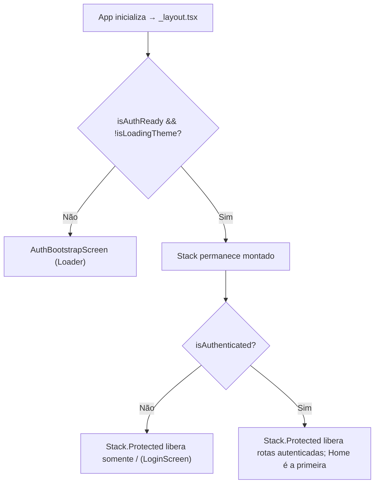

# Navegação

Sistema de navegação baseado em arquivos usando Expo Router. Cada arquivo em `app/` é uma rota. O layout raiz mantém um único `Stack` montado e usa `Stack.Protected` para disponibilizar Login ou as rotas autenticadas conforme o estado do [[Autenticação|AuthContext]].

## Estrutura de Rotas

```
/ (index.tsx)           → LoginScreen
/home (home.tsx)        → Container de abas
  tab=0                 → HomeScreen (Dashboard)
  tab=1                 → AddRegisterExpensesScreen (Controle)
  tab=2                 → ConfigurationsScreen (Configurações)

Rotas do grupo Home:
/category-analysis        → CategoryAnalysisScreen
/financial-forecast      → FinancialForecastScreen
/annotations             → LocalAnnotationsScreen (lista e editor local)

Rota direta do navegador:
/lumus-assistant         → LumusAssistantScreen
/app-tests               → AppTestsScreen (central manual segura, oculta por padrão)

Rotas de cadastro:
/add-register-bank        → AddRegisterBankScreen
/add-register-user        → AddRegisterUserScreen
/add-register-expenses    → AddRegisterExpensesScreen
/add-register-gain        → AddRegisterGainScreen
/add-register-tag         → AddRegisterTagScreen
/add-mandatory-expenses   → AddMandatoryExpensesScreen
/add-mandatory-gains      → AddMandatoryGainsScreen
/add-finance              → AddFinanceScreen
/add-rescue               → AddRescueScreen
/add-user-relation        → AddUserRelationScreen
/screen-settings          → ScreenSettingsScreen
/register-monthly-balance → AddRegisterMonthlyBalanceScreen

Rotas de listagem:
/bank-movements           → BankMovementsScreen
/bank-summary             → Redirect para /home?tab=0 (não é uma tela real)
/financial-list           → FinancialListScreen
/mandatory-expenses       → MandatoryExpensesListScreen (`focusMandatoryExpenseId` abre o pagamento pendente indicado)
/mandatory-gains          → MandatoryGainsListScreen
/transfer-screen          → TransferScreen
```

> **Nota:** `/bank-summary` é apenas um `<Redirect>` para home — não renderiza tela própria.

## Fluxo de Autenticação



O guard usa `Stack.Protected`, disponível no Expo Router 6. Quando o estado de autenticação muda, o Router remove do histórico as telas que ficaram protegidas sem desmontar o navegador raiz nem disparar uma ação imperativa concorrente.

## Como funciona

1. O entry ativo é `index.ts`, que apenas carrega `expo-router/entry` e monta `app/_layout.tsx`. O layout mantém o bootstrap obrigatório mínimo e delega a composição global para `components/app/app-root.tsx`, onde os providers seguem a ordem: `ThemeProvider` → `ValueVisibilityProvider` → `PostSubmitBehaviorProvider` → `RouteVisibilityProvider` → `GestureHandlerRootView` → `GluestackUIProvider` → `NotifierWrapper` → `AuthProvider`
2. `AuthenticatedStack` consome `useAuth()`, `useAppTheme()` e [[Visibilidade de Rotas]]. Depois do bootstrap, mantém o mesmo `Stack`: `index` fica disponível para visitantes e cada rota autenticada recebe seu próprio `Stack.Protected`. Rotas ocultas localmente permanecem protegidas mesmo por deep link ou navegação programática.
3. `app/home.tsx` é somente o adaptador de rota para `screens/HomeTabsScreen.tsx`, que implementa o container de abas com renderização condicional (não Tab Navigator). Cada tela principal renderiza `components/uiverse/navigator.tsx`, cuja resolução `.web.tsx` assume a navegação no navegador
4. Parâmetros de rota passados via `useLocalSearchParams()` do Expo Router
5. `utils/navigation.ts` é o registro central de rotas (`APP_ROUTE_PATHS`), abas Home (`HOME_TAB_INDEX`) e helpers imperativos. Navegação manual para frente usa `push`, seleção/saída explícita usa um único `replace`, retorno inline conhecido usa `back` e redirect automático usa `redirectToRoute`/`redirectToHomeTab`
6. O grupo Home de `components/uiverse/navigator.tsx` e `.web.tsx` contém o Dashboard, o atalho **Lumus IA**, a [[Análise por Categoria]], a [[Previsão de Fluxo de Caixa]] e [[Anotações Locais]], mantendo assistência, relatórios, planejamento e organização pessoal perto da tela inicial. Lumus e Anotações só aparecem quando sua preferência em [[Visibilidade de Rotas]] estiver ativa; Anotações começa oculta por estar em desenvolvimento. Quando a rota ativa é `/bank-movements`, o mesmo grupo insere a opção contextual **Movimentos do banco** entre **Início** e os demais destinos, deixando a tela atual marcada sem esconder o caminho de volta para a Home.
7. As duas variantes do navigator podem sobrescrever temporariamente o rótulo de uma opção quando a rota ativa representa um fluxo de cadastro derivado da lista. Isso já acontece em `add-mandatory-expenses`, `add-mandatory-gains` e `add-finance`, para que o item ativo deixe explícito no navigator que o usuário está em um registro novo e não na listagem.
8. Em `/home`, o navigator resolve o grupo ativo pelo parâmetro `tab` e pelo `defaultValue` da tela, não apenas pelo pathname. Assim `/home?tab=0`, `/home?tab=1` e `/home?tab=2` destacam Home, Controle e Config corretamente.
9. Telas de cadastro/edição que concluem um registro financeiro ou administrativo aplicam [[Comportamento Pós-Registro]] após o feedback de sucesso; por padrão retornam para `/home?tab=0`, mas podem permanecer na rota atual e limpar ou manter campos conforme preferência. O redirect espera um `requestAnimationFrame` para o `finally` do formulário concluir e então despacha exatamente um `REPLACE`.
10. `add-register-tag` preserva o retorno inline para a tela de origem quando recebe `returnAfterCreate`; as quatro telas de origem também enviam `placement` (`expense`, `mandatory-expense`, `gain` ou `mandatory-gain`) e `returnToRoute` para fallback determinístico quando não houver histórico válido. A criação normal pode receber `availabilityPreset` ou abrir o seletor completo de disponibilidade.
11. `app/_layout.tsx` chama `bootstrapLocalNotifications()` no carregamento do módulo para preparar canais Android e o handler de foreground. Dentro de `components/app/app-root.tsx`, `NotificationLifecycleBridge` ativa o UID, restaura os lembretes do Firestore após login e renova a janela ao voltar ao foreground. Não existe handler Notifee em `index.ts`.
12. A ação **Sair** é serializada em cada renderer do navigator, mas o fluxo seguro único fica em `utils/secureLogout.ts`. Ele é vinculado ao UID que iniciou a ação e exige a limpeza confirmada dos lembretes antes de `signOut`; respostas atrasadas não podem limpar nem deslogar uma conta posterior.
13. No grupo Config do navigator, a rota `/add-register-tag` mantém o caminho técnico de tag, mas o rótulo visível deve usar "Nova categoria" para alinhar com a nomenclatura padrão da interface.
14. A rota `/screen-settings` fica no grupo Config do navigator como **Config. das telas** e abre a UI de [[Comportamento Pós-Registro]].
15. A rota `/app-tests` também pertence ao grupo Config, mas começa oculta pela preferência local `appTests`. Quando o switch **Mostrar no app** é ligado em `ScreenSettingsScreen.tsx`, a opção **Testes do app** aparece no navigator; quando desligado, `Stack.Protected` nega também o acesso direto. A central envia apenas uma notificação imediata pelo canal existente, consulta a disponibilidade/configuração do Lumus sem mensagem ao modelo e abre rascunhos de despesa/ganho; a persistência continua dependendo do submit explícito do formulário.
16. Quando [[Transações de Despesas]] detecta um gasto obrigatório pendente, usa a navegação manual `navigateToRoute(APP_ROUTE_PATHS.mandatoryExpenses, { focusMandatoryExpenseId })`. A lista recarrega os dados, revalida o alvo e abre somente a confirmação de registro daquele item, sem disparar persistência automática.
17. O navigator inferior possui três ações de largura igual. Home, Controle e Config abrem menus; **Lumus IA** fica no menu do botão Home e abre `/lumus-assistant`, mantendo o grupo Home ativo nessa rota quando a preferência local o mantém visível.
18. `/lumus-assistant` monta provider e tela diretamente, sem `React.lazy`/`Suspense`, para que o Native Stack conclua a abertura da rota sem aguardar imports de tela. O painel interno mantém um estado de preparação enquanto consulta preferências, Remote Config e disponibilidade. O gateway ainda posterga somente React Native Firebase até validar o runtime; configuração pendente aparece no próprio chat e a boundary local cobre apenas erro inesperado de renderização.

### Navegação Web responsiva

- `WebAppShell` envolve o `Stack` autenticado somente no navegador e preserva o fundo de workspace sem alterar o Stack, os guards ou os parâmetros de rota. Ele não reserva mais uma faixa permanente para navegação. Os helpers de `utils/navigation.ts` emitem o evento Web antes de despachar `push`, `replace` ou `back`; `WebRouteTransition` escuta esse evento e usa Motion em um portal DOM para cobrir e revelar a página com um véu horizontal curto. A transição não captura ponteiros e é removida quando `prefers-reduced-motion` está ativo.
- `components/uiverse/navigator.web.tsx` é a variante Web do registro visual das opções. A partir de `1024px`, ela mantém o `StaggeredMenu` fixo pela borda esquerda, agrupando todas as rotas em Home, Controle e Config. Fechado, o próprio painel é recortado a 68px e mostra somente os ícones e o avatar do usuário autenticado; ao abrir, essa mesma superfície revela a largura completa, seus rótulos e o nome/e-mail do usuário no rodapé, sem trocar ou sobrepor outro componente, preservando a sequência escalonada das camadas de abertura atrás do painel. O fechamento reproduz essa sequência de forma espelhada. Links reais mantêm abrir em nova aba/Cmd+clique. A ação Sair continua um botão, pois executa o fluxo seguro de logout.
- Em telas menores, a variante Web preserva a barra inferior compacta; Android/iOS continuam usando `navigator.tsx` e o menu Gluestack existentes. Os dois formatos não aparecem juntos.
- `navigator.tsx` não contém mais uma sidebar desktop inatingível: a resolução de módulo sempre escolhe `navigator.web.tsx` no navegador. A variante nativa fica restrita à barra inferior e menus mobile; o logout seguro é compartilhado entre as duas variantes.
- O painel mantém a opção contextual de movimentos bancários, os rótulos de formulários derivados, logout serializado e as rotas ocultáveis. Cada item tem estado selecionado, foco visível, fecha com Escape/clique externo e reduz a animação quando o sistema pede menos movimento.
- O Firebase Hosting reescreve a navegação de cliente para `index.html`. Por isso, uma abertura direta de `/home`, `/financial-list` ou outra rota autenticada atravessa o mesmo `Stack.Protected` e não deve ganhar um guard ou registro de rota paralelo.

## Arquivos principais

- `index.ts` — Entry mínimo que carrega `expo-router/entry`
- `app/_layout.tsx` — Bootstrap mínimo de compatibilidade, estilos e notificações locais
- `components/app/app-root.tsx` — Providers, `Stack.Protected`, loader de bootstrap e ciclo de vida de notificações autenticadas
- `components/uiverse/web-app-shell.tsx` — Reserva o workspace autenticado no navegador desktop sem modificar a hierarquia de rotas
- `components/uiverse/web-route-transition.web.tsx` — Feedback de troca de rota Web com Motion, isolado do Stack React Native
- `app/home.tsx` / `screens/HomeTabsScreen.tsx` — Adaptador de rota e container de abas (renderização condicional por índice)
- `app/app-tests.tsx` / `screens/AppTestsScreen.tsx` — Central manual de testes, sob visibilidade local, com diagnóstico não persistente e atalhos de rascunho
- `app/category-analysis.tsx` — Rota da análise dinâmica por tag
- `app/financial-forecast.tsx` — Rota da previsão financeira
- `app/annotations.tsx` — Rota protegida das anotações locais
- `app/lumus-assistant.tsx` — Rota protegida do [[Assistente Lumus]]
- `components/uiverse/assistant-route-boundary.tsx` — Recuperação de erro inesperado da rota do assistente
- `app/screen-settings.tsx` — Rota de configurações por tela
- `app/index.tsx` — Rota raiz (login)
- `app/bank-summary.tsx` — Redirect para home (rota legada)
- `components/uiverse/navigator.tsx` / `.web.tsx` — Navegação padrão do app, com implementação específica por plataforma
- `contexts/RouteVisibilityContext.tsx` — Preferência local e defaults de visibilidade das rotas
- `utils/navigation.ts` — Registro central de rotas, navegação manual e orquestração serializada dos redirects automáticos via `replace`
- `hooks/usePostSubmitBehavior.ts` — Aplica retorno/limpeza configurados após sucesso e ignora conclusão obsoleta quando a tela já perdeu o foco
- `utils/localNotifications.ts` — Bootstrap de notificações usado pelo root layout
- `utils/secureLogout.ts` — Limpeza segura de lembretes e encerramento de sessão compartilhados pelos navigators
- `babel.config.js` — Preset Expo, NativeWind, aliases e plugin Worklets
- `App.tsx` — Entry alternativo usado apenas se `index.ts` voltar a ser o main

## Integrações

- [[Autenticação]] — `useAuth()` controla redirecionamentos
- [[Sistema de Temas]] — `ThemeProvider` no root layout; `isLoadingTheme` bloqueia render
- [[Privacidade de Valores]] — `ValueVisibilityProvider` no root layout
- [[Notificações]] — `NotifierWrapper` e bootstrap de notificações no layout
- [[Análise por Categoria]] — Rota de relatório no grupo Home do navigator
- [[Previsão de Fluxo de Caixa]] — Rota de planejamento no grupo Home do navigator
- [[Anotações Locais]] — Páginas locais do grupo Home, com editor visual que salva Markdown e visibilidade local configurável
- [[Comportamento Pós-Registro]] — Preferência que escolhe destino ou limpeza após salvar formulários
- [[Visibilidade de Rotas]] — Filtra menus e protege as rotas configuráveis no Stack
- [[Assistente Lumus]] — Atalho opcional no menu Home e sessão em memória mantida fora do Stack

## Configuração

- `app.json`: `"scheme": "financesapp"` para deep links
- `app.json`: `web.output: "single"` para exportar uma SPA estática em `dist/`
- `firebase.json`: Hosting serve `dist/` com `cleanUrls` e rewrite SPA para `/index.html`
- `expo-linking` para resolução de URLs externas
- `babel.config.js`: alias `@` aponta para a raiz e `tailwind.config` para o arquivo estável do Tailwind 3; não há transformação compensatória para dependências porque o lock fixa o grafo React Aria/Stately compatível

## Observações importantes

- Expo Router usa file-system routing — arquivos em `app/` viram rotas automaticamente
- A resposta de `index.bundle?platform=android&dev=true` deve ser validada após mudanças em Babel, Metro, NativeWind ou arquivos de rota. O bundle de produção pode aceitar sintaxe que o pipeline de desenvolvimento rejeita; por isso, export de produção sozinho não encerra a validação da tela branca.
- A configuração Firebase é avaliada antes de `expo-router/entry` montar o primeiro frame. Portanto, cada `EXPO_PUBLIC_*` usada no bootstrap deve aparecer como acesso direto no código-fonte e como valor incorporado no bundle release; deixar `process.env` inteiro para resolução em runtime mantém a splash nativa porque o Stack nunca chega a montar.
- `home.tsx` usa parâmetro `tab` para controlar aba ativa (não é roteamento de stack dentro das abas)
- Layout animation no Android desabilitado via `utils/reactNativeCompat.ts` (compatibilidade New Architecture)
- `navigator.tsx` e `.web.tsx` são a única navegação do domínio `uiverse`: barra inferior/menu Gluestack em Android/iOS e painel `StaggeredMenu` no Web a partir de `1024px`
- O navigator preserva o grupo ativo de `Controle` ao entrar em rotas filhas de cadastro e adapta o texto do item correspondente para refletir o contexto atual do fluxo
- Em `/bank-movements`, o grupo Home do navigator deve exibir **Início**, **Movimentos do banco** e **Análise por Categoria**; a opção contextual só aparece nessa rota e fica ativa enquanto a tela de movimentos está aberta
- A rota `/financial-forecast` deve ser tratada como destino do grupo Home, usando `APP_ROUTE_PATHS.financialForecast` e `navigateToRoute()`; ela não é uma nova aba do container `/home`
- A rota `/annotations` deve ser tratada como destino do grupo Home, usando `APP_ROUTE_PATHS.annotations` e `navigateToRoute()`; não criar uma quarta aba fixa para as anotações. Quando ocultada em [[Visibilidade de Rotas]], ela sai do navigator e `Stack.Protected` bloqueia o acesso direto.
- A rota `/app-tests` deve ser tratada como destino opcional do grupo Config, usando `APP_ROUTE_PATHS.appTests` e `navigateToRoute()`. Ela começa oculta; a notificação manual usa somente o canal financeiro existente e os testes de lançamentos devem abrir formulários com rascunho, nunca escrever no Firestore diretamente.
- O atalho **Lumus IA** usa `APP_ROUTE_PATHS.lumusAssistant` no menu do grupo Home quando sua visibilidade local estiver ativa; não criar uma quarta ação fixa na barra inferior.
- A barra inferior mantém `16px` de padding horizontal no contêiner externo e limita o conteúdo a `280px`; assim, Home, Controle e Config permanecem com a mesma largura em todas as telas, sem encostar nas bordas.
- No Web desktop, a rail compacta do `StaggeredMenu` permanece fixa e o painel expandido é fixo somente enquanto está visível; `WebAppShell` não reserva largura para nenhum deles. Não introduzir uma segunda barra inferior, rotas duplicadas ou um segundo registro de rotas exclusivo do navegador.
- O item de cadastro de categorias no grupo `Config` deve exibir "Nova categoria", mesmo que a rota continue sendo `/add-register-tag`
- Submits de criação/edição em telas de formulário devem aplicar `usePostSubmitBehavior()` após salvar; não chamar `router.back()` nem strings de rota soltas como retorno pós-submit
- `router.dismissTo()`, `router.dismissAll()` e `withAnchor` são proibidos nos redirects automáticos deste app. No Expo Router 6, `dismissTo` enfileira `POP_TO`; falhas no despacho não chegam a um `try/catch` síncrono e podem deixar o NativeStack Android sem conteúdo em release.
- Redirect automático deve executar no máximo uma ação. `redirectToRoute()`/`redirectToHomeTab()` cancelam uma intenção pendente quando outra navegação centralizada vence no mesmo frame.
- Conclusões assíncronas de formulários desfocados não podem navegar nem limpar campos; `usePostSubmitBehavior()` valida foco antes de aplicar a preferência.
- O retorno inline após criar categoria preserva a tela de origem via `back`, mas também é diferido um frame por `redirectBackOrRoute()` para não concorrer com o `finally` do formulário.
- A edição de categoria navega apenas com `tagId`; `AddRegisterTagScreen` busca a categoria canônica antes de permitir o salvamento, evitando dados antigos serializados pela tabela administrativa.
- `focusMandatoryExpenseId` é um parâmetro interno de `/mandatory-expenses`: ele orienta o usuário ao pagamento obrigatório pendente detectado e não deve ser usado para pular a confirmação ou registrar uma despesa automaticamente.
- O botão físico de voltar em telas de formulário deve ser interceptado para cair na Home quando não houver um fluxo inline explícito
- Na rota `/home`, o botão físico do Android encerra o app. Ele não pode desempilhar uma Home duplicada ou reabrir formulário antigo mantido abaixo pelo `REPLACE` seguro.
- Novos destinos devem ser adicionados em `APP_ROUTE_PATHS` antes de serem usados por telas ou pelo navigator
- Rotas ocultáveis precisam ser registradas em `ROUTE_VISIBILITY_PATHS`; filtrá-las somente no navigator não é suficiente, pois o `Stack.Protected` também deve negar acesso direto.
- `/lumus-assistant` deve permanecer na lista central protegida; `tests/navigation.test.ts` compara todas as rotas físicas com `APP_ROUTE_PATHS`
- A rota `/lumus-assistant` deve montar `LumusAssistantProvider` e `LumusAssistantScreen` diretamente, sem `React.lazy`/`Suspense`. A inicialização assíncrona de IA deve ficar no painel da tela, e a boundary local deve servir somente como recuperação para erro inesperado.
- Com `main: "index.ts"`, handlers de background obrigatórios devem ser registrados antes de `require('expo-router/entry')`; inicializações de UI/canais permanecem em `app/_layout.tsx` ou utilitários importados por ele, nunca em `App.tsx`
