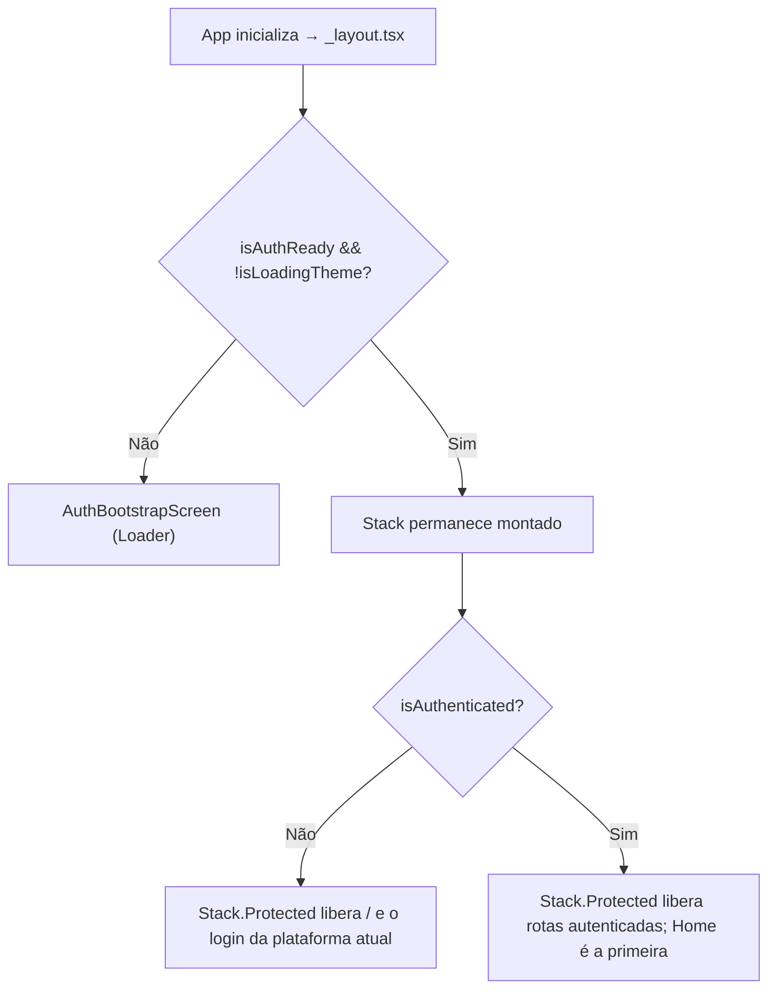

# Navegação

Sistema de navegação baseado em arquivos usando Expo Router. Cada arquivo em `app/` é uma rota. O layout raiz mantém um único `Stack` montado e usa `Stack.Protected` para disponibilizar Login ou as rotas autenticadas conforme o estado do [[Autenticação|AuthContext]].

## Estrutura de Rotas

```
/ (index.tsx)           → Redireciona para `/web` ou `/mobile`
/web (web/index.web.tsx) → LoginScreen Web
/mobile (mobile/index.native.tsx) → LoginScreen Android/iOS
/web/home (web/home.web.tsx) → Container de abas Web
/mobile/home (mobile/home.native.tsx) → Container de abas Android/iOS
  tab=0                 → HomeScreen (Dashboard)
  tab=1                 → AddRegisterExpensesScreen (Controle)
  tab=2                 → ConfigurationsScreen (Configurações)

Rotas do grupo Home:
/web/category-analysis → CategoryAnalysisScreen.web; /mobile/category-analysis → CategoryAnalysisScreen
/web/financial-forecast → FinancialForecastScreen.web; /mobile/financial-forecast → FinancialForecastScreen
/web/annotations e /mobile/annotations → LocalAnnotationsScreen (lista e editor local)

Rota direta do navegador:
/web/lumus-assistant e /mobile/lumus-assistant → LumusAssistantScreen

Rotas de cadastro:
/web/add-register-bank → `screens/web/AddRegisterBankScreen.web.tsx`; /mobile/add-register-bank → `screens/mobile/AddRegisterBankScreen.tsx`
/web/add-register-expenses e /mobile/add-register-expenses → AddRegisterExpensesScreen
/web/add-register-gain e /mobile/add-register-gain → AddRegisterGainScreen
/web/add-register-tag e /mobile/add-register-tag → AddRegisterTagScreen
/web/add-mandatory-expenses e /mobile/add-mandatory-expenses → AddMandatoryExpensesScreen
/web/add-mandatory-gains e /mobile/add-mandatory-gains → AddMandatoryGainsScreen
/web/add-finance e /mobile/add-finance → AddFinanceScreen
/web/add-rescue e /mobile/add-rescue → AddRescueScreen
/web/add-user-relation e /mobile/add-user-relation → AddUserRelationScreen
/web/screen-settings → ScreenSettingsScreen.web; /mobile/screen-settings → ScreenSettingsScreen
/web/register-monthly-balance e /mobile/register-monthly-balance → AddRegisterMonthlyBalanceScreen

Rotas de listagem:
/web/bank-movements e /mobile/bank-movements → BankMovementsScreen
/web/bank-summary e /mobile/bank-summary → Redirect para a Home da plataforma (não é uma tela real)
/web/financial-list → FinancialListScreen.web; /mobile/financial-list → FinancialListScreen
/web/mandatory-expenses e /mobile/mandatory-expenses → MandatoryExpensesListScreen (`focusMandatoryExpenseId` abre o pagamento pendente indicado)
/web/mandatory-gains e /mobile/mandatory-gains → MandatoryGainsListScreen
/web/transfer-screen e /mobile/transfer-screen → TransferScreen
```

> **Nota:** `/bank-summary` é apenas um `<Redirect>` para home — não renderiza tela própria.

## Convenção dos adaptadores de plataforma

`app/` separa fisicamente os adaptadores em `app/web/` e `app/mobile/`. Como essas pastas são segmentos públicos do Expo Router, os caminhos também usam `/web/...` e `/mobile/...`. Dentro de cada diretório, os pares `<rota>.web.tsx`/`<rota>.tsx` e `<rota>.native.tsx`/`<rota>.tsx` mantêm os fallbacks exigidos pelo Router. O guia curto para manutenção está em `app/README.md`.

## Fluxo de Autenticação


```mermaid
graph TD
    INIT["App inicializa → _layout.tsx"] --> CHECK{isAuthReady && !isLoadingTheme?}
    CHECK -->|Não| BOOT["AuthBootstrapScreen (Loader)"]
    CHECK -->|Sim| STACK["Stack permanece montado"]
    STACK --> AUTH{isAuthenticated?}
    AUTH -->|Não| LOGIN["Stack.Protected libera / e o login da plataforma atual"]
    AUTH -->|Sim| HOME["Stack.Protected libera rotas autenticadas; Home é a primeira"]
```

O guard usa `Stack.Protected`, disponível no Expo Router 6. Quando o estado de autenticação muda, o Router remove do histórico as telas que ficaram protegidas sem desmontar o navegador raiz nem disparar uma ação imperativa concorrente.

## Como funciona

1. O entry ativo é `index.ts`, que apenas carrega `expo-router/entry` e monta `app/_layout.tsx`. O layout mantém o bootstrap obrigatório mínimo e delega a composição global para `components/app/app-root.tsx`, onde os providers seguem a ordem: `ThemeProvider` → `ValueVisibilityProvider` → `PostSubmitBehaviorProvider` → `RouteVisibilityProvider` → `GestureHandlerRootView` → `GluestackUIProvider` → `NotifierWrapper` → `AuthProvider`
2. `AuthenticatedStack` consome `useAuth()`, `useAppTheme()` e [[Visibilidade de Rotas]]. Depois do bootstrap, mantém o mesmo `Stack`: `index` fica disponível para visitantes e cada rota autenticada recebe seu próprio `Stack.Protected`. Rotas ocultas localmente permanecem protegidas mesmo por deep link ou navegação programática.
3. `app/mobile/home.tsx` é somente o adaptador de rota para `screens/mobile/HomeTabsScreen.tsx`; `app/web/home.web.tsx` aponta para `screens/web/HomeTabsScreen.web.tsx`. Cada container implementa as mesmas abas com renderização condicional (não Tab Navigator) e seleciona a composição correta de Home/Controle por plataforma. Cada tela principal, inclusive `ConfigurationsScreen.web.tsx`, renderiza `components/uiverse/navigation/navigator.tsx`, cuja resolução `.web.tsx` assume a navegação no navegador
4. Parâmetros de rota passados via `useLocalSearchParams()` do Expo Router
5. `utils/navigation.ts` é o registro central de rotas (`APP_ROUTE_PATHS`), abas Home (`HOME_TAB_INDEX`) e helpers imperativos. Navegação manual para frente usa `push`, seleção/saída explícita usa um único `replace`, retorno inline conhecido usa `back` e redirect automático usa `redirectToRoute`/`redirectToHomeTab`
6. O grupo Home de `components/uiverse/navigation/navigator.tsx` e `.web.tsx` contém o Dashboard, **Movimentos do banco**, o atalho **Lumus IA**, a [[Análise por Categoria]], a [[Previsão de Fluxo de Caixa]] e [[Anotações Locais]], mantendo acesso direto ao extrato, assistência, relatórios, planejamento e organização pessoal perto da tela inicial. Lumus e Anotações só aparecem quando sua preferência em [[Visibilidade de Rotas]] estiver ativa; Anotações começa oculta por estar em desenvolvimento. A opção **Movimentos do banco** permanece disponível no grupo Home e fica marcada quando a rota correspondente `/web/bank-movements` ou `/mobile/bank-movements` está aberta.
7. As duas variantes do navigator podem sobrescrever temporariamente o rótulo de uma opção quando a rota ativa representa um fluxo de cadastro derivado da lista. Isso já acontece em `add-mandatory-expenses`, `add-mandatory-gains` e `add-finance`, para que o item ativo deixe explícito no navigator que o usuário está em um registro novo e não na listagem.
8. Em `/web/home` ou `/mobile/home`, o navigator resolve o grupo ativo pelo parâmetro `tab` e pelo `defaultValue` da tela, não apenas pelo pathname. Assim os parâmetros `tab=0`, `tab=1` e `tab=2` destacam Home, Controle e Config corretamente.
9. Telas de cadastro/edição que concluem um registro financeiro ou administrativo aplicam [[Comportamento Pós-Registro]] após o feedback de sucesso; por padrão retornam para a Home da plataforma (`/web/home?tab=0` ou `/mobile/home?tab=0`), mas podem permanecer na rota atual e limpar ou manter campos conforme preferência. O redirect espera um `requestAnimationFrame` para o `finally` do formulário concluir e então despacha exatamente um `REPLACE`.
10. `add-register-tag` preserva o retorno inline para a tela de origem quando recebe `returnAfterCreate`; as quatro telas de origem também enviam `placement` (`expense`, `mandatory-expense`, `gain` ou `mandatory-gain`) e `returnToRoute` para fallback determinístico quando não houver histórico válido. A criação normal pode receber `availabilityPreset` ou abrir o seletor completo de disponibilidade.
11. `app/_layout.tsx` chama `bootstrapLocalNotifications()` no carregamento do módulo para preparar canais Android e o handler de foreground. Dentro de `components/app/app-root.tsx`, `NotificationLifecycleBridge` ativa o UID, restaura os lembretes do Firestore após login e renova a janela ao voltar ao foreground. Não existe handler Notifee em `index.ts`.
12. A ação **Sair** é serializada em cada renderer do navigator, mas o fluxo seguro único fica em `utils/secureLogout.ts`. Ele é vinculado ao UID que iniciou a ação e exige a limpeza confirmada dos lembretes antes de `signOut`; respostas atrasadas não podem limpar nem deslogar uma conta posterior.
13. O grupo Config do navigator contém somente **Configurações**, **Meu perfil** e **Sair**. Os atalhos **Novo banco**, **Nova categoria** e **Config. das telas** foram retirados nas variantes mobile/Web; as rotas e seus acessos dentro de [[Configurações]] permanecem disponíveis.
14. A tela Testes do aplicativo foi removida do sistema, incluindo rotas, preferência de visibilidade e recursos exclusivos.
15. Quando [[Transações de Despesas]] detecta um gasto obrigatório pendente, usa a navegação manual `navigateToRoute(APP_ROUTE_PATHS.mandatoryExpenses, { focusMandatoryExpenseId })`. A lista recarrega os dados, revalida o alvo e abre somente a confirmação de registro daquele item, sem disparar persistência automática.
16. O navigator inferior possui três ações de largura igual. Home, Controle e Config abrem menus; **Lumus IA** fica no menu do botão Home e abre `/lumus-assistant`, mantendo o grupo Home ativo nessa rota quando a preferência local o mantém visível.
17. Os rótulos das opções dos menus e das três abas inferiores compartilham `LUMUS_NAVIGATION_CLASS_NAMES.menuLabel`: 12px, peso 700, caixa alta e espaçamento `tracking-label`. As cores continuam seguindo o tema e o estado ativo da rota.
18. As rotas `/lumus-assistant` montam a tela e sua boundary diretamente, sem `React.lazy`/`Suspense`. `LumusAssistantProvider` fica no root, dentro dos contextos de autenticação, finanças e preferências, para conservar conversa/rascunhos ao abrir outra tela e voltar. Preferências, Remote Config e disponibilidade começam somente na primeira entrada no assistente. Falha do modelo não impede carregar consentimento local ou executar os comandos determinísticos disponíveis. Speech/clipboard são carregados quando usados, sem inicializar recursos nativos de IA na Home.

### Navegação Web responsiva

- Carteira, análise por categoria, previsão e configurações por tela usam implementações independentes em `screens/web/`. A paridade é preservada pelos mesmos contratos de contexto/Firebase e utilitários financeiros, sem importar as telas mobile.
- As rotas com uma composição de tela independente mantêm adaptadores explícitos em `app/web/<rota>.web.tsx` e `app/mobile/<rota>.native.tsx`, cada um acompanhado pelo fallback `<rota>.tsx` no seu diretório. O navegador usa `/web/<rota>` e seleciona a tela em `screens/web/`; Android/iOS usam `/mobile/<rota>` e selecionam a tela em `screens/mobile/`. Rotas sem composição dedicada continuam apontando para a implementação canônica responsiva. `/web/home` usa `screens/web/HomeTabsScreen.web.tsx` e `/mobile/home` usa `screens/mobile/HomeTabsScreen.tsx`, mantendo a mesma navegação e selecionando os filhos da plataforma.
- `WebAppShell` envolve o `Stack` autenticado somente no navegador e preserva o fundo de workspace sem alterar o Stack, os guards ou os parâmetros de rota. Ele não reserva mais uma faixa permanente para navegação. Os helpers de `utils/navigation.ts` emitem o evento Web antes de despachar `push`, `replace` ou `back`; `WebRouteTransition` escuta esse evento e usa Motion em um portal DOM para cobrir e revelar a página com um véu horizontal curto. A transição não captura ponteiros e é removida quando `prefers-reduced-motion` está ativo.
- `components/web/navigation/navigator.web.tsx` é a implementação Web do registro visual das opções. A partir de `1024px`, ela mantém o `StaggeredMenu` fixo pela borda esquerda, agrupando todas as rotas em Home, Controle e Config. Fechado, o próprio painel é recortado a 68px e mostra somente os ícones e o avatar do usuário autenticado; ao abrir, essa mesma superfície revela a largura completa, seus rótulos e o nome/e-mail do usuário no rodapé, sem trocar ou sobrepor outro componente, preservando a sequência escalonada das camadas de abertura atrás do painel. A superfície usa navy/amarelo no dark mode e white/slate com camadas amarelo suave no light mode, seguindo `themeMode`; o fechamento reproduz essa sequência de forma espelhada. Links reais mantêm abrir em nova aba/Cmd+clique. A ação Sair continua um botão, pois executa o fluxo seguro de logout.
- Em telas menores, a variante Web preserva a barra inferior compacta; Android/iOS continuam usando `navigator.tsx` e o menu Gluestack existentes. Os dois formatos não aparecem juntos.
- `navigator.tsx` não contém mais uma sidebar desktop inatingível: a resolução de módulo sempre escolhe `navigator.web.tsx` no navegador. A variante nativa fica restrita à barra inferior e menus mobile; o logout seguro é compartilhado entre as duas variantes.
- O painel mantém a opção permanente de movimentos bancários, os rótulos de formulários derivados, logout serializado e as rotas ocultáveis. Cada item tem estado selecionado, foco visível, fecha com Escape/clique externo **e antes da navegação interna** para não transportar a rail expandida para a próxima tela, e reduz a animação quando o sistema pede menos movimento.
- O Firebase Hosting reescreve a navegação de cliente para `index.html`. Por isso, uma abertura direta de `/web/home`, `/web/financial-list` ou outra rota Web autenticada atravessa o mesmo `Stack.Protected` e não deve ganhar um guard ou registro de rota paralelo.

## Arquivos principais

- `index.ts` — Entry mínimo que carrega `expo-router/entry`
- `app/_layout.tsx` — Bootstrap mínimo de compatibilidade, estilos e notificações locais
- `components/app/app-root.tsx` — Providers, `Stack.Protected`, loader de bootstrap e ciclo de vida de notificações autenticadas
- `components/web/navigation/web-app-shell.web.tsx` / `components/mobile/navigation/web-app-shell.native.tsx` — workspace autenticado por plataforma sem modificar a hierarquia de rotas
- `components/web/navigation/web-route-transition.web.tsx` / `components/mobile/navigation/web-route-transition.native.tsx` — feedback de troca de rota Web e fallback nativo isolado do Stack React Native
- `app/mobile/home.native.tsx` / `app/web/home.web.tsx` / `screens/mobile/HomeTabsScreen.tsx` / `screens/web/HomeTabsScreen.web.tsx` — Adaptadores de rota e containers de abas por plataforma (renderização condicional por índice)
- `app/mobile/category-analysis.tsx` — Rota da análise dinâmica por tag
- `app/mobile/financial-forecast.tsx` — Rota da previsão financeira
- `app/mobile/annotations.tsx` — Rota protegida das anotações locais
- `app/mobile/lumus-assistant.tsx` — Rota protegida do [[Assistente Lumus]]
- `components/uiverse/assistant/assistant-route-boundary.tsx` — Recuperação de erro inesperado da rota do assistente
- `app/mobile/screen-settings.tsx` — Rota de configurações por tela
- `app/index.tsx` — Entry raiz que encaminha para o login Web ou mobile
- `app/mobile/bank-summary.tsx` — Redirect para home (rota legada)
- `components/uiverse/navigation/navigator.tsx` / `.web.tsx` — Navegação padrão do app, com implementação específica por plataforma
- `contexts/RouteVisibilityContext.tsx` — Preferência local e defaults de visibilidade das rotas
- `utils/navigation.ts` — Registro central de rotas, navegação manual e orquestração serializada dos redirects automáticos via `replace`
- `hooks/usePostSubmitBehavior.ts` — Aplica retorno/limpeza configurados após sucesso e ignora conclusão obsoleta quando a tela já perdeu o foco
- `utils/localNotifications.ts` — Bootstrap de notificações usado pelo root layout
- `utils/secureLogout.ts` — Limpeza segura de lembretes e encerramento de sessão compartilhados pelos navigators
- `babel.config.js` — Preset Expo, NativeWind, aliases e plugin Worklets
- `App.tsx` — Entry alternativo usado apenas se `index.ts` voltar a ser o main

## Integrações

- [[Autenticação]] — `useAuth()` controla redirecionamentos
- [[Sistema de Temas]] — `ThemeProvider` no root layout; `isLoadingTheme` bloqueia render
- [[Privacidade de Valores]] — `ValueVisibilityProvider` no root layout
- [[Notificações]] — `NotifierWrapper` e bootstrap de notificações no layout
- [[Análise por Categoria]] — Rota de relatório no grupo Home do navigator
- [[Previsão de Fluxo de Caixa]] — Rota de planejamento no grupo Home do navigator
- [[Anotações Locais]] — Páginas locais do grupo Home, com editor visual que salva Markdown e visibilidade local configurável
- [[Comportamento Pós-Registro]] — Preferência que escolhe destino ou limpeza após salvar formulários
- [[Visibilidade de Rotas]] — Filtra menus e protege as rotas configuráveis no Stack
- [[Assistente Lumus]] — Atalho opcional no menu Home e sessão em memória mantida fora do Stack

## Configuração

- `app.json`: `"scheme": "financesapp"` para deep links
- `app.json`: `web.output: "single"` para exportar uma SPA estática em `dist/`
- `firebase.json`: Hosting serve `dist/` com `cleanUrls` e rewrite SPA para `/index.html`
- `expo-linking` para resolução de URLs externas
- `babel.config.js`: alias `@` aponta para a raiz e `tailwind.config` para o arquivo estável do Tailwind 3; não há transformação compensatória para dependências porque o lock fixa o grafo React Aria/Stately compatível

## Observações importantes

- Expo Router usa file-system routing — arquivos em `app/` viram rotas automaticamente
- A resposta de `index.bundle?platform=android&dev=true` deve ser validada após mudanças em Babel, Metro, NativeWind ou arquivos de rota. O bundle de produção pode aceitar sintaxe que o pipeline de desenvolvimento rejeita; por isso, export de produção sozinho não encerra a validação da tela branca.
- A configuração Firebase é avaliada antes de `expo-router/entry` montar o primeiro frame. Portanto, cada `EXPO_PUBLIC_*` usada no bootstrap deve aparecer como acesso direto no código-fonte e como valor incorporado no bundle release; deixar `process.env` inteiro para resolução em runtime mantém a splash nativa porque o Stack nunca chega a montar.
- `home.tsx` usa parâmetro `tab` para controlar aba ativa (não é roteamento de stack dentro das abas)
- Layout animation no Android desabilitado via `utils/reactNativeCompat.ts` (compatibilidade New Architecture)
- `navigator.tsx` e `.web.tsx` são a única navegação do domínio `uiverse`: barra inferior/menu Gluestack em Android/iOS e painel `StaggeredMenu` no Web a partir de `1024px`
- O navigator preserva o grupo ativo de `Controle` ao entrar em rotas filhas de cadastro e adapta o texto do item correspondente para refletir o contexto atual do fluxo
- O grupo Home do navigator deve exibir **Movimentos do banco** como destino permanente entre **Início** e os demais relatórios; a opção fica ativa somente enquanto a tela `/bank-movements` está aberta
- A rota `/financial-forecast` deve ser tratada como destino do grupo Home, usando `APP_ROUTE_PATHS.financialForecast` e `navigateToRoute()`; ela não é uma nova aba do container `/home`
- A rota `/annotations` deve ser tratada como destino do grupo Home, usando `APP_ROUTE_PATHS.annotations` e `navigateToRoute()`; não criar uma quarta aba fixa para as anotações. Quando ocultada em [[Visibilidade de Rotas]], ela sai do navigator e `Stack.Protected` bloqueia o acesso direto.
- O atalho **Lumus IA** usa `APP_ROUTE_PATHS.lumusAssistant` no menu do grupo Home quando sua visibilidade local estiver ativa; não criar uma quarta ação fixa na barra inferior.
- A barra inferior mantém `16px` de padding horizontal no contêiner externo e limita o conteúdo a `280px`; assim, Home, Controle e Config permanecem com a mesma largura em todas as telas, sem encostar nas bordas.
- No Web desktop, a rail compacta do `StaggeredMenu` permanece fixa e o painel expandido é fixo somente enquanto está visível; `WebAppShell` não reserva largura para nenhum deles. A variante visual acompanha o `themeMode` atual e mantém contraste, foco visível e área clicável mínima de 44px nos dois temas. Não introduzir uma segunda barra inferior, rotas duplicadas ou um segundo registro de rotas exclusivo do navegador.
- Banco, categoria e configurações das telas mantêm suas rotas e fluxos internos, sem atalhos no navigator.
- Submits de criação/edição em telas de formulário devem aplicar `usePostSubmitBehavior()` após salvar; não chamar `router.back()` nem strings de rota soltas como retorno pós-submit
- `router.dismissTo()`, `router.dismissAll()` e `withAnchor` são proibidos nos redirects automáticos deste app. No Expo Router 6, `dismissTo` enfileira `POP_TO`; falhas no despacho não chegam a um `try/catch` síncrono e podem deixar o NativeStack Android sem conteúdo em release.
- Redirect automático deve executar no máximo uma ação. `redirectToRoute()`/`redirectToHomeTab()` cancelam uma intenção pendente quando outra navegação centralizada vence no mesmo frame.
- Conclusões assíncronas de formulários desfocados não podem navegar nem limpar campos; `usePostSubmitBehavior()` valida foco antes de aplicar a preferência.
- O retorno inline após criar categoria preserva a tela de origem via `back`, mas também é diferido um frame por `redirectBackOrRoute()` para não concorrer com o `finally` do formulário.
- A edição de categoria navega apenas com `tagId`; `AddRegisterTagScreen` busca a categoria canônica antes de permitir o salvamento, evitando dados antigos serializados pela tabela administrativa.
- `focusMandatoryExpenseId` é um parâmetro interno de `/mandatory-expenses`: ele orienta o usuário ao pagamento obrigatório pendente detectado e não deve ser usado para pular a confirmação ou registrar uma despesa automaticamente.
- O botão físico de voltar em telas de formulário deve ser interceptado para cair na Home quando não houver um fluxo inline explícito
- Na rota `/home`, o botão físico do Android encerra o app. Ele não pode desempilhar uma Home duplicada ou reabrir formulário antigo mantido abaixo pelo `REPLACE` seguro.
- Novos destinos devem ser adicionados em `APP_ROUTE_PATHS` antes de serem usados por telas ou pelo navigator
- Rotas ocultáveis precisam ser registradas em `ROUTE_VISIBILITY_PATHS`; filtrá-las somente no navigator não é suficiente, pois o `Stack.Protected` também deve negar acesso direto.
- `/lumus-assistant` deve permanecer na lista central protegida; `tests/navigation.test.ts` compara todas as rotas físicas com `APP_ROUTE_PATHS`
- `LumusAssistantProvider` deve permanecer único no root, dentro dos contextos que consome. As rotas `/lumus-assistant` montam apenas sua tela/boundary, sem `React.lazy`/`Suspense`; a sessão continua em memória ao navegar e é limpa por pedido explícito, revogação, logout ou troca de UID. Preparação assíncrona inicia na primeira entrada, sem bloquear a montagem do Stack.
- Com `main: "index.ts"`, handlers de background obrigatórios devem ser registrados antes de `require('expo-router/entry')`; inicializações de UI/canais permanecem em `app/_layout.tsx` ou utilitários importados por ele, nunca em `App.tsx`

## Perfil pessoal — 2026-09-27

`APP_ROUTE_PATHS.profile` registra `/web/profile` e `/mobile/profile`, com adaptadores/fallbacks próprios e as telas independentes `PerfilPersonScreen.web.tsx` / `PerfilPersonScreen.tsx`. O guard autenticado é derivado do registro central. Meu perfil substitui Relacionar usuário no grupo Config e fica ativo também na rota de vínculo. O perfil não é ocultável; seu atalho interno Relacionar usuário continua condicionado a `addUserRelation`. A rota existente é preservada, recebe `fromProfile=1` e oferece retorno explícito/físico ao perfil, com fallback determinístico para acesso direto. Ver [[Perfil do Usuário]].

## Ajuste de saldo — 2026-09-30

`APP_ROUTE_PATHS.bankBalanceAdjustment` registra as variantes Web/mobile autenticadas. Configurações abre o cadastro; o extrato abre edição com `adjustmentId` e `bankId`. O sucesso usa `redirectToRoute` para uma única transição ao extrato com nome do banco e `focusDate` em `DD/MM/YYYY`, que seleciona o mês correspondente. Este fluxo de conferência possui retorno fixo, documentado em [[Ajuste de Saldo]], sem preferência pós-submit/visibilidade nem novo item no navigator. O hook impede redirects após perda de foco ou troca de UID.

## Inventário e navegação conversacional — 2026-10-02

[[Cobertura Conversacional Lumus]] relaciona os 82 arquivos físicos de `app/` aos 25 destinos lógicos de cada grupo, incluindo fallbacks/adaptadores, entradas, redirects e fluxos internos. `utils/appRouteGuards.ts` deriva os guards do registro central para todas as rotas físicas: o grupo alternativo permanece negado, login exige visitante e os demais destinos exigem sessão/visibilidade aplicável. Ocultar um menu não substitui o guard nem a autorização de domínio.

O assistente abre destinos somente por `APP_ROUTE_PATHS` e `navigateToRoute`, com os índices das abas Home/Controle/Config; nega destinos ocultos. A saída usa `logoutCurrentUser`, incluindo limpeza segura de lembretes e vínculo ao UID original. Não declara logout antes de observar a sessão encerrada. O chat mantém contexto para voltar, sem depender de abrir uma tela para concluir uma operação financeira.

`tests/lumusAssistantRouteInventory.test.ts` compara inventário, registro, grupos, adapters e guards Web/Android. `tests/assistantRouteBootstrap.test.ts` verifica telas diretas sem provider duplicado; `tests/lumusAssistantContextIntegration.test.ts` verifica bootstrap tardio e memória entre rotas. Essas evidências não substituem smoke test visual, navegação instalada, teclado ou áudio real.

O cleanup do provider encerra e zera o executor, invalida intenções/autorização e aborta áudio; o próximo envio cria uma sessão válida mesmo quando o ambiente de desenvolvimento repete efeitos mantendo refs (Fast Refresh). O teste do provider reproduz esse ciclo e verifica o efeito persistido da anotação, sem confundir desenvolvimento com execução instalada.
