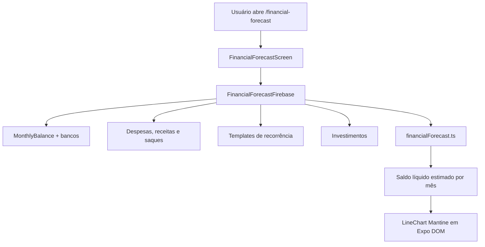

# Previsão de Fluxo de Caixa

Tela de planejamento financeiro de curto e médio prazo. Ela estima o saldo líquido global para 3, 6 ou 12 meses sem persistir, alterar ou criar qualquer movimentação.

## Como funciona

1. A rota `/financial-forecast` abre `FinancialForecastScreen.tsx` e fica no grupo **Home** de `navigator.tsx` como **Previsão Financeira**.
2. A tela sempre lê os dados novamente ao receber foco e também aceita pull-to-refresh.
3. O usuário seleciona um horizonte de 3, 6 ou 12 meses pelo `Tabs` de `components/ui/tabs`. Os três gatilhos dividem toda a largura disponível dentro de um card `notTintedCardClassName`; o indicador animado amarelo acompanha o período ativo e a seleção somente recalcula/redesenha o cenário.
4. A tela mostra saldo de hoje, saldo projetado no fim do horizonte, variação estimada, linha de evolução e detalhamento expansível por mês.
5. O gráfico é `LineChart` de `@mantine/charts`, isolado em `components/uiverse/financial-forecast-chart.tsx` como Expo DOM Component. Com mais de sete pontos — caso do horizonte de 12 meses, que inclui Hoje — a curva recebe largura por período e pode ser arrastada horizontalmente para não sobrepor rótulos. A UI restante continua React Native/Gluestack.

## Regras de cálculo

### Saldo de abertura

- Para cada banco, é usado o `MonthlyBalance` mais recente que não esteja no futuro. O valor-base é atualizado por despesas, receitas e investimentos iniciais já datados depois desse snapshot.
- Movimentos em dinheiro (`bankId: null`) entram integralmente no saldo conhecido, pois não têm snapshot próprio.
- Saques em espécie são neutros quando a conta de origem tem snapshot: reduzem o banco e aumentam o dinheiro no mesmo valor. Se a origem ainda não possui snapshot, o dinheiro conhecido continua contabilizado.
- Transferências entre bancos são ignoradas no total global porque não alteram o patrimônio líquido.
- Banco sem snapshot não inventa um saldo inicial. A tela lista os nomes afetados e oferece atalho para [[Balanço Mensal]].

### Compromissos projetados

- [[Despesas Fixas]] e [[Receitas Fixas]] são resolvidas mês a mês com `resolveMonthlyOccurrence()`, inclusive para dias úteis e dias 29/30/31.
- O ciclo que já possui movimentação vinculada não é projetado novamente. Parcelamentos respeitam `installmentStartDate`, `installmentEndDate`, `installmentTotal` e `installmentsCompleted`.
- Compromissos fixos (incluindo parcelamentos ativos) e lançamentos reais já datados no futuro têm precedência na projeção. Um lançamento futuro conhecido substitui a estimativa variável da mesma categoria naquele mês.
- Despesas e receitas variáveis usam a média inteira em centavos dos três meses fechados anteriores, agrupada por categoria, mas só entram quando a categoria aparece em pelo menos **dois meses distintos** dessa janela. Vários lançamentos concentrados em um único mês continuam sendo pontuais e não qualificam a categoria para a projeção.
- Movimentos que representam recorrências são removidos da base variável para não duplicar os templates obrigatórios.
- Transferências e sincronizações internas não entram na média histórica nem nas previsões de ganhos/despesas.

### Investimentos

- A criação futura de um investimento e aportes futuros reduzem o caixa previsto; resgates futuros já registrados aumentam o caixa.
- A disponibilidade por prazo de liquidez aparece no mês correspondente como aviso. Ela **não** é somada como entrada, pois nenhum resgate real foi criado.
- O valor já aplicado não é tratado como caixa disponível. Essa separação preserva a regra de [[Balanço Mensal]] de não misturar investimento com resultado de ganho/despesa.

### Segurança do domínio

- Todos os cálculos financeiros permanecem em centavos inteiros. Conversão para reais ocorre apenas nos formatadores de exibição e no gráfico.
- A previsão é somente leitura: `FinancialForecastFirebase.ts` usa `getDocs()` e `financialForecast.ts` é puro. Nenhuma previsão cria `expenses`, `gains`, transferências, aportes ou resgates.
- [[Privacidade de Valores]] é aplicada à tela e ao gráfico: textos monetários, tooltip e eixo vertical são ocultados quando a preferência está ativa.

## Arquivos principais

- `app/financial-forecast.tsx` — Rota fina Expo Router
- `screens/FinancialForecastScreen.tsx` — Tela nativa, períodos, estados e detalhamento
- `functions/FinancialForecastFirebase.ts` — Leitura agregada e normalização de Firestore
- `utils/financialForecast.ts` — Cálculo puro do saldo de abertura e da projeção
- `components/uiverse/financial-forecast-chart.tsx` — LineChart Mantine em Expo DOM
- `components/ui/tabs/index.tsx` — Tabs controladas e indicador animado reutilizados pelo seletor de horizonte
- `tests/financialForecast.test.ts` — Cobertura de recorrências, médias, investimentos e saldo-base
- `assets/UnDraw/financialForecast.svg` — Ilustração da tela

## Integrações

- [[Navegação]] — Registro `APP_ROUTE_PATHS.financialForecast`, stack autenticado e opção no grupo Home
- [[Balanço Mensal]] — Fonte do saldo-base por banco e caminho de correção para snapshots ausentes
- [[Despesas Fixas]] e [[Receitas Fixas]] — Templates e parcelas previstas, sem efetivação automática
- [[Investimentos]] — Aportes, resgates e avisos de liquidez
- [[Componentes UI]] — Expo DOM Component para Mantine Charts, mantendo o padrão nativo nas demais áreas
- [[Privacidade de Valores]] — Máscara `••••` para valores da tela e do gráfico

## Configuração

- Dependências: `@mantine/core@8.3.18`, `@mantine/hooks@8.3.18`, `@mantine/charts@8.3.18`, `recharts@3.7.0` e `react-native-webview@13.15.0`.
- `react-native-webview` é a ponte usada pelos Expo DOM Components no SDK atual. Após adicionar ou atualizar essa dependência, é necessário gerar/instalar uma nova build nativa; um reload do Metro não basta.
- Os estilos Mantine são importados apenas dentro do componente DOM, evitando alterar o tema Gluestack/NativeWind do restante do aplicativo. O `body` desse WebView e seu contêiner nativo permanecem transparentes, para que o gráfico herde visualmente o card em ambos os temas. Como o gráfico não possui controles focáveis, o WebView não recebe foco nem exibe contorno ao toque.

## Observações importantes

- O cenário é uma estimativa baseada nos dados cadastrados; não substitui conciliação bancária nem extrato real. Categorias variáveis usadas apenas uma vez na janela histórica, como uma compra pontual de bicicleta, ficam fora da previsão.
- A leitura é consolidada no dispositivo para cobrir saldo em espécie e histórico de categorias. Se o volume de documentos crescer de forma relevante, a próxima evolução deve introduzir agregados mensais no Firestore, sem alterar as regras de cálculo.
- Um investimento disponível para resgate não é caixa até que o usuário registre o resgate pelo fluxo de [[Investimentos]].
- Bancos sem snapshot reduzem a confiança do saldo global; a tela deve manter o aviso visível em vez de assumir saldo zero como dado real.
