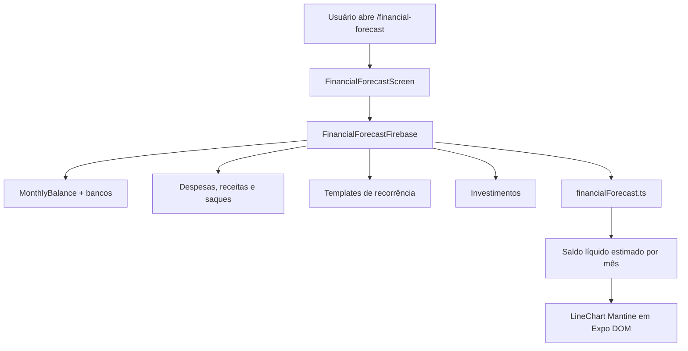

# Previsão de Fluxo de Caixa

Tela de planejamento financeiro de curto e médio prazo. Ela estima o saldo líquido global para 3, 6 ou 12 meses sem persistir, alterar ou criar qualquer movimentação.

## Como funciona

```mermaid
graph TD
    U[Usuário abre /financial-forecast] --> S[FinancialForecastScreen]
    S --> F[FinancialForecastFirebase]
    F --> MB[MonthlyBalance + bancos]
    F --> M[Despesas, receitas e saques]
    F --> R[Templates de recorrência]
    F --> I[Investimentos]
    F --> C[financialForecast.ts]
    C --> O[Saldo líquido estimado por mês]
    O --> CH[LineChart Mantine em Expo DOM]
```

1. A rota `/financial-forecast` abre `FinancialForecastScreen.tsx` e fica no grupo **Home** de `navigator.tsx` como **Previsão Financeira**.
2. A tela sempre lê os dados novamente ao receber foco e também aceita pull-to-refresh. O UID vem de `AuthContext`; se não houver sessão, a tela remove o estado ocupado e mantém a mensagem de erro visível.
3. O usuário seleciona um horizonte de 3, 6 ou 12 meses. No mobile, `components/ui/tabs` distribui os três gatilhos dentro de um card `notTintedCardClassName` e acompanha o período ativo com indicador amarelo animado. Na Web, `MantineTabs` reutiliza o contrato visual de `CategoryAnalysisScreen.web.tsx`, com pills amarelas, texto branco na opção ativa, foco visível e largura distribuída. Em ambas as plataformas, a seleção recalcula/redesenha o cenário.
4. A tela mostra saldo de hoje e variação prevista em cards lado a lado; abaixo deles, o gráfico da evolução ocupa a largura disponível sem uma superfície ou borda própria. O detalhamento mensal permanece expansível.
5. O gráfico é `LineChart` de `@mantine/charts`, isolado em `components/uiverse/reports/financial-forecast-chart.tsx` como Expo DOM Component. Com mais de sete pontos — caso do horizonte de 12 meses, que inclui Hoje — a curva recebe largura por período e pode ser arrastada horizontalmente para não sobrepor rótulos. A UI restante continua React Native/Gluestack.
6. O resumo projetado usa `LinearGradient`: verde para saldo final positivo e vermelho para saldo negativo, com os pares semânticos de `LUMUS_FINANCIAL_GRADIENTS`, compartilhados com a Análise por Categoria. O texto e os indicadores internos permanecem brancos. Entradas, saídas e avisos seguem as cores semânticas do design system; controles de informação, ação para cadastrar saldos e expansão mensal mantêm alvos de toque e foco visível nas duas plataformas.

## Regras de cálculo

### Saldo de abertura

- O serviço escolhe a fonte pelo corte do usuário. Em grupo migrado, a abertura é a soma dos saldos materializados de bancos e Caixa em `financialAccounts`, sem reaplicar eventos, investimentos ou snapshots legados. O valor aplicado em contas de investimento não entra como caixa disponível.
- O backend já materializa o efeito no commit mesmo quando `effectiveAt` é futuro. Por isso, um evento do razão já confirmado, inclusive futuro, não é projetado novamente como saída/entrada futura; templates ainda pendentes continuam na projeção. A previsão não desfaz deltas futuros nem modifica os saldos persistidos.
- Na fonte migrada, despesas/receitas históricas usam `ledgerTransactions` ativos do grupo, com corte até o fim do dia civil atual em São Paulo. Estornos até esse corte excluem os originais mesmo fora da janela dos três meses; estornos e movimentos internos não entram na média variável. Vínculos de templates reconhecem os IDs do razão e evitam projetar novamente ciclos já concluídos.
- As regras abaixo de `MonthlyBalance`, dinheiro sem snapshot e saques descrevem a fonte legada, anterior ao corte.
- Para cada banco, é usado o `MonthlyBalance` mais recente que não esteja no futuro. O valor-base é atualizado por despesas, receitas e investimentos iniciais já datados depois desse snapshot.
- Movimentos em dinheiro (`bankId: null`) entram integralmente no saldo conhecido, pois não têm snapshot próprio.
- Saques em espécie são neutros quando a conta de origem tem snapshot: reduzem o banco e aumentam o dinheiro no mesmo valor. Se a origem ainda não possui snapshot, o dinheiro conhecido continua contabilizado.
- Transferências entre bancos são ignoradas no total global porque não alteram o patrimônio líquido.
- Banco sem snapshot não inventa um saldo inicial. A tela lista os nomes afetados e oferece atalho para [[Balanço Mensal]].
- Na fonte legada, o cálculo de abertura lê todas as páginas relevantes de despesas/receitas/saques, inclusive anteriores aos três meses usados para a média. Um snapshot antigo e o Caixa não podem perder movimentações porque a janela estatística é menor que seu histórico financeiro.

### Compromissos projetados

- [[Despesas Fixas]] e [[Receitas Fixas]] são resolvidas mês a mês com `resolveMonthlyOccurrence()`, inclusive para dias úteis e dias 29/30/31.
- O ciclo que já possui movimentação vinculada não é projetado novamente. Parcelamentos respeitam `installmentStartDate`, `installmentEndDate`, `installmentTotal` e `installmentsCompleted`.
- Compromissos fixos (incluindo parcelamentos ativos) e lançamentos reais já datados no futuro têm precedência na projeção. Um lançamento futuro conhecido substitui a estimativa variável da mesma categoria naquele mês.
- Despesas e receitas variáveis usam a média inteira em centavos dos três meses fechados anteriores, agrupada por categoria, mas só entram quando a categoria aparece em pelo menos **dois meses distintos** dessa janela. Vários lançamentos concentrados em um único mês continuam sendo pontuais e não qualificam a categoria para a projeção.
- Movimentos que representam recorrências são removidos da base variável para não duplicar os templates obrigatórios.
- Transferências e sincronizações internas não entram na média histórica nem nas previsões de ganhos/despesas.

### Investimentos

- A criação futura de um investimento e aportes futuros reduzem o caixa previsto; resgates futuros já registrados aumentam o caixa.
- A disponibilidade por prazo de liquidez aparece no mês correspondente como aviso. Ela **não** é somada como entrada, pois nenhum resgate real foi criado.
- O valor já aplicado não é tratado como caixa disponível. Essa separação preserva a regra de [[Balanço Mensal]] de não misturar investimento com resultado de ganho/despesa.
- Em grupo migrado, liquidez usa saldo e metadados da conta de investimento, com metadados legados legíveis como compatibilidade quando necessário. A criação da conta já materializada não gera uma nova saída na projeção. Sem data/prazo válidos, o serviço não inventa uma data de disponibilidade.

### Segurança do domínio

- Todos os cálculos financeiros permanecem em centavos inteiros. Conversão para reais ocorre apenas nos formatadores de exibição e no gráfico.
- A previsão é somente leitura: `FinancialForecastFirebase.ts` usa `getDocs()` e `financialForecast.ts` é puro. Nenhuma previsão cria `expenses`, `gains`, transferências, aportes ou resgates.
- [[Privacidade de Valores]] é aplicada à tela e ao gráfico: textos monetários, tooltip e eixo vertical são ocultados quando a preferência está ativa.

## Arquivos principais

- `app/mobile/financial-forecast.tsx` — Rota fina Expo Router
- `screens/mobile/FinancialForecastScreen.tsx` — Tela nativa, períodos, estados e detalhamento
- `screens/web/FinancialForecastScreen.web.tsx` — Composição Web e seletor Mantine alinhado à Análise por Categoria
- `functions/FinancialForecastFirebase.ts` — Leitura agregada e normalização de Firestore
- `functions/FinancialLedgerFirebase.ts` — Fonte de contas e histórico paginado do grupo migrado
- `utils/financialCivilDate.ts` — Calendário civil de São Paulo na fronteira dos calculadores e instantes de consulta
- `utils/financialForecast.ts` — Cálculo puro do saldo de abertura e da projeção
- `components/uiverse/reports/financial-forecast-chart.tsx` — LineChart Mantine em Expo DOM
- `components/ui/tabs/index.tsx` — Tabs controladas e indicador animado usados pelo seletor mobile de horizonte
- `design-system/mantine.ts` — Contrato Mantine compartilhado pelo seletor Web de horizonte e pela Análise por Categoria
- `design-system/tokens.ts` — Pares de cores para gradientes financeiros positivos/negativos usados pelo resumo projetado e pela Análise por Categoria
- `tests/financialForecast.test.ts` — Cobertura de recorrências, médias, investimentos e saldo-base
- `tests/ledgerProjectionReads.test.ts` — Efeitos de leituras legadas/migradas, 251 eventos, estornos, metadados de grupo, futuro sem duplicação e liquidez; Firestore simulado, sem escrita financeira
- `assets/UnDraw/financialForecast.svg` — Ilustração da tela

## Integrações

- [[Navegação]] — Registro `APP_ROUTE_PATHS.financialForecast`, stack autenticado e opção no grupo Home
- [[Balanço Mensal]] — Fonte do saldo-base por banco e caminho de correção para snapshots ausentes
- [[Despesas Fixas]] e [[Receitas Fixas]] — Templates e parcelas previstas, sem efetivação automática
- [[Investimentos]] — Aportes, resgates e avisos de liquidez
- [[Componentes UI]] — Expo DOM Component para Mantine Charts, mantendo o padrão nativo nas demais áreas
- [[Privacidade de Valores]] — Máscara `••••` para valores da tela e do gráfico

## Configuração

- Dependências: `@mantine/core@9.5.1`, `@mantine/hooks@9.5.1`, `@mantine/charts@9.5.1`, `recharts@3.7.0` e `react-native-webview@13.16.1`.
- No Expo SDK 57, o Expo DOM seleciona `@expo/dom-webview` por padrão. A tela mobile define `dom.useExpoDOMWebView: false` para usar o `react-native-webview` já instalado no projeto e evitar a ausência de `ExpoDomWebViewModule` em builds nativas anteriores. Se o binário instalado também não incluir `react-native-webview`, é necessário gerar/instalar uma nova build nativa; um reload do Metro não basta.
- Os estilos Mantine são importados apenas dentro do componente DOM, evitando alterar o tema Gluestack/NativeWind do restante do aplicativo. O `body` desse WebView e seu contêiner nativo permanecem transparentes, para que o gráfico herde visualmente o card em ambos os temas. Como o gráfico não possui controles focáveis, o WebView não recebe foco nem exibe contorno ao toque.

## Observações importantes

- O cenário é uma estimativa baseada nos dados cadastrados; não substitui conciliação bancária nem extrato real. Categorias variáveis usadas apenas uma vez na janela histórica, como uma compra pontual de bicicleta, ficam fora da previsão.
- A leitura é consolidada no dispositivo para cobrir saldo em espécie e histórico de categorias. Se o volume de documentos crescer de forma relevante, a próxima evolução deve introduzir agregados mensais no Firestore, sem alterar as regras de cálculo.
- Um investimento disponível para resgate não é caixa até que o usuário registre o resgate pelo fluxo de [[Investimentos]].
- Bancos sem snapshot reduzem a confiança do saldo global; a tela deve manter o aviso visível em vez de assumir saldo zero como dado real.
- `tests/ledgerProjectionEmulator.test.ts` verifica a abertura migrada por SDK real/Emulator demo: 91.460 no banco mais 500 no Caixa resultam em 91.960 centavos, mesmo existindo despesas legadas e 253 eventos no razão. Os eventos já materializados não são debitados novamente; as fixtures isoladas são removidas após a suíte opt-in.

### Apresentação do detalhamento mensal (2026-09-28)

As duas telas exibem "Evolução do saldo" e "Detalhamento mensal" como títulos de seção sem ícone. O gráfico Mantine mantém largura mínima mensurável no contêiner e na raiz, inclusive dentro do WebView nativo. Os meses usam o `Accordion` compartilhado, controlado por chave de mês, com linhas sem card/borda externa; cada mês mostra o saldo final no gatilho e entradas, saídas, variação e compromissos no conteúdo. A lista de compromissos começa com três itens e o botão "Mostrar mais compromissos" revela os demais daquele mês; "Mostrar menos compromissos" volta ao resumo. Os valores e regras de projeção não mudam. A apresentação segue [[Análise por Categoria]] e [[Componentes UI]].

### Rótulo do título do gráfico (2026-09-28)

"Evolução do saldo" usa nas composições mobile e Web o mesmo tratamento visual do label de gráfico da Home: caixa alta, peso forte e espaçamento ampliado entre letras. O indicador de carregamento permanece alinhado ao título.

O título "Detalhamento mensal" usa o mesmo tratamento de caixa alta, peso forte e espaçamento ampliado nas duas plataformas, mantendo consistência com o label da evolução e os gráficos da Home.

## Ajustes de saldo — 2026-09-30

[[Ajuste de Saldo]] compõe somente a base disponível: diferenças e estornos posteriores ao snapshot são somados em centavos à abertura da previsão. Eles não são normalizados como ganhos/despesas, não alteram médias históricas e não criam compromissos futuros.
