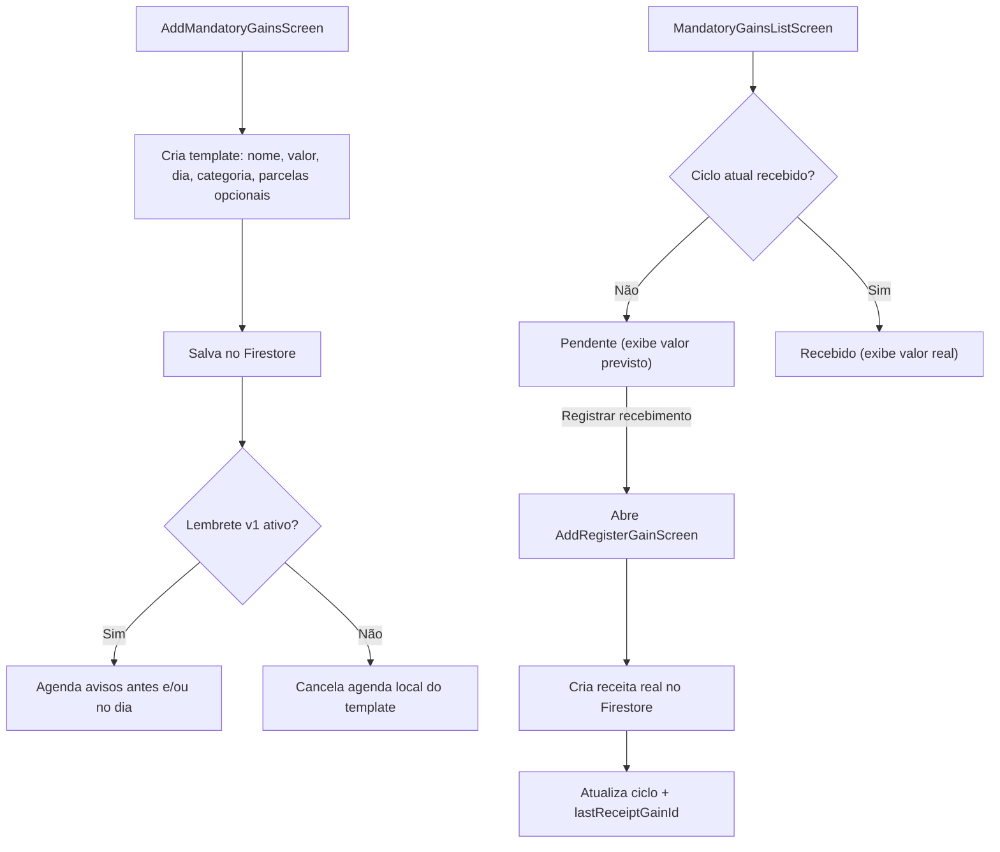

# Receitas Fixas

Gerencia receitas recorrentes mensais (ex: salário, aluguel recebido, pensão) com rastreamento de recebimento por ciclo, lembretes locais configuráveis antes e/ou no dia esperado e aviso remoto aos usuários vinculados quando o template muda.

## Como funciona

1. `screens/mobile/AddMandatoryGainsScreen.tsx` cria a receita fixa com nome, valor, dia esperado de recebimento, categoria obrigatória e parcelamento opcional; o seletor de categoria usa o ActionSheet customizado das telas de registro, com ícone, nome e ação interna para abrir `AddRegisterTagScreen.tsx` sem perder o contexto
2. Cada receita fixa tem um controle de ciclo (`YYYY-MM`) para rastrear se já foi recebida no mês atual
3. `MandatoryGainsListScreen.tsx` exibe todas as receitas fixas com status: recebida / pendente no ciclo atual
4. Após criar ou editar o template obrigatório, `AddMandatoryGainsScreen.tsx` aplica [[Comportamento Pós-Registro]] depois do feedback de sucesso
5. Ao registrar o recebimento do mês, o app abre o fluxo de [[Transações de Receitas|receita]] real; nesse momento o banco e a data exata são definidos, o ciclo é atualizado e o submit da receita segue a preferência da tela de receitas
6. O card **Lembrete do recebimento** agenda avisos cumulativos nos dias escolhidos antes do recebimento e, opcionalmente, um aviso no próprio dia, via [[Notificações]]
7. Ao registrar o recebimento real, o app suprime imediatamente qualquer aviso restante do mesmo ciclo `YYYY-MM`
8. Enquanto a receita fixa estiver pendente no ciclo atual, o calendário e a timeline exibem o valor previsto do template; após o registro do mês, passam a mostrar o valor efetivamente salvo na receita real vinculada via `lastReceiptGainId`
9. Quando o parcelamento está ativo, o template mantém `installmentTotal`, `installmentsCompleted`, `installmentStartDate` e `installmentEndDate`; cada recebimento mensal registrado avança uma parcela e a listagem exibe `Parcela X de Y`
10. `screens/mobile/MandatoryGainsListScreen.tsx` exibe um resumo do mês corrente com total do ciclo, valores recebidos, valores pendentes, parcelamentos concluídos fora do ciclo e botão para baixar o resumo em PDF via `expo-print`/`expo-sharing`; as ações de baixar PDF e adicionar ganho ficam lado a lado em um `HStack`
11. A lista reconcilia a agenda local com os templates do UID autenticado ao carregar ou atualizar por pull-to-refresh
12. Criações, edições e exclusões confirmadas no Firestore acionam a Function de [[Notificações]], que envia push aos aparelhos registrados do dono e de seus `relatedIdUsers`; a lista mantém somente a responsabilidade de reconciliar a agenda local.
13. No resumo diário Web, os itens do mesmo dia aparecem com pendentes antes dos recebidos e, dentro de cada estado, em ordem alfabética pelo nome. O detalhe é compacto e preserva registrar, editar, reivindicar e excluir; a ação de quitar parcelas não é exibida para ganhos.
14. `screens/web/MandatoryGainsListScreen.web.tsx` mantém a mesma composição Web da lista de despesas — calendário mensal, atualização por pull-to-refresh, resumo, timeline expansível, confirmação de ações e impressão — mas carrega ganhos com `getMandatoryGainsWithRelationsFirebase`, usa `lastReceipt*` e navega para `addRegisterGain`, sem oferecer quitação antecipada.
15. `screens/web/AddMandatoryGainsScreen.web.tsx` mantém a composição hero/sheet responsiva de `AddMandatoryExpensesScreen.web.tsx`, com grid de nome/valor, recebimento por dia útil, calendário customizado de parcelas, ActionSheet de categorias obrigatórias, lembrete com antecedência de 1/2/3 dias e aviso opcional no recebimento, além do controle mensal. A variante chama somente `getMandatoryGainFirebase`, `addMandatoryGainFirebase` e `updateMandatoryGainFirebase`; no navegador, persiste a configuração do lembrete e informa que a entrega acontece no aplicativo instalado.
16. `screens/web/MandatoryGainsListScreen.web.tsx` exibe os mesmos três indicadores Web da lista de despesas: barra de progresso do ciclo, radar de ganhos por categoria e scatter dos dias de recebimento. A barra e o radar usam o total efetivamente exibido em centavos, substituem os dados por valores neutros quando a privacidade está ativa e os rótulos acessíveis identificam recebimentos/ganhos, sem alterar o loader ou a lógica de `lastReceipt*`.

## Chave de Ciclo

Usa a mesma lógica de `utils/mandatoryExpenses.ts`:
- `getCycleKeyFromDate()` → `YYYY-MM`
- `isCycleKeyCurrent()` → verifica se o ciclo salvo é o mês vigente
- Ao virar o mês, todas as receitas fixas ficam automaticamente como pendentes

## Lembretes de recebimento

- TimePickerField abre o seletor de hora nativo no Android/iOS e devolve HH:MM; no Web, abre um menu próprio com colunas roláveis de hora e minuto, estados de seleção/hover, seta e padding alinhados ao `web-select-field.tsx`. No Android, o cabeçalho, o marcador e as ações usam o amarelo padrão do sistema configurado no build. A tela converte o valor escolhido para os campos numéricos já persistidos, sem alterar a agenda ou as regras de entrega.
- Receitas usam o mesmo schema versionado de [[Notificações]]: `reminderConfigVersion: 1`, `reminderDaysBefore` entre 1 e 3 e `reminderOnDueDate` opcional. A antecedência é cumulativa: 3 dias agenda avisos em D-3, D-2 e D-1.
- A UI de receitas oferece as opções de 1/2/3 dias antes e um switch para incluir o aviso final no próprio dia do recebimento, mantendo a mesma regra de [[Despesas Fixas]].
- O horário salvo em `reminderHour`/`reminderMinute` é preferido, não uma garantia de minuto exato no Android; economia de bateria e políticas do fabricante podem atrasar a entrega.
- Templates sem `reminderConfigVersion: 1` ficam opt-out mesmo que possuam flags antigas. O usuário precisa revisar, reativar e salvar o card para criar uma agenda nova.
- A data mensal é concreta e resolvida antes do agendamento, preservando dias 29/30/31 e dias úteis.
- A agenda é escopada pelo UID, limitada ao período de parcelamento e renovada por horizonte móvel/reconciliação.
- `lastReceiptCycle` impede avisos do ciclo já recebido. Salvar com o switch desligado, concluir o parcelamento ou excluir o template cancela suas datas futuras.

## Parcelamento

- Parcelamento é opcional. Sem `installmentTotal`, a receita continua sendo uma recorrência mensal sem prazo final.
- Com `installmentTotal`, o template passa a representar uma receita parcelada finita. O valor mensal continua em centavos em `valueInCents`.
- Ao ativar o parcelamento, `AddMandatoryGainsScreen.tsx` mostra calendário de início preenchido com hoje e calendário final bloqueado até haver uma quantidade válida de parcelas.
- A quantidade e a data final ficam sincronizadas: alterar a quantidade recalcula `installmentEndDate`; alterar a data final recalcula `installmentTotal` pelos meses inclusivos entre início e fim.
- `installmentStartDate` permite backfill de templates antigos: ao editar/salvar ou listar, o app calcula quantas parcelas mensais já transcorreram antes do ciclo atual e mantém o ciclo atual dependente do recebimento real registrado.
- `installmentsCompleted` guarda quantos ciclos já foram efetivados. Ao registrar o recebimento via [[Transações de Receitas]], `markMandatoryGainReceiptFirebase()` incrementa esse contador uma vez por ciclo.
- Ao reivindicar/desfazer o recebimento do ciclo, `clearMandatoryGainReceiptFirebase()` remove o vínculo com a receita real e recua uma parcela quando havia recebimento vinculado.
- Quando `installmentsCompleted >= installmentTotal`, a listagem trata o parcelamento como concluído e bloqueia novos registros para o template.
- A UI usa `formatMandatoryInstallmentLabel()` em `utils/mandatoryInstallments.ts` para exibir `Parcela X de Y` no calendário e na timeline.
- A sincronização de lembretes trata parcelamentos concluídos como `reminderEnabled: false`, cancelando notificações futuras ao recarregar a lista.

## Arquivos principais

- `screens/mobile/AddMandatoryGainsScreen.tsx` — Formulário de criação/edição
- `screens/web/AddMandatoryGainsScreen.web.tsx` — Composição Web do formulário, parcelamento, lembrete com antecedência configurável e controle mensal
- `screens/mobile/MandatoryGainsListScreen.tsx` — Lista, timeline e controle de recebimento
- `screens/web/MandatoryGainsListScreen.web.tsx` — Composição Web da lista, calendário, timeline, modais e resumo imprimível
- `functions/MandatoryGainFirebase.ts` — CRUD no Firestore + enriquecimento com valor real
- `utils/mandatoryExpenses.ts` — Lógica de chave de ciclo (compartilhada)
- `utils/mandatoryInstallments.ts` — Normalização e rótulos de parcelamento
- `utils/mandatoryPeriodSummaryPdf.ts` — HTML compartilhado para PDF de resumo mensal de recorrências
- `utils/mandatoryReminderNotifications.ts` — Serviço compartilhado de lembretes obrigatórios
- `utils/mandatoryReminderConfig.ts` — Schema v1 e validação opt-out compartilhada
- `utils/mandatoryGainNotifications.ts` — Agendamento de notificações (wrapper fino)
- `app/mobile/add-mandatory-gains.tsx`, `app/web/add-mandatory-gains.web.tsx` e `app/mobile/add-mandatory-gains.native.tsx` — Rotas por plataforma do cadastro
- `app/mobile/mandatory-gains.tsx`, `app/web/mandatory-gains.web.tsx` e `app/mobile/mandatory-gains.native.tsx` — Rotas por plataforma da lista
- `utils/navigation.ts` — Saída explícita para Home pelo voltar físico/navigator
- `hooks/usePostSubmitBehavior.ts` — Aplica retorno/limpeza após salvar templates
- `components/uiverse/categories/tag-actionsheet-selector.tsx` — Seletor de categoria obrigatória em ActionSheet
- `components/mobile/recurring/time-picker-field.native.tsx` / `components/web/recurring/time-picker-field.web.tsx` — Seletor reutilizável de horário do lembrete

## Integrações

- [[Transações de Receitas]] — Marcar como recebida cria receita real no Firestore
- [[Gerenciamento de Bancos]] — Banco é escolhido no lançamento mensal da receita real
- [[Notificações]] — Agendamento de lembretes de recebimento via `mandatoryReminderNotifications.ts`
- [[Despesas Fixas]] — Módulo paralelo que compartilha o motor de agenda, com lembretes cumulativos próprios
- [[Gerenciamento de Tags]] — Categoria obrigatória pode ser criada inline
- [[Privacidade de Valores]] — Resumo e PDF respeitam a preferência de ocultar valores
- [[Previsão de Fluxo de Caixa]] — Template pendente é projetado no ciclo correspondente; recebimento real vinculado e parcelas concluídas não são projetados novamente
- [[Comportamento Pós-Registro]] — Define retorno/limpeza após salvar templates

## Configuração

- Usa exclusivamente `expo-notifications` e requer permissão do usuário
- Expo Go serve para smoke test local; canais, segundo plano e produção devem ser validados em development build e build de produção
- Demais configurações e canais estão em [[Notificações]]

## Observações importantes

- Estrutura de recorrência e lembretes espelhada ao módulo de [[Despesas Fixas]], com antecedência cumulativa e aviso opcional no dia do recebimento
- Receitas fixas **não creditam automaticamente** — o usuário precisa confirmar recebimento
- A [[Previsão de Fluxo de Caixa]] somente representa o recebimento como cenário. Ela não cria ganho nem altera `lastReceiptCycle`
- Compartilha utilitários de ciclo com [[Despesas Fixas]]
- A lista reconcilia os lembretes salvos, corrigindo datas ausentes, expiradas ou defasadas na agenda Expo do UID atual
- A autenticação também executa a reconciliação global via `mandatoryReminderAccountSync.ts`, portanto um relogin restaura os lembretes sem exigir que esta lista seja aberta
- O texto da notificação é personalizado com o nome do ganho e reforça que o recebimento deve ser realizado
- O formulário libera campos progressivamente; se houver alterações pendentes em um template salvo, é preciso salvá-las antes de registrar o ciclo
- Todos os inputs textuais do formulário, incluindo quantidade de parcelas e observações, devem usar a rotina de foco que mantém o campo visível acima do teclado. O horário do lembrete usa o seletor nativo e não abre o teclado.
- Em formulários novos, o switch de lembrete começa desligado e fica desabilitado até nome, valor, dia e categoria serem preenchidos
- Quando a categoria é criada inline, a tela de tags abre com tipo `gain` e obrigatoriedade pré-selecionados, mas editáveis; ao salvar uma categoria compatível, ela retorna já selecionada
- O seletor de categoria obrigatória deve permanecer no ActionSheet compartilhado com `<TagIcon />` e ação interna de criação, sem regressão para o menu padrão do Android ou botão externo ao campo
- O valor no ciclo atual usa `displayValueInCents` dos pares `date-calendar.native.tsx` / `.web.tsx`: antes da efetivação mostra o template, após mostra o `valueInCents` da receita real apontada por `lastReceiptGainId`
- Salvar ou editar um template obrigatório deve passar por [[Comportamento Pós-Registro]]
- Ao criar um novo template obrigatório, a limpeza dos campos é controlada pela preferência da tela quando o retorno automático está desligado; o submit usa trava síncrona enquanto salva e agenda/cancela lembrete para impedir duplo registro
- Receitas parceladas permanecem no calendário/lista até a conclusão, mas deixam de aceitar novos registros depois da última parcela
- Templates parcelados criados antes de `installmentStartDate` continuam compatíveis; ao editar, o formulário sugere hoje como início e recalcula o fim pela quantidade atual até o usuário salvar a nova configuração
- O resumo mensal inclui itens recebidos no ciclo atual e pendentes do mês; parcelamentos concluídos em ciclos anteriores aparecem como contagem separada e não entram no total financeiro do mês
- O PDF é gerado localmente no dispositivo, compartilhado com nome contextual `Lumus-Financas-Receitas-Fixas-[mes]-[data].pdf` e usa os mesmos valores exibidos na tela, incluindo valores ocultos quando a privacidade está ativa

## Integração com o Assistente Lumus

- [[Assistente Lumus]] cria/edita/exclui templates e registra/desfaz o recebimento por comandos próprios.
- Recebimento e ganho real são escritos na mesma transação; vínculo do ciclo e avanço de parcela não podem ficar sem o lançamento correspondente.
- Atualizações de lembrete acontecem depois do commit e falhas locais são mostradas como aviso recuperável.
