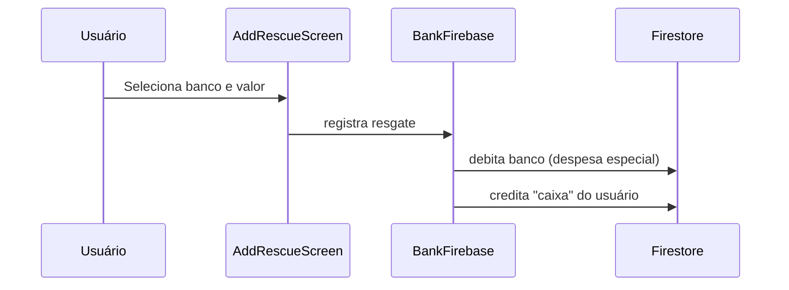

# Resgate de Caixa

Permite registrar a retirada de dinheiro em espécie de uma conta bancária, creditando o valor no saldo "em caixa" (dinheiro físico) do usuário.

> **Após o corte do grupo financeiro**, Caixa deixa de ser um campo especial: é a única conta compartilhada do grupo, do tipo cash. A rota e o nome Saque são mantidos por compatibilidade, mas AddRescueScreen chama transferFunds para criar uma transferência banco → Caixa com duas pernas imutáveis.

## Como funciona

1. `AddRescueScreen.tsx` coleta: banco de origem e valor do resgate; o banco é selecionado pelo ActionSheet compartilhado com ícone
2. `BankFirebase.ts` registra a operação:
   - Débita o valor do banco selecionado (cria despesa especial)
   - Credita no total de "caixa" do usuário
3. Após registrar o saque, `AddRescueScreen.tsx` aplica [[Comportamento Pós-Registro]] depois do feedback de sucesso
4. O saldo em caixa aparece destacado no [[Dashboard Home]]
5. Feedback via `notifier-alert.tsx`

## Arquivos principais

- `screens/AddRescueScreen.tsx` — Formulário de resgate
- `functions/BankFirebase.ts` — Operação de resgate
- `components/uiverse/bank-actionsheet-selector.tsx` — Seletor de banco de origem
- `app/add-rescue.tsx` — Rota
- `utils/navigation.ts` — Saída explícita para Home pelo voltar físico/navigator
- `hooks/usePostSubmitBehavior.ts` — Aplica retorno/limpeza após salvar

## Integrações

- [[Gerenciamento de Bancos]] — Banco de origem é debitado
- [[Dashboard Home]] — Saldo em caixa exibido separadamente no dashboard
- [[Transações de Receitas]] / [[Transações de Despesas]] — Gera movimentos especiais
- [[Notificações]] — Feedback via `notifier-alert.tsx`
- [[Comportamento Pós-Registro]] — Define retorno/limpeza após registrar saque

## Configuração

- Sem configuração especial

## Observações importantes

- No razão, Caixa é uma conta compartilhada, materializada em centavos e não pode ficar negativa.
- Banco pode ficar negativo, mas o saque exige justificativa gravada no evento quando isso ocorrer.
- Grupos ainda não migrados continuam no adaptador legado até o administrador aprovar o corte.

- "Caixa" é um conceito separado de "banco" — representa dinheiro físico disponível
- O resgate não cria um banco chamado "Caixa" — é um campo especial no documento do usuário
- Após registrar um saque, banco, valor, data, descrição e saldo carregado só são limpos quando a preferência da tela manda permanecer e limpar; o submit usa trava síncrona para impedir múltiplos saques iguais antes da resposta do Firestore

## Integração com o Assistente Lumus

- [[Assistente Lumus]] valida banco, saldo mensal e saldo disponível antes de registrar o saque.
- Desfazer usa o registro escolhido no catálogo opaco, confirma novamente propriedade/fingerprint e remove somente o saque selecionado.
