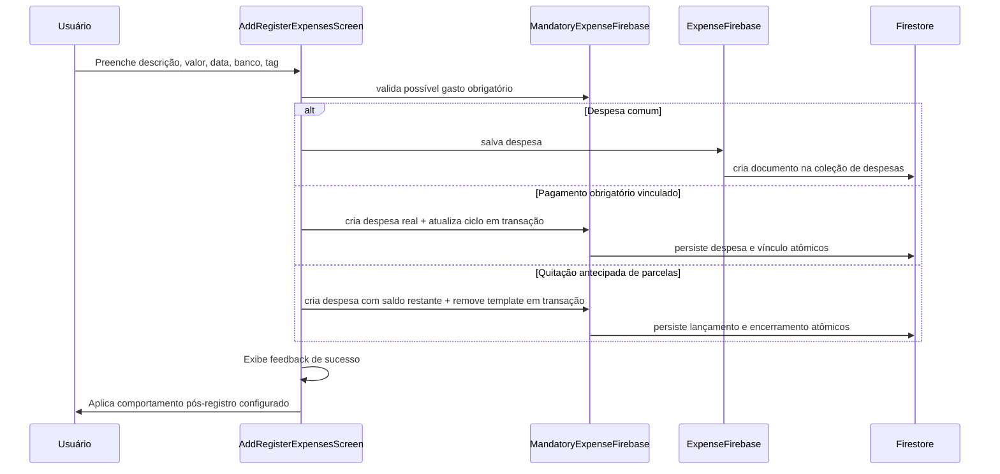

# Transações de Despesas

Permite registrar saídas financeiras vinculadas a uma conta bancária, com categorização por tags, data e valor. Suporta despesas comuns, depósitos em investimentos e débitos de transferências.

## Como funciona

1. Usuário acessa `AddRegisterExpensesScreen.tsx` no Android/iOS ou `AddRegisterExpensesScreen.web.tsx` no navegador
2. Preenche: descrição, valor, data, banco de origem e tag; banco e tag são escolhidos por ActionSheets customizados com ícone, nome e destaque da seleção atual, e a tag mantém a ação interna para criar uma nova categoria de despesa
3. Em novos registros comuns do ciclo atual, antes de salvar, a tela consulta [[Despesas Fixas]] e usa `utils/mandatoryExpenseSuggestions.ts` para sugerir somente um candidato pendente, único e de alta confiança
4. Despesas comuns são salvas por `ExpenseFirebase.ts`; pagamentos iniciados a partir de um template obrigatório usam `registerMandatoryExpensePaymentFirebase()` para criar a despesa real e concluir o ciclo na mesma transação Firestore. A quitação antecipada usa `settleMandatoryExpenseFirebase()` para lançar o valor efetivamente pago — que pode incluir desconto — e remover o template na mesma transação
5. Após criar ou editar uma despesa, `AddRegisterExpensesScreen.tsx` aplica [[Comportamento Pós-Registro]] depois do feedback de sucesso; por padrão volta para [[Dashboard Home]]
6. O movimento aparece na timeline do [[Dashboard Home]] e em [[Gerenciamento de Bancos|BankMovementsScreen]]
7. O saldo do banco selecionado é impactado automaticamente nos cálculos de saldo

## Tipos de Despesa (flags booleanas)

| Flag | Descrição | Entra nos totais? |
|---|---|---|
| (nenhuma flag) | Despesa comum | Sim |
| `isInvestmentDeposit` | Depósito em investimento | Não |
| `isFinanceInvestment` | Movimento de investimento | Não |
| `isFinanceInvestmentSync` | Sincronização de investimento | Não |

> **Nota:** Transferências (`transfer_out`) e investimentos usam flags booleanas nos documentos, filtradas por `shouldIncludeMovementInGainExpenseTotals()` em `utils/monthlyBalance.ts`.

## Arquivos principais

- `screens/AddRegisterExpensesScreen.tsx` — Formulário de registro
- `screens/AddRegisterExpensesScreen.web.tsx` — Composição Web fullscreen do mesmo fluxo, seguindo o hero/sheet da Home com wallpaper, título e ilustração animados e grade de campos; não contém regras financeiras diferentes
- `components/uiverse/tag-actionsheet-selector.tsx` — Seletor de categoria em ActionSheet
- `components/uiverse/bank-actionsheet-selector.tsx` — Seletor de banco em ActionSheet
- `functions/ExpenseFirebase.ts` — CRUD de despesas comuns no Firestore
- `functions/MandatoryExpenseFirebase.ts` — Consulta de templates e transação atômica de pagamento obrigatório
- `utils/mandatoryExpenseSuggestions.ts` — Match conservador e resolução do alvo de sugestão antes de salvar despesa comum
- `app/add-register-expenses.tsx` — Rota
- `utils/monthlyBalance.ts` — Define se despesa entra nos totais
- `hooks/usePostSubmitBehavior.ts` — Aplica retorno/limpeza após salvar

## Integrações

- [[Gerenciamento de Bancos]] — Banco selecionado é debitado
- [[Gerenciamento de Tags]] — Tag categoriza a despesa (ícone renderizado via `<TagIcon />`)
- [[Dashboard Home]] — Aparece na timeline e no gráfico de pizza
- [[Transferências]] — Transferências criam despesas com flags especiais
- [[Investimentos]] — Depósitos criam despesas com `isInvestmentDeposit`
- [[Despesas Fixas]] — Templates pendentes podem interceptar registros comuns com sugestão e foco no pagamento correto da lista

## Configuração

- Valores armazenados em **centavos** (integer)
- Data armazenada como timestamp Firestore
- A variante Web pode reorganizar hero, sheet, tamanho, espaçamento e animação dos campos, mas chama as mesmas funções Firebase e o mesmo `usePostSubmitBehavior()` da tela nativa. Dentro do `ScrollView`, o hero mantém o wallpaper, `Grainient`, conteúdo e sheet em camadas explícitas.
- O seed do emulador cria despesas de demonstração diretamente em `expenses`, com `name` e `valueInCents`, para que sejam lidas pelo mesmo fluxo das despesas registradas no app.

## Observações importantes

- Consultas de despesas no cliente são sempre escopadas por `personId` do usuário autenticado e pelos usuários relacionados. A fachada legada `getAllExpensesFirebase()` não faz varredura global, pois as Firestore Rules não filtram resultados depois da consulta.

- Despesas com flags de investimento/transferência são excluídas dos totais de gastos exibidos no dashboard para evitar dupla contagem
- A tag é opcional mas recomendada para o gráfico de pizza funcionar corretamente
- O campo `personId` liga a despesa ao usuário — usuários relacionados compartilham visibilidade
- O submit de novos registros e edições deve passar por [[Comportamento Pós-Registro]]; não usar `router.back()` nem strings livres de rota como retorno pós-submit
- Em novo registro, a limpeza dos campos é controlada pela preferência da tela quando o retorno automático está desligado; o submit usa trava síncrona para impedir duplo clique enquanto a persistência e integrações obrigatórias/investimento concluem
- A central opcional **Testes do aplicativo** pode abrir este formulário com `templateName`, `templateDescription` e `templateValueInCents=1` (R$ 0,01). Isso é apenas um rascunho de teste: nenhum documento é gravado até o usuário executar o submit normal.
- Antes de salvar uma despesa comum do ciclo atual, a tela bloqueia a persistência se não conseguir validar gastos obrigatórios. A regra é aplicada a **todo** template obrigatório pendente: um nome principal canônico e único (por exemplo, `Fatura do Aluguel`/`Aluguel`, `Pagamento da Internet Residencial`/`Internet Residencial` ou `Mensalidade da Academia`/`Academia`) pode identificar o obrigatório mesmo com categoria diferente e valor variável; `Luz`, `Conta de Luz` e `Energia Elétrica` são apenas outro exemplo. Para nomes apenas parecidos, o match exige valor compatível com o template/último pagamento mais categoria igual ou vencimento em até sete dias. Itens já pagos, parcelamentos concluídos, fora de vigência ou ambíguos não são sugeridos
- Nomes semanticamente distintos sem termos em comum, como uma marca e o serviço genérico correspondente, não são tratados como equivalentes por suposição; isso evita redirecionar para o gasto obrigatório errado
- Quando há match, o modal permite ignorar e registrar como comum ou abrir `MandatoryExpensesListScreen` com `focusMandatoryExpenseId`. A lista revalida o alvo e abre a confirmação de registro somente se ele ainda estiver pendente
- A sugestão não roda em edição, em fluxo já iniciado por gasto obrigatório (`templateMandatoryExpenseId`), em ajuste de investimento ou para datas fora do ciclo atual, pois a lista obrigatória efetiva somente o ciclo vigente
- O registro iniciado por `templateMandatoryExpenseId` exige data do ciclo atual e usa uma única transação para criar a despesa real e atualizar `lastPaymentExpenseId`/`lastPaymentCycle`; falha na transação não cria uma despesa parcial
- O campo de categoria não deve voltar para o menu padrão do Android nem exibir botão externo desalinhado; o fluxo usa o ActionSheet compartilhado para selecionar e criar categorias
- O campo de banco também usa ActionSheet compartilhado para exibir `iconKey`/`colorHex` dos bancos cadastrados e evitar regressão para o menu padrão do Android
- A tela também é renderizada como tab 1 do container de abas em `home.tsx` (aba "Controle")

## Integração com o Assistente Lumus

- [[Assistente Lumus]] propõe despesas com `valueInCents`, data civil e handles temporários de banco/categoria; o modelo nunca recebe IDs Firestore.
- Lançamentos de transferência, pagamento obrigatório e aporte são excluídos da edição/exclusão genérica e usam o comando específico de desfazer.
- Cada despesa proposta possui ID pré-alocado e só é gravada depois da confirmação individual do cartão.
