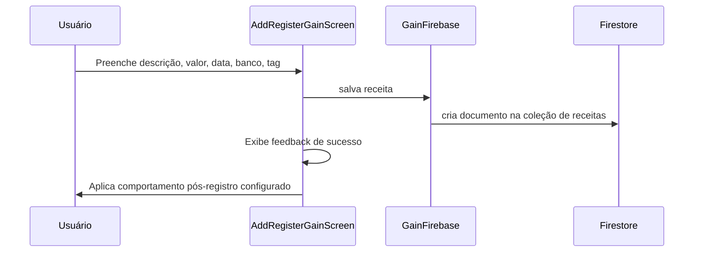

# Transações de Receitas

Permite registrar entradas financeiras vinculadas a uma conta bancária, com categorização por tags, data e valor. Suporta receitas comuns, resgates de investimentos e créditos de transferências.

## Como funciona

1. Usuário acessa `AddRegisterGainScreen.tsx`
2. Preenche: descrição, valor, data, banco de destino e tag; banco e tag são escolhidos por ActionSheets customizados com ícone, nome e destaque da seleção atual, e a tag mantém a ação interna para criar uma nova categoria de ganho
3. `GainFirebase.ts` salva o documento no Firestore na coleção de receitas do usuário
4. Após criar ou editar uma receita, `AddRegisterGainScreen.tsx` aplica [[Comportamento Pós-Registro]] depois do feedback de sucesso; por padrão volta para [[Dashboard Home]]
5. O movimento aparece na timeline do [[Dashboard Home]] e em [[Gerenciamento de Bancos|BankMovementsScreen]]
6. O saldo do banco selecionado é incrementado automaticamente nos cálculos

## Tipos de Receita (flags booleanas)

| Flag | Descrição | Entra nos totais? |
|---|---|---|
| (nenhuma flag) | Receita comum | Sim |
| `isInvestmentRedemption` | Resgate de investimento | Não |
| `isFinanceInvestment` | Movimento de investimento | Não |
| `isFinanceInvestmentSync` | Sincronização de investimento | Não |

> **Nota:** A filtragem é feita por `shouldIncludeMovementInGainExpenseTotals()` em `utils/monthlyBalance.ts`, que verifica flags booleanas — não tipos string.

## Arquivos principais

- `screens/AddRegisterGainScreen.tsx` — Formulário de registro
- `components/uiverse/tag-actionsheet-selector.tsx` — Seletor de categoria em ActionSheet
- `components/uiverse/bank-actionsheet-selector.tsx` — Seletor de banco em ActionSheet
- `functions/GainFirebase.ts` — CRUD de receitas no Firestore
- `app/add-register-gain.tsx` — Rota
- `hooks/usePostSubmitBehavior.ts` — Aplica retorno/limpeza após salvar

## Integrações

- [[Gerenciamento de Bancos]] — Banco selecionado é creditado
- [[Gerenciamento de Tags]] — Tag categoriza a receita (ícone via `<TagIcon />`)
- [[Dashboard Home]] — Aparece na timeline e nos totais
- [[Transferências]] — Transferências criam receitas com flags especiais
- [[Investimentos]] — Resgates criam receitas com `isInvestmentRedemption`
- [[Resgate de Caixa]] — Gera receita especial no banco de destino

## Configuração

- Valores armazenados em **centavos** (integer)
- Data armazenada como timestamp Firestore
- O seed do emulador cria ganhos de demonstração diretamente em `gains`, com `name` e `valueInCents`, para que sejam lidos pelo mesmo fluxo das receitas registradas no app.

## Observações importantes

- Consultas de ganhos no cliente são sempre escopadas por `personId` do usuário autenticado e pelos usuários relacionados. A fachada legada `getAllGainsFirebase()` não faz varredura global, pois as Firestore Rules não filtram resultados depois da consulta.

- Receitas com flags de investimento/transferência são excluídas dos totais de entradas para evitar dupla contagem
- Estrutura idêntica à de Despesas — seguem o mesmo padrão de campos no Firestore
- Usuários relacionados compartilham visibilidade das receitas
- O submit de novos registros e edições deve passar por [[Comportamento Pós-Registro]]; não usar `router.back()` nem strings livres de rota como retorno pós-submit
- Em novo registro, a limpeza dos campos é controlada pela preferência da tela quando o retorno automático está desligado; o submit usa trava síncrona para impedir duplo clique enquanto a persistência e integrações obrigatórias/investimento concluem
- A central opcional **Testes do aplicativo** pode abrir este formulário com `templateName`, `templateDescription` e `templateValueInCents=1` (R$ 0,01). Isso é apenas um rascunho de teste: nenhum documento é gravado até o usuário executar o submit normal.
- O campo de categoria não deve voltar para o menu padrão do Android nem exibir botão externo desalinhado; o fluxo usa o ActionSheet compartilhado para selecionar e criar categorias
- O campo de banco também usa ActionSheet compartilhado para exibir `iconKey`/`colorHex` dos bancos cadastrados e evitar regressão para o menu padrão do Android

## Integração com o Assistente Lumus

- [[Assistente Lumus]] usa os mesmos campos em centavos e resolve banco/categoria por handles temporários.
- Entradas vinculadas a transferência, recebimento obrigatório ou resgate de investimento não aceitam edição genérica no chat.
- Uma fala com várias receitas gera cartões independentes e cada gravação exige seu próprio botão de confirmação.
