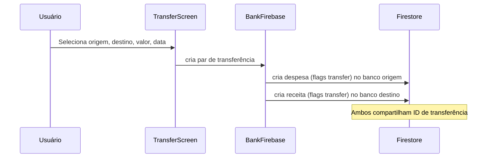

# Transferências

Permite mover valores entre contas bancárias do mesmo usuário. Gera dois movimentos simultâneos: um débito no banco de origem e um crédito no banco de destino.

> **Após o corte do grupo financeiro**, uma transferência é um único evento do razão com duas pernas, clientActionId idempotente e referências de origem. O extrato continua mostrando saída na origem e entrada no destino, mas não existem dois documentos financeiros mutáveis.

## Como funciona

1. `TransferScreen.tsx` coleta: banco de origem, banco de destino, valor, data e descrição; origem e destino usam o ActionSheet compartilhado com ícones dos bancos
2. `BankFirebase.ts` cria dois documentos no Firestore:
   - Uma [[Transações de Despesas|despesa]] com flags de transferência no banco de origem
   - Uma [[Transações de Receitas|receita]] com flags de transferência no banco de destino
3. Ambos os movimentos compartilham um ID de transferência para rastreabilidade
4. Feedback via `notifier-alert.tsx`
5. Após registrar a transferência, `TransferScreen.tsx` aplica [[Comportamento Pós-Registro]] depois do feedback de sucesso

## Por que dois movimentos?

A arquitetura de transferência como par débito/crédito permite que o [[Gerenciamento de Bancos|BankMovementsScreen]] exiba o movimento individualmente em cada banco, enquanto o `shouldIncludeMovementInGainExpenseTotals()` filtra esses tipos para evitar que o total de despesas/receitas do [[Dashboard Home]] seja inflado.

Na busca do extrato bancário, `getBankMovementsByPeriodFirebase()` considera tanto o `bankId` gravado no movimento quanto os metadados `bankTransferSourceBankId` e `bankTransferTargetBankId`. Assim, uma transferência aparece como saída no banco de origem e como entrada no banco de destino.

## Arquivos principais

- `screens/TransferScreen.tsx` — Formulário de transferência
- `components/uiverse/bank-actionsheet-selector.tsx` — Seletores de origem e destino
- `functions/BankFirebase.ts` — Criação dos dois movimentos
- `app/transfer-screen.tsx` — Rota
- `utils/monthlyBalance.ts` — Filtra movimentos de transferência dos totais
- `utils/navigation.ts` — Saída explícita para Home pelo voltar físico/navigator
- `hooks/usePostSubmitBehavior.ts` — Aplica retorno/limpeza após salvar

## Integrações

- [[Gerenciamento de Bancos]] — Dois bancos envolvidos na operação
- [[Transações de Despesas]] — Gera despesa com flags de transferência
- [[Transações de Receitas]] — Gera receita com flags de transferência
- [[Dashboard Home]] — Movimentos aparecem na timeline mas não nos totais de entrada/saída
- [[Notificações]] — Feedback via `notifier-alert.tsx`
- [[Comportamento Pós-Registro]] — Define retorno/limpeza após registrar transferência

## Configuração

- Sem configuração especial

## Observações importantes

- No razão, transferências e aportes/resgates não entram nos totais de receita/despesa; adaptadores analíticos devem usar o tipo do lançamento, sem recontar as duas pernas.

- Transferência entre o mesmo banco é bloqueada no formulário e em `transferBetweenBanksFirebase()`
- Após uma transferência bem-sucedida, origem, destino, valor, data, descrição e saldo carregado só são limpos quando a preferência da tela manda permanecer e limpar; o submit usa trava síncrona para impedir novo envio antes da conclusão do par débito/crédito
- O fluxo manual usa batch e o [[Assistente Lumus]] usa transação; transferência, saída e entrada são commits atômicos, sem documento parcial
- Os movimentos usam flags booleanas (não tipos string) para serem excluídos dos totais
- O extrato de bancos usa os metadados de origem/destino como reforço de leitura para transferências, sem transformar esses movimentos em despesas/receitas comuns nos totais do dashboard

## Integração com o Assistente Lumus

- O assistente exige dois bancos diferentes, saldo mensal disponível na origem e saldo suficiente antes de abrir a confirmação.
- Os três IDs são pré-alocados a partir do cartão para evitar duplicação; os movimentos continuam marcados como transferência e fora dos totais de ganho/despesa.
